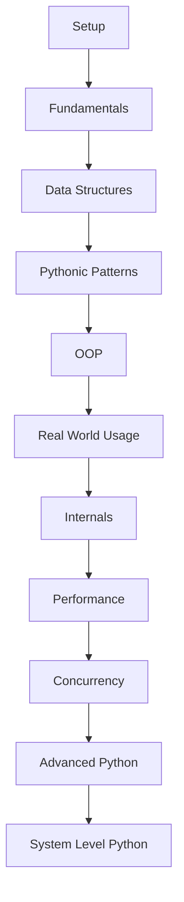
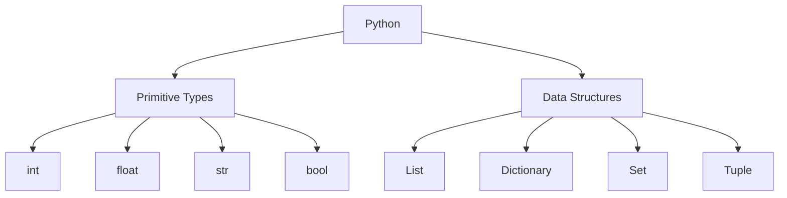
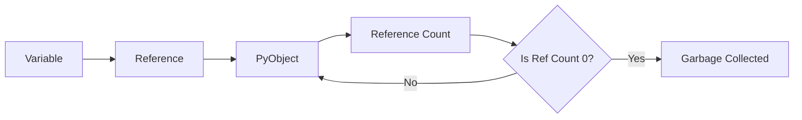

# Python Roadmap for AI Data Engineer Gita

This roadmap is designed for someone starting as a **complete beginner in Python** and progressing to a **top 1% AI Data Engineer / AI Infrastructure Engineer**.

The goal is not just to learn syntax, but to:

* build strong fundamentals from scratch
* understand how Python works internally
* write efficient and scalable code
* use Python in real data and AI systems
* prepare for top-tier engineering interviews

---

# How to Use This Roadmap

Each phase should be followed with:

* Learning concepts
* Solving problems
* Building small tools
* Writing notes (in this Gita)

Cycle:

Learn → Practice → Build → Document

---

# Phase 0 — Absolute Beginner Setup (Do NOT Skip)

## Topics

📄 Files:

* `book/01_python_programming/01_setup_installation.md`

* `book/01_python_programming/02_python_basics.md`

* Installing Python

* Running scripts

* Using VS Code / Cursor

* Virtual environments (venv)

* pip and package installation

---

# Phase 1 — Python Fundamentals

📄 Files:

* `book/01_python_programming/02_python_basics.md`
* `book/01_python_programming/03_lists.md`
* `book/01_python_programming/04_dictionaries.md`
* `book/01_python_programming/05_sets.md`
* `book/01_python_programming/06_tuples.md`

## Topics

* Variables and data types
* Strings and operations
* Lists, dictionaries, sets, tuples
* Control flow (if, loops)
* Functions
* Basic file handling

## Goal

* Become comfortable writing Python code without hesitation

## Practice

* 30 problems

Examples:

* Reverse a list
* Find max/min
* Count frequency of elements
* String manipulation problems

---

# Phase 2 — Problem Solving & Data Structures

📄 Files:

* `book/01_python_programming/03_lists.md`
* `book/01_python_programming/04_dictionaries.md`
* `book/01_python_programming/05_sets.md`
* `book/01_python_programming/06_tuples.md`

## Topics

* Lists (deep understanding)
* Dictionaries (hash maps)
* Sets
* Tuples
* Collections module

## Key Concepts

* Time complexity
* Space complexity
* Choosing the right structure

## Goal

* Solve problems efficiently using Python

## Practice

* 50+ problems (focus on real patterns)

---

# Phase 3 — Pythonic Coding & Patterns

📄 Files:

* `book/01_python_programming/07_memory_model.md`
* `book/01_python_programming/10_concurrency.md`
* `book/01_python_programming/12_profiling_optimization.md`

## Topics

* *args, **kwargs
* Lambda functions
* List/dict comprehensions
* Generators
* Iterators
* Standard library (collections, itertools, functools, heapq)

## Goal

* Write clean, readable, and efficient Python code
* Leverage built-in libraries instead of reinventing logic

---

# Phase 4 — Object-Oriented Programming

📄 Files:

* `book/01_python_programming/08_slots.md`
* `book/01_python_programming/09_garbage_collection.md`
* `book/01_python_programming/13_c_extensions_numba.md`

## Topics

* Classes and objects
* Inheritance
* Encapsulation
* Polymorphism
* Dunder methods

## Goal

* Build structured and reusable systems

---

# Phase 5 — Real-World Python for Data Engineering

📄 Files:

* `book/01_python_programming/02_python_basics.md`
* `book/01_python_programming/03_lists.md`
* `book/01_python_programming/04_dictionaries.md`

## Topics

* File processing (CSV, JSON)
* Working with APIs (requests)
* Logging
* Error handling (try/except, retries)
* CLI tools
* Debugging (pdb, logs, tracing)
* Project structure and packaging (venv, requirements, modules)

## Goal

* Use Python in real-world data workflows
* Write robust and production-ready code

## Mini Projects

* Log analyzer
* API data fetcher
* CSV processor

---

# Phase 6 — Python Internals (Critical)

📄 Files:

* `book/01_python_programming/07_memory_model.md`
* `book/01_python_programming/09_garbage_collection.md`

## Topics

* Memory model
* PyObject structure
* Reference counting
* Garbage collection
* id() vs is

## Goal

* Understand how Python works under the hood

---

# Phase 7 — Performance Optimization

📄 Files:

* `book/01_python_programming/12_profiling_optimization.md`

## Topics

* Time complexity analysis
* Profiling (cProfile, line_profiler)
* Memory optimization
* **slots**
* Identifying bottlenecks

## Goal

* Write efficient and scalable Python code
* Develop performance-first thinking

---

# Phase 8 — Concurrency & Parallelism

📄 Files:

* `book/01_python_programming/10_concurrency.md`
* `book/01_python_programming/11_asyncio.md`

## Topics

* Threading
* Multiprocessing
* Asyncio
* GIL (Global Interpreter Lock)

## Goal

* Handle large-scale data processing

---

# Phase 9 — Advanced Python

📄 Files:

* `book/01_python_programming/13_c_extensions_numba.md`

## Topics

* Decorators
* Context managers
* Metaclasses
* Descriptors

## Goal

* Build frameworks and advanced abstractions

---

# Phase 10 — System-Level Python (Top 1% Layer)

📄 Files:

* `book/01_python_programming/13_c_extensions_numba.md`

## Topics

* C extensions
* Numba
* Memory optimization
* Low-level performance tuning
* Reading source code of libraries

## Goal

* Achieve near C-level performance where required
* Understand and work with large-scale production systems

---

# Final Goal

By completing this roadmap, you should be able to:

* Write production-grade Python code
* Understand performance bottlenecks
* Build scalable data systems
* Use Python in AI/data infrastructure
* Crack top AI/data engineering interviews

---