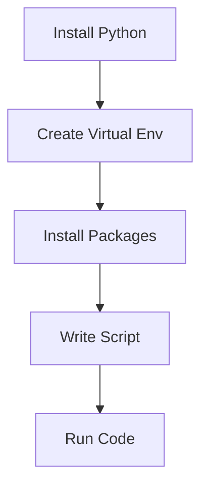
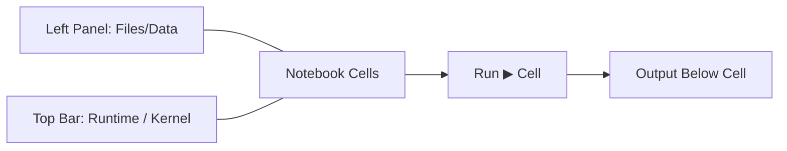
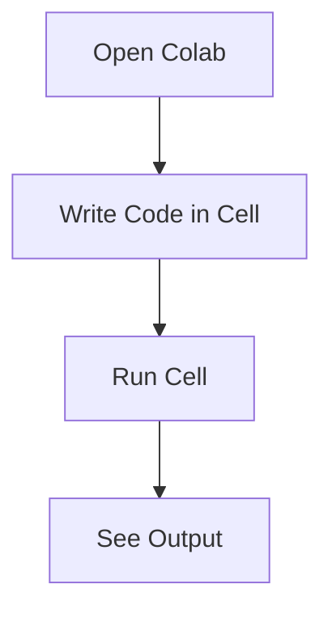
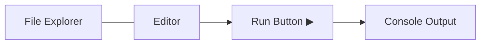
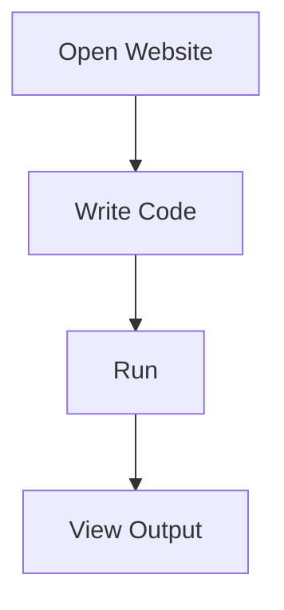

# Setup & Installation

📄 File: `book/01_python_programming/01_setup_installation.md`

This chapter helps you set up Python so you can start learning immediately.

Choose **ONE option** below and stick to it.

> 💡 **Want zero setup hassle?** Skip directly to the **Appendix (Agent / Cursor Prompt)** at the end of this chapter. It allows you to automate the entire installation using an AI agent.
>
> ## Which Option Should You Choose?
>
> * Just exploring → Option C
> * Beginner (quick start) → Option B
> * Serious learning → Option A ✅

---

## Option A — Local Setup (Recommended)

Best for serious learning and becoming a **top 1% AI Data Engineer**.

### Step 1 — Install Python

Download Python (3.10+):

* **Python Official Downloads** — [https://www.python.org/downloads/](https://www.python.org/downloads/)

---

### Step 2 — Verify Installation

```bash
python3 --version
```

Expected output:

```
Python 3.x.x
```

---

### Step 3 — Create Virtual Environment

```bash
python3 -m venv venv
```

Activate:

**Mac/Linux**

```bash
source venv/bin/activate
```

**Windows**

```bash
venv\\Scripts\\activate
```

---

### Step 4 — Install Packages

```bash
pip install requests pandas numpy
```

---

### Step 5 — Run Your First Script

Create `hello.py`:

```python
print("Hello AI Data Engineer Gita")
```

Run:

```bash
python hello.py
```

---

### Step 6 — Editor Setup

Choose one (all are industry-relevant):

* **Visual Studio Code (VS Code)** — [https://code.visualstudio.com/](https://code.visualstudio.com/)
* **Cursor (AI-first IDE, recommended for this book)** — [https://www.cursor.so/](https://www.cursor.so/)
* **PyCharm (JetBrains)** — [https://www.jetbrains.com/pycharm/](https://www.jetbrains.com/pycharm/)

Recommended VS Code extensions:

* Python (Microsoft) — [https://marketplace.visualstudio.com/items?itemName=ms-python.python](https://marketplace.visualstudio.com/items?itemName=ms-python.python)
* Pylance — [https://marketplace.visualstudio.com/items?itemName=ms-python.vscode-pylance](https://marketplace.visualstudio.com/items?itemName=ms-python.vscode-pylance)
* Jupyter — [https://marketplace.visualstudio.com/items?itemName=ms-toolsai.jupyter](https://marketplace.visualstudio.com/items?itemName=ms-toolsai.jupyter)

---

### Diagram — Local Setup Flow



---

## Option B — Cloud Notebooks (No Setup)

Best if you want to start instantly.

### Tools

* **Google Colab (recommended)** — [https://colab.research.google.com](https://colab.research.google.com)
* **Kaggle Notebooks** — [https://www.kaggle.com/code](https://www.kaggle.com/code)

---

### Google Colab — Quick Steps

1. Open: [https://colab.research.google.com](https://colab.research.google.com)
2. Click **New Notebook**
3. Run:

```python
print("Hello from Colab")
```

4. Install packages if needed:

```python
!pip install pandas
```

---

### Kaggle Notebooks — Quick Steps

1. Open: [https://www.kaggle.com](https://www.kaggle.com)
2. Sign in → Click **Code** → **New Notebook**
3. Ensure runtime is **Python** (top right)
4. Add a cell and run:

```python
print("Hello from Kaggle")
```

5. (Optional) Add datasets via the **Add data** panel
6. Install packages if needed:

```python
!pip install pandas
```

---

### Diagram — Notebook Interface (Colab/Kaggle)



---

### Diagram — Cloud Workflow



---

## Option C — Online Python Interpreter

Best for very quick experiments.

### Tools

* **Replit** — [https://replit.com](https://replit.com)
* **Programiz Online Compiler** — [https://programiz.com/python-programming/online-compiler](https://programiz.com/python-programming/online-compiler)

---

### Steps

1. Open website
2. Create or open a Python project (if required)
3. Write code in the editor
4. Click **Run**

---

### Diagram — Interpreter Interface



---

### Diagram — Online Interpreter Flow



---

## Common Issues & Fixes

**python not found**

```bash
python3 --version
```

**pip not working**

```bash
python3 -m pip install package_name
```

**venv not activated**

* Activate before installing packages

---

## Goal of This Chapter

After completing this setup, you should be able to:

* Run Python scripts
* Install libraries
* Use an editor
* Execute code without errors

---

## Appendix — Optional: Agent / Cursor Prompt (Advanced users)

> **Purpose:** This is an optional automation prompt you can paste into a Cursor-like agent or run in an AI-enabled IDE that supports executing shell commands. **Only use this if you trust the execution environment and understand that the agent will run system commands (may require ************`sudo`************).** Review the commands before running.

### How it works (summary)

* Detects the operating system (macOS / Linux / Windows).
* Installs Python 3.10+ if missing (using the OS package manager or recommended installer). **The agent will prompt for sudo credentials if required unless you explicitly let it run unattended.**
* Creates and activates a virtual environment `venv` in the current project folder.
* Installs a default set of packages (`pip install --upgrade pip setuptools wheel requests pandas numpy jupyterlab`) and any additional packages you list.
* Optionally installs VS Code CLI and recommended extensions (if VS Code is available).
* Verifies the installation and prints a short report with next steps.

> **Important safety note:** Running installation scripts as an automated agent can change your system. If you want zero-risk, use Option B (cloud notebooks) or Option C (online interpreters).

### Cursor / Agent prompt (paste into your agent)

```text
# Agent prompt: Install Python dev environment (UNATTENDED if confirmed)

You are an automation agent with the ability to run shell commands in the user's environment. Follow these steps precisely.

Behavior rules:
- Before running any command that requires elevated privileges (sudo), check whether the environment already has Python 3.10+. If Python is present and >= 3.10, do NOT install system packages.
- If you need to run sudo commands and the user has not explicitly allowed unattended sudo, stop and ask for explicit permission.
- If a step fails, stop and report the error with remediation steps.
- Run non-destructive operations first (checks, dry-run where possible).

Steps to perform:
1. **Environment checks**
   - Detect OS: `uname`/Windows detection.
   - Check Python version: `python3 --version` or `python --version`.
2. **If Python >= 3.10 present**
   - Create a virtual environment in the current directory: `python3 -m venv venv`.
   - Activate it in a way appropriate for the OS and shell.
   - Upgrade pip: `venv/bin/python -m pip install --upgrade pip setuptools wheel` (use appropriate path on Windows).
   - Install default packages: `venv/bin/python -m pip install requests pandas numpy jupyterlab`.
3. **If Python not present or version too low**
   - On macOS (Homebrew available):
     - `brew install python@3.10` (ask for permission if brew will modify system)
   - On Debian/Ubuntu:
     - `sudo apt-get update && sudo apt-get install -y software-properties-common`
     - `sudo add-apt-repository -y ppa:deadsnakes/ppa`
     - `sudo apt-get update && sudo apt-get install -y python3.10 python3.10-venv python3.10-dev` (only with explicit sudo consent)
   - On Windows (winget available):
     - `winget install --id=Python.Python.3.10 -e --source winget` (or instruct the user to run the official installer if CLI installer not allowed)
   - After installing system Python, repeat the venv + pip steps.
4. **Optional: VS Code setup** (only if VS Code is installed and user allows)
   - Install recommended extensions using `code --install-extension` (Python, Pylance, Jupyter).
5. **Optional: Jupyter / Lab shortcuts**
   - Create a small `start_jupyter.sh` script that activates the venv and runs `jupyter lab --no-browser --ip=127.0.0.1`.
6. **Verify & Report**
   - Print `python --version`, `venv/bin/python -m pip list`, and the paths used.
   - Provide a short next-steps checklist: how to activate venv, run `hello.py`, open Jupyter/Colab.

Output format (produce exactly):
- `STATUS: OK` or `STATUS: ERROR` with short reason
- `REPORT:` JSON object listing: {os, python_version, venv_path, installed_packages: [...], next_steps: [...]}

If at any point you require an elevated permission and the user has not allowed unattended sudo, stop and output a clear message explaining the command that requires sudo and how to run it manually.

End of prompt.
```

### Cloud / Remote agent alternative

If you prefer a fully automated, zero-local-risk approach, use a cloud-based runner or ephemeral workspace (e.g., GitHub Codespaces, Gitpod, or a managed VM). Example instruction for the agent:

```text
- Launch a temporary Gitpod workspace for the repository and run the same setup steps inside that workspace. 
- Or provide a one-click Codespace configuration that includes Python 3.10 and the default packages in `.devcontainer/devcontainer.json`.
```

### Final note for Canvas

This appendix is optional and intended for **advanced users who know how to run automation agents safely**. If you'd like, I can also create a version of this prompt that **always runs unattended** (without sudo prompts) — but I strongly recommend reviewing it and granting explicit permission before doing so.

---
