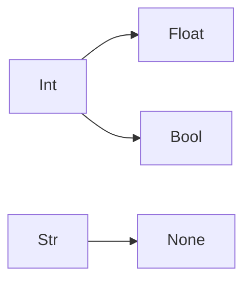
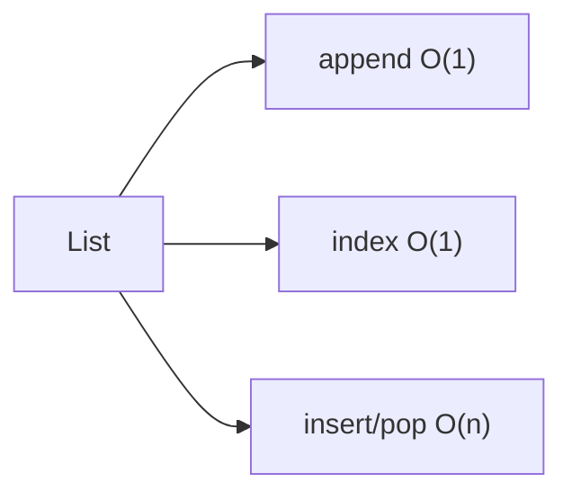
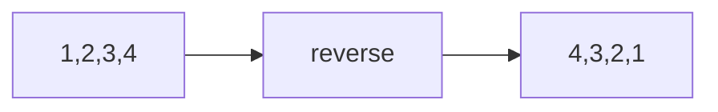
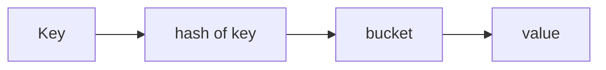
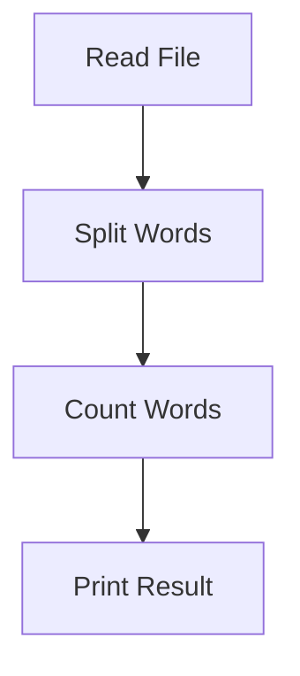
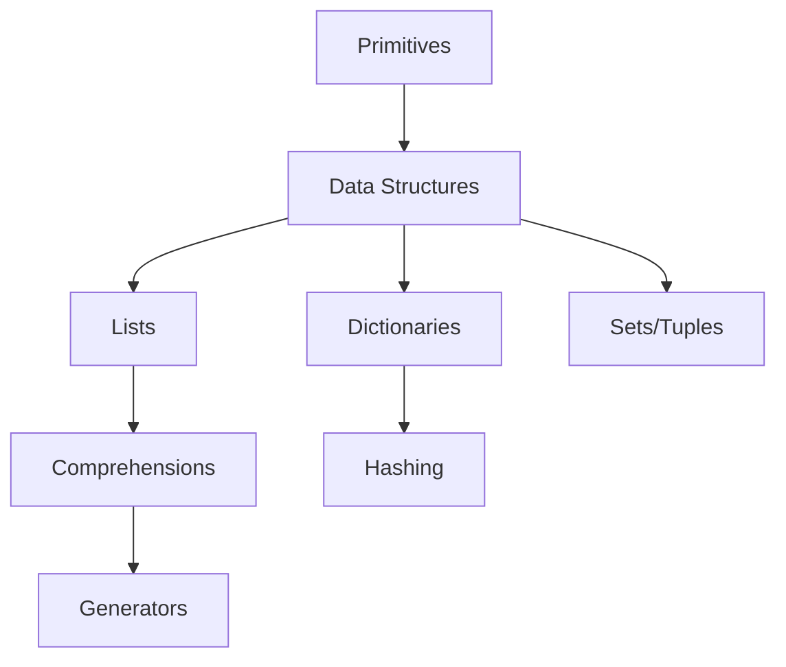

# Python Basics

📄 File: `book/01_python_programming/02_python_basics.md`

This chapter teaches the essential Python concepts every AI data engineer must know. It's written for beginners but includes notes and insights that scale to production work.

---

## Study Plan (2 weeks)

**Week 1**

* Day 1–2: Primitives, variables
* Day 3–4: Lists, dictionaries
* Day 5–6: Sets, tuples
* Day 7: Control flow + exercises

**Week 2**

* Day 1–2: Functions + exercises
* Day 3–4: File I/O + small scripts
* Day 5–6: Error handling + mini project
* Day 7: Mixed exercises + revision

---

## 1 — What you'll learn

* Python syntax and primitives
* Built-in data structures (list, dict, set, tuple)
* Control flow and functions
* File I/O and simple scripting
* Small, practical exercises to build muscle memory

---

## 2 — Primitives & Variables

### Core types

* `int`, `float`, `str`, `bool`, `None`

```python
x = 10           # int
pi = 3.1415      # float
name = "Sourav" # str
ok = True        # bool
n = None         # NoneType
```

### Diagram — Primitives



---

## 3 — Lists (Ordered, Mutable)

### Basics

```python
lst = [1, 2, 3]
lst.append(4)
val = lst[0]
```

### Important operations (and complexity)

* Indexing: `O(1)`
* Append (amortized `O(1)`)
* Insert/pop at front: `O(n)`

### Diagram — List behavior



### Exercises — Lists

1. Reverse a list
   Input:

```python
lst = [1,2,3,4]
```

Output:

```python
[4,3,2,1]
```

Hint: slicing `[::-1]`

Example solution (with comments):

```python
lst = [1,2,3,4]
rev = lst[::-1]   # creates a new list by stepping -1 (reverse)
print(rev)
```



2. Remove duplicates
   Input:

```python
[1,2,2,3]
```

Output:

```python
[1,2,3]
```

Hint: set or seen loop

Example solution:

```python
lst = [1,2,2,3]
seen = set()          # set stores unique items
out = []
for x in lst:
    if x not in seen: # membership check is O(1) avg
        seen.add(x)
        out.append(x) # preserve order
print(out)
```

3. Flatten a list of lists
   Input:

```python
[[1,2],[3,4]]
```

Output:

```python
[1,2,3,4]
```

Hint: nested comprehension

Example solution:

```python
lst = [[1,2],[3,4]]
flat = [x for sub in lst for x in sub]  # iterate sublists, then elements
print(flat)
```

---

## 4 — Dictionaries (Hash maps)

### Basics

```python
user = {"name": "Sourav", "age": 31}
user["email"] = "sourav@example.com"
```

### Properties

* Average lookup/insert/delete: `O(1)`
* Key must be hashable (immutable types usually)

### Diagram — Dict lookup



### Exercises — Dictionaries

1. Merge two dictionaries
   Input:

```python
d1={"a":1}; d2={"b":2}
```

Output:

```python
{"a":1,"b":2}
```

Hint: `{**d1, **d2}`

Example solution:

```python
d1={"a":1}; d2={"b":2}
merged = {**d1, **d2}  # unpack both dicts into a new one
print(merged)
```

2. Word frequency
   Input:

```python
"hi hi bye"
```

Output:

```python
{"hi":2,"bye":1}
```

Hint: split + dict

Example solution:

```python
text = "hi hi bye"
freq = {}
for w in text.split():         # split string into words
    freq[w] = freq.get(w, 0) + 1  # get existing count or 0, then increment
print(freq)
```

3. First non-repeating character
   Input:

```python
"aabbc"
```

Output:

```python
"c"
```

Hint: count map

Example solution:

```python
s = "aabbc"
count = {}
for ch in s:
    count[ch] = count.get(ch, 0) + 1
for ch in s:
    if count[ch] == 1:  # first char with count 1
        print(ch)
        break
```

---

## 5 — Sets & Tuples

* **Set**: unordered, unique elements — good for membership checks (`O(1)` average).
* **Tuple**: immutable ordered collection — use for fixed records.

```python
s = {1,2,3}
if 2 in s: print("present")
pt = (10, 20)
```

### Exercises — Sets & Tuples

1. Membership check
   Input:

```python
s={1,2,3}
```

Output:

```python
True (for 2 in s)
```

Example solution:

```python
s = {1,2,3}
print(2 in s)  # O(1) average membership via hashing
```

2. Remove duplicates using set
   Input:

```python
[1,1,2,3]
```

Output:

```python
[1,2,3]
```

Example solution:

```python
lst = [1,1,2,3]
unique = list(set(lst))  # set removes duplicates (order not preserved)
print(unique)
```

---

## 6 — Control Flow & Comprehensions

### If / For / While

```python
if x > 0:
    print("positive")

for i in range(5):
    print(i)
```

### Comprehensions (pythonic)

```python
squares = [i*i for i in range(10) if i % 2 == 0]
```

### Exercises — Control Flow

1. Count vowels
   Input:

```python
"hello"
```

Output:

```python
2
```

Example solution:

```python
s = "hello"
vowels = set("aeiou")
cnt = 0
for ch in s:
    if ch in vowels:  # membership check in set is fast
        cnt += 1
print(cnt)
```

2. Palindrome check
   Input:

```python
"madam"
```

Output:

```python
True
```

Example solution:

```python
s = "madam"
print(s == s[::-1])  # compare string with its reverse
```

---

## 7 — Functions & Scope

```python
def add(a, b=0):
    return a + b
```

### Exercises — Functions

1. Factorial
   Input:

```python
5
```

Output:

```python
120
```

Example solution:

```python
def fact(n):
    res = 1
    for i in range(1, n+1):  # multiply 1..n
        res *= i
    return res

print(fact(5))
```

---

## 8 — File I/O & Small Scripts

```python
with open('data.txt') as f:
    for line in f:
        print(line.strip())
```

### Exercises — File I/O

1. Count lines
   Input: file with 3 lines
   Output: `3`

Example solution:

```python
cnt = 0
with open('data.txt') as f:
    for _ in f:     # iterate each line
        cnt += 1
print(cnt)
```

---

## 9 — Error Handling & Logging

```python
import logging
logging.basicConfig(level=logging.INFO)
```

---

## 10 — Small, Practical Examples

### Example 1 — Word count (small script)

```python
text = "hi hi bye"
words = text.split()
freq = {}
for w in words:
    freq[w] = freq.get(w, 0) + 1
print(freq)
```

### Example 2 — Read file and print lines

```python
with open('data.txt') as f:
    for line in f:
        print(line.strip())
```

---

## 11 — Mini Project (Step-by-step)

### Word Frequency Analyzer

Build a small script using only concepts learned in this chapter.

#### Step 1 — Read file

```python
with open('file.txt') as f:
    text = f.read()
```

#### Step 2 — Split words

```python
words = text.split()
```

#### Step 3 — Count words

```python
freq = {}
for w in words:
    freq[w] = freq.get(w, 0) + 1
```

#### Step 4 — Print result

```python
print(freq)
```

#### Input Example

file.txt:

```
hi hi bye
```

#### Output

```python
{"hi": 2, "bye": 1}
```

### Diagram — Flow



---

## 12 — Mixed Exercises (Multi-topic)

1. Replace words using mapping
   Input:

```python
text="hi world"; m={"hi":"hello"}
```

Output:

```python
"hello world"
```

Example solution:

```python
text = "hi world"
m = {"hi":"hello"}
words = text.split()
words = [m.get(w, w) for w in words]  # replace if present in map
print(" ".join(words))
```

2. Group words by length
   Input:

```python
["hi","hello"]
```

Output:

```python
{2:["hi"],5:["hello"]}
```

Example solution:

```python
words = ["hi","hello"]
g = {}
for w in words:
    k = len(w)
    g.setdefault(k, []).append(w)  # create list if key missing, then append
print(g)
```

---

## 13 — Interview Questions (with answers)

1. Difference between list, tuple, set, and dictionary?

Answer:

* List → ordered, mutable
* Tuple → ordered, immutable
* Set → unordered, unique values
* Dict → key-value mapping, fast lookup

2. What is mutable vs immutable?

Answer:

* Mutable → can change (list, dict, set)
* Immutable → cannot change (int, str, tuple)

3. What is a list comprehension?

Answer:
A compact way to create lists in one line:

```python
[x*x for x in range(5)]
```

4. How does dictionary achieve O(1)?

Answer:
Uses hashing → key converted to hash → direct bucket lookup

5. Why use virtual environments?

Answer:
To isolate dependencies for each project and avoid conflicts

---

## 14 — Tips & Best Practices

* Prefer readability over clever tricks
* Use meaningful variable names
* Break code into small functions
* Use virtual environments for every project
* Handle errors using try/except
* Use logging instead of print for larger scripts

---

## Diagram cheat-sheet (key concepts)



---

## 15 — Next chapter

Proceed to:

**03_lists.md**
