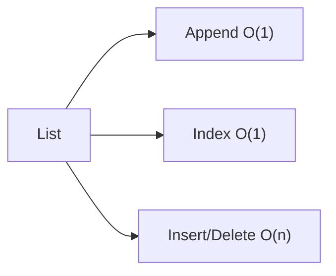
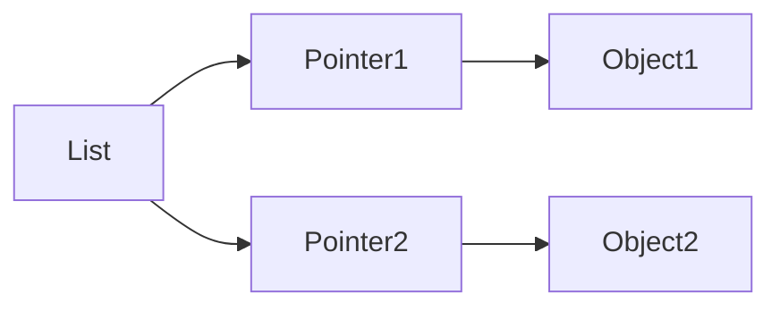
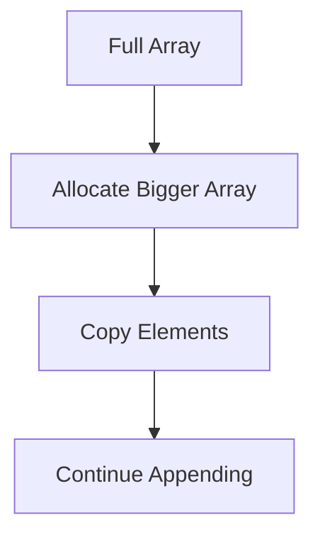

# Lists (Deep Dive)

📄 File: `book/01_python_programming/03_lists.md`

This chapter takes you from basic usage of lists to **how they work internally in Python (CPython)** and how to use them efficiently in real systems.

---

## Study Plan (3–4 days)

* Day 1: Basics + operations
* Day 2: Complexity + patterns
* Day 3: Internals + memory model
* Day 4: Exercises + mini project

---

## 1 — What is a List?

A Python list is a **dynamic array of object references**.

* Ordered
* Mutable
* Can hold mixed types

```python
lst = [1, "a", 3.14]
```

---

## 2 — Core Operations

```python
lst = [1, 2, 3]

lst.append(4)        # add at end
lst.pop()            # remove last
lst.insert(0, 10)    # insert at index
lst[1]               # access
```

### Complexity

| Operation       | Complexity |
| --------------- | ---------- |
| Index access    | O(1)       |
| Append          | O(1)*      |
| Insert (middle) | O(n)       |
| Delete          | O(n)       |

(*amortized)

---

## Diagram — List Operations



---

## 3 — How Lists Work Internally (Important)

A Python list is:

```text
Array of pointers → each pointer → PyObject
```

### Diagram — Memory Layout



### Key Insight

* List stores **references**, not actual values
* Allows mixed data types

---

## 4 — Dynamic Resizing

When list grows:

* Python allocates extra memory (over-allocation)
* Avoids frequent resizing

### Example

```python
lst = []
for i in range(1000):
    lst.append(i)
```

This is efficient because resizing is not done every time.

---

## Diagram — Resizing



---

## 5 — Slicing (Important Feature)

```python
lst = [1,2,3,4,5]
print(lst[1:4])
```

Output:

```python
[2,3,4]
```

### Internal Note

* Creates a **new list**
* Time complexity: O(n)

---

## 6 — Common Patterns

### Iteration

```python
for x in lst:
    print(x)
```

### Enumeration

```python
for i, val in enumerate(lst):
    print(i, val)
```

### List comprehension

```python
[x*x for x in lst]
```

---

## Exercises — Lists (with explanation)

### 1. Reverse a list

Input:

```python
[1,2,3,4]
```

Output:

```python
[4,3,2,1]
```

Solution:

```python
lst = [1,2,3,4]
rev = lst[::-1]   # slicing with step -1 reverses
print(rev)
```

---

### 2. Find second largest element

Input:

```python
[1,5,3,9]
```

Output:

```python
5
```

Solution:

```python
lst = [1,5,3,9]
lst_sorted = sorted(lst)  # creates new sorted list
print(lst_sorted[-2])     # second last element
```

---

### 3. Remove duplicates (preserve order)

Input:

```python
[1,2,2,3]
```

Output:

```python
[1,2,3]
```

Solution:

```python
lst = [1,2,2,3]
seen = set()
out = []
for x in lst:
    if x not in seen:
        seen.add(x)
        out.append(x)
print(out)
```

---

### 4. Rotate list by k steps

Input:

```python
lst = [1,2,3,4]
k = 1
```

Output:

```python
[4,1,2,3]
```

Solution:

```python
lst = [1,2,3,4]
k = 1
print(lst[-k:] + lst[:-k])  # slicing and concatenation
```

---

### 5. Flatten list

Input:

```python
[[1,2],[3,4]]
```

Output:

```python
[1,2,3,4]
```

Solution:

```python
lst = [[1,2],[3,4]]
flat = [x for sub in lst for x in sub]
print(flat)
```

---

## Mini Project — List Analyzer

Build a script that:

* Takes a list of numbers
* Finds:

  * max
  * min
  * average
  * unique elements

### Example

```python
lst = [1,2,2,3,4]

print(max(lst))
print(min(lst))
print(sum(lst)/len(lst))
print(list(set(lst)))
```

---

## Interview Questions (with answers)

1. Why is list append O(1)?
   Answer: Because of over-allocation and amortized resizing

2. Why is insert O(n)?
   Answer: Elements must shift

3. What is difference between list and array?
   Answer: Python list is dynamic and stores references

---

## Tips & Best Practices

* Avoid inserting at beginning frequently
* Use list comprehension for readability
* Be careful with large slicing (creates copy)

---

## Deep Practice — Operations, Complexity & Patterns (Guided)

This section builds deeper understanding. Each example explains **what happens internally**.

---

### Access List Item

```python
lst = [10, 20, 30]
print(lst[1])  # Access index 1
```

Explanation:

# Python directly accesses memory using index → O(1)

---

### Append to List

```python
lst = [1,2,3]
lst.append(4)  # Adds element at end
```

Explanation:

# Python appends at end; uses extra allocated space → O(1) amortized

---

### Insert at Beginning

```python
lst = [1,2,3]
lst.insert(0, 0)
```

Explanation:

# All elements shift right → O(n)

---

### Remove Element

```python
lst = [1,2,3,4]
lst.remove(3)
```

Explanation:

# Python scans list → O(n)

---

### Length of List

```python
lst = [1,2,3]
print(len(lst))
```

Explanation:

# Length stored internally → O(1)

---

### Sum of List

```python
lst = [1,2,3]
print(sum(lst))
```

Explanation:

# Iterates through all elements → O(n)

---

### Reverse List (Manual)

```python
lst = [1,2,3]
rev = []
for i in range(len(lst)-1, -1, -1):  # iterate backward
    rev.append(lst[i])
print(rev)
```

Explanation:

# Loop runs n times → O(n)

---

### Clone List

```python
lst = [1,2,3]
copy = lst[:]
```

Explanation:

# Creates new list → shallow copy → O(n)

---

### Check Element Exists

```python
lst = [1,2,3]
print(2 in lst)
```

Explanation:

# Linear search → O(n)

---

### Find Max

```python
lst = [1,5,3]
print(max(lst))
```

Explanation:

# Iterates all elements → O(n)

---

### Even Numbers from List

```python
lst = [1,2,3,4]
evens = [x for x in lst if x % 2 == 0]
print(evens)
```

Explanation:

# Loop + condition → O(n)

---

### Remove Duplicates (Order Preserved)

```python
lst = [1,2,2,3]
seen = set()
out = []
for x in lst:
    if x not in seen:   # O(1) check
        seen.add(x)
        out.append(x)
print(out)
```

Explanation:

# Uses set for fast lookup → overall O(n)

---

### Merge Two Lists

```python
l1 = [1,2]
l2 = [3,4]
print(l1 + l2)
```

Explanation:

# Creates new list → O(n+m)

---

### Intersection of Lists

```python
l1 = [1,2,3]
l2 = [2,3,4]
res = list(set(l1) & set(l2))
print(res)
```

Explanation:

# Convert to sets → fast intersection → O(n)

---

## Key Takeaways

* Access → O(1)
* Append → O(1) amortized
* Insert/Delete → O(n)
* Search → O(n)
* Copy/Slice → O(n)

👉 Understanding these is what makes you a **top 1% engineer**.

---

## Next Chapter

Proceed to:

**04_dictionaries.md**
