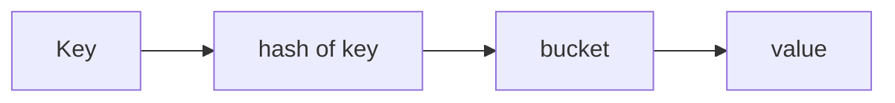
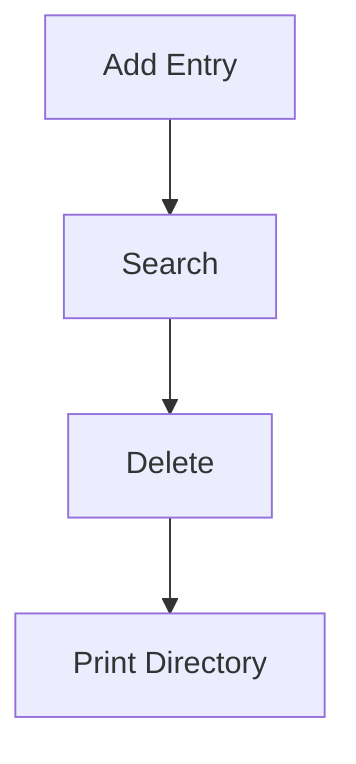

# Dictionaries (Deep Dive)

📄 File: `book/01_python_programming/04_dictionaries.md`

This chapter covers dictionaries from basics to **internals (hashing)** and how to use them efficiently in real systems.

---

## Study Plan (3–4 days)

* Day 1: Basics + operations
* Day 2: Patterns (frequency, grouping)
* Day 3: Internals (hashing, collisions)
* Day 4: Exercises + mini project

---

## 1 — What is a Dictionary?

A dictionary is a **hash table (key → value mapping)**.

* Unordered (insertion-ordered since Python 3.7)
* Mutable
* Fast lookup (average O(1))

```python
d = {"name": "Sourav", "age": 31}
```

---

## 2 — Core Operations

```python
d = {"a": 1}

d["b"] = 2          # insert/update
d.get("a")          # safe access (returns None if missing)
d.pop("a")          # remove key
"b" in d            # membership check (keys)
```

### Complexity

| Operation | Complexity |
| --------- | ---------- |
| Access    | O(1) avg   |
| Insert    | O(1) avg   |
| Delete    | O(1) avg   |
| Iterate   | O(n)       |

---

## Diagram — Dict Lookup



---

## 3 — Internals (Hashing & Collisions)

* Python computes `hash(key)` to find a bucket
* If collision occurs, Python probes other slots (open addressing)

### Key rules

* Keys must be **hashable** (immutable types like int, str, tuple)
* Average O(1), worst-case O(n) (rare)

---

## 4 — Common Patterns

### Frequency count

```python
text = "hi hi bye"
freq = {}
for w in text.split():
    freq[w] = freq.get(w, 0) + 1  # default 0 then increment
print(freq)
```

### Grouping

```python
words = ["hi", "hello", "ok"]
g = {}
for w in words:
    k = len(w)
    g.setdefault(k, []).append(w)  # create list if missing, then append
print(g)
```

---

## Exercises — Dictionaries (with inputs, outputs, hints & explained code)

### 1. Sort by Key

Input:

```python
d = {"b":2, "a":1}
```

Output:

```python
{"a":1, "b":2}
```

Solution:

```python
d = {"b":2, "a":1}

# d.items() → converts dictionary into list of (key, value) tuples
# Example: [("b",2), ("a",1)]

# sorted(...) → sorts tuples based on first element (key by default)
# Result: [("a",1), ("b",2)]

# dict(...) → converts sorted list of tuples back into dictionary
res = dict(sorted(d.items()))

print(res)
```

---

### 2. Handling Missing Keys

Input:

```python
count = {}
key = "a"
```

Output:

```python
0 (default)
```

Solution:

```python
count = {}

# get("a", 0)
# → tries to access key "a"
# → since "a" is not present, returns default value 0

print(count.get("a", 0))
```

---

### 3. Find Sum of All Values

Input:

```python
d = {"a":1, "b":2}
```

Output:

```python
3
```

Solution:

```python
d = {"a":1, "b":2}

# d.values() → returns all values in dictionary [1,2]
# sum(...) → iterates through all elements and adds them
# Time complexity: O(n)

print(sum(d.values()))
```

---

### 4. Merge Two Dictionaries

Input:

```python
d1 = {"a":1}; d2 = {"b":2}
```

Output:

```python
{"a":1, "b":2}
```

Solution:

```python
# **d1 → unpack dictionary d1 into key-value pairs
# **d2 → unpack dictionary d2
# Later values overwrite earlier ones if keys clash

res = {**d1, **d2}

print(res)
```

---

### 5. Remove a Key

Input:

```python
d = {"a":1, "b":2}
```

Output:

```python
{"b":2}
```

Solution:

```python
d = {"a":1, "b":2}

# pop("a") → removes key "a" and returns its value
# If key not present → raises KeyError

removed_value = d.pop("a")

print(d)
```

---

### 6. Replace Words Using Dictionary

Input:

```python
text = "hi world"; m = {"hi":"hello"}
```

Output:

```python
"hello world"
```

Solution:

```python
# Step 1: split string into words
words = text.split()

# Step 2: replace words using dictionary
# m.get(w, w)
# → if w exists in dictionary, return mapped value
# → otherwise return original word
words = [m.get(w, w) for w in words]

# Step 3: join words back into string
print(" ".join(words))
```

---

### 7. Count Frequencies (Core Pattern)

Input:

```python
["a","b","a"]
```

Output:

```python
{"a":2, "b":1}
```

Solution:

```python
arr = ["a","b","a"]
freq = {}

# Loop through each element
for x in arr:
    # freq.get(x, 0)
    # → returns existing count OR 0 if not present
    # Then we increment count by 1
    freq[x] = freq.get(x, 0) + 1

print(freq)
```

---

### 8. Extract Values of a Key in Nested Data

Input:

```python
arr = [{"a":1},{"a":2}]
```

Output:

```python
[1,2]
```

Solution:

```python
# Iterate through list of dictionaries
# For each dictionary d, access key "a"

res = [d["a"] for d in arr]

print(res)
```

---

## Mini Project — Simple Phone Directory

Build a dictionary-based phone directory.

### Steps

```python
d = {}

# add entries
d["alice"] = "123"
d["bob"] = "456"

# search
name = "alice"
print(d.get(name, "not found"))

# delete
d.pop("bob")

print(d)
```

### Diagram



---

## Deep Practice — Operations & Complexity (Explained)

### Access

```python
print(d["a"])  # hash lookup → O(1)
```

### Insert

```python
d["x"] = 10  # compute hash, place in bucket → O(1)
```

### Iterate

```python
for k, v in d.items():
    pass  # visits all elements → O(n)
```

### Collision (concept)

```text
Two keys → same hash → probe next slot
```

---

## Key Takeaways

* Dict = hash table
* O(1) average operations
* Use `get()` to avoid KeyError
* Use `setdefault()` for grouping

---

## Interview Questions (with answers)

1. Why is dictionary O(1)?
   Answer: hashing → direct bucket access

2. What causes collisions?
   Answer: different keys with same hash value

3. Why keys must be immutable?
   Answer: hash must remain constant

---

## Detailed Time & Space Complexity — Dictionaries (In-depth)

This section explains **time and space complexity** for dictionary operations in detail, with examples and line-by-line commentary so you understand both *what the code does* and *how CPython implements it*.

---

### Overview: why complexity matters

* **Time complexity** tells you how runtime grows with input size `n`.
* **Space complexity** tells you how much memory grows with `n`.
* For hash tables (Python dicts), average-case time is **O(1)** for access/insert/delete, but the **space cost** and worst-case time can be significant and important in systems.

---

### 1) Access / Lookup — `d[key]` and `d.get(key)`

**Time:** Average **O(1)**. Worst-case **O(n)** (hash collisions or degenerate hash function).

**Space:** No additional space beyond the dictionary storage.

**Why (how it works):**

1. CPython computes `h = hash(key)` (O(1) for built-in hashable types).
2. It maps `h` to an index in the internal table (bucket).
3. If that bucket contains the same key, value is returned immediately.
4. If there is a collision, CPython probes other buckets (open addressing) until it finds the key or an empty slot.

**Example:**

```python
# Access example
d = {i: str(i) for i in range(1000)}  # build dict of 1000 items
print(d.get(500))  # O(1) average — computes hash, jumps to bucket, reads value
```

**Commentary (line-by-line):**

* `hash(key)` is a small, constant-time operation for ints/strings.
* Direct table index lookup is O(1).
* Only when many keys hash to the same bucket do we probe more slots → worst-case O(n).

---

### 2) Insert / Update — `d[key] = value`

**Time:** Average **O(1)**. Occasionally O(n) during a resize.

**Space:** May allocate more memory when table grows (see resizing & load factor).

**Why (how it works):**

* Insert computes `hash(key)` and finds a free slot via probing and writes a pointer to the key and a pointer to the value into the table.
* If table is too full (load factor threshold exceeded), CPython allocates a larger table and re-inserts all entries (rehash), which takes O(n) time for that operation. Because rehash happens rarely, amortized cost remains O(1).

**Example:**

```python
d = {}
for i in range(10000):
    d[i] = i  # mostly O(1), some iterations will trigger a rehash (O(n) cost on that step)
```

**Commentary:**

* Each item stored is two pointers (key and value) plus the table slot metadata.
* Rehash cost is why bursts of inserts can cause a spike; for steady-state throughput, amortized cost is constant.

---

### 3) Delete — `d.pop(key)` / `del d[key]`

**Time:** Average **O(1)**. Worst-case **O(n)** if collisions cascade.

**Space:** Does not shrink the internal table immediately in CPython; the slot becomes a "dummy" entry until periodic resizing/grow/shrink policies.

**Why:**

* Delete finds the key via hash and probing and marks the slot deleted.
* Marking ensures probes relying on that slot still work correctly (tombstone technique). Reclaiming space fully may require later compaction.

**Example:**

```python
d = {i: i for i in range(1000)}
val = d.pop(10)
```

**Commentary:**

* Deleting many keys does not instantly free and shrink the table; the dict may keep the allocated table, so memory stays used until a resize policy triggers.

---

### 4) Iterate — `for k in d`, `d.items()`, `d.values()`

**Time:** **O(n)** to visit `n` items.

**Space:** `d.items()` returns a view (O(1) extra) in Python 3 — but converting to a list `list(d.items())` is **O(n)** space.

**Why:**

* Iteration reads each occupied slot once. The iterator walks the internal table and yields key/value pairs.

**Example:**

```python
for k, v in d.items():
    # process pair — overall O(n)
    pass
```

**Commentary:**

* If you need a concrete list of pairs, converting to `list(d.items())` creates O(n) extra memory.

---

### 5) Space Complexity Overview

**Basic:** Storing `n` key-value pairs requires **O(n)** space.

**But:** the *constant factor* can be high:

* The dict stores a sparse array of slots (table) sized larger than `n` to keep load factor low.
* Each slot stores references (pointers) to the key and value objects (and sometimes cached hashes), not the raw data.
* Keys and values themselves are full Python objects stored elsewhere — the dict only holds references.

**Implication:**

* A dictionary of `n` small integers still uses more memory than a compact C array of `n` ints because of object overhead and pointers.

**Practical note:**

* Use `__slots__`, arrays, NumPy, or specialized libraries when you need dense, memory-efficient storage for large collections (millions of items).

---

### 6) Load Factor and Resizing (Practical effect on time & space)

* CPython keeps a load factor (ratio of used slots to table size) that triggers resizing when exceeded.
* Resizing increases table size (usually ~2× or so) and re-inserts items — this takes O(n) time and O(n) extra temporary memory during rehash.

**Best practice:**

* If you can estimate number of items ahead of time, pre-size by inserting into a dict in a controlled way or building from a sequence (e.g., using `dict.fromkeys()` or comprehensions) to avoid multiple resizes.

---

### 7) Worst-case scenarios & security

* If an attacker supplies many keys with the same hash (hash collision attack), operations can degrade to **O(n)**. Modern Python versions use randomized hash seeds to mitigate simple collisions, but pathological cases exist.

* For cryptographic safety or adversarial environments, consider alternative data structures or using keyed hashing.

---

### 8) Examples comparing dict vs list for membership

**Membership using list** — O(n):

```python
lst = list(range(100000))
# membership test
print(99999 in lst)  # must scan potentially whole list → O(n)
```

**Membership using dict/set** — O(1) average:

```python
s = set(range(100000))
print(99999 in s)  # hash lookup → O(1)
```

**Commentary:**

* For frequent membership tests, prefer `set`/`dict` (O(1)) over list (O(n)).

---

### 9) Common operations & their complexities (summary)

| Operation                         |                                               Time |                       Space (extra) |
| --------------------------------- | -------------------------------------------------: | ----------------------------------: |
| Lookup `d[key]`                   |                               Avg O(1), Worst O(n) |                                O(1) |
| Insert `d[key]=v`                 | Avg O(1), Amortized O(1), resize occasionally O(n) |    O(1) (may allocate larger table) |
| Delete `d.pop(key)`               |                                           Avg O(1) |            O(1) (table slot marked) |
| Iterate `for k in d`              |                                               O(n) | O(1) (views) or O(n) if list() used |
| Convert to list `list(d.items())` |                                               O(n) |                                O(n) |
| Sort items `sorted(d.items())`    |                                         O(n log n) |                                O(n) |

---

### 10) Measuring in practice (how you can test)

Use `timeit` for small benchmarks, but remember microbenchmarks are affected by CPU cache, memory layout, and Python interpreter details. Example:

```python
import timeit
setup = "d = {i:i for i in range(10000)}"
stmt = "d.get(5000)"
print(timeit.timeit(stmt, setup=setup, number=100000))
```

This shows average lookup times — but doesn’t show occasional rehash spikes.

---

### Final recommendations

* Use `dict`/`set` for membership and mapping tasks (O(1) average).
* Beware memory overhead when storing millions of items — consider specialized structures (NumPy arrays, arrays, or custom C extensions).
* When performance matters, measure (profile) and, if needed, switch to more memory-efficient or lower-level representations.

---

## Next Chapter

Proceed to:

**05_sets.md**
