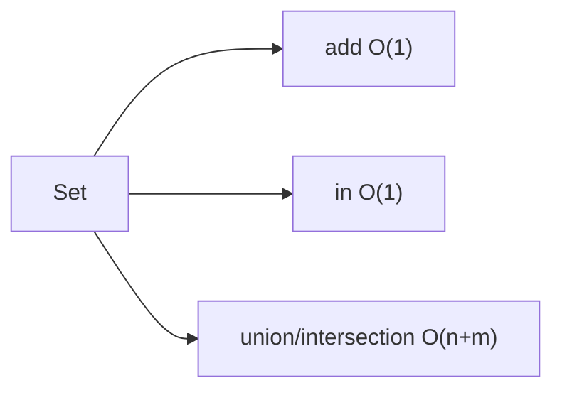
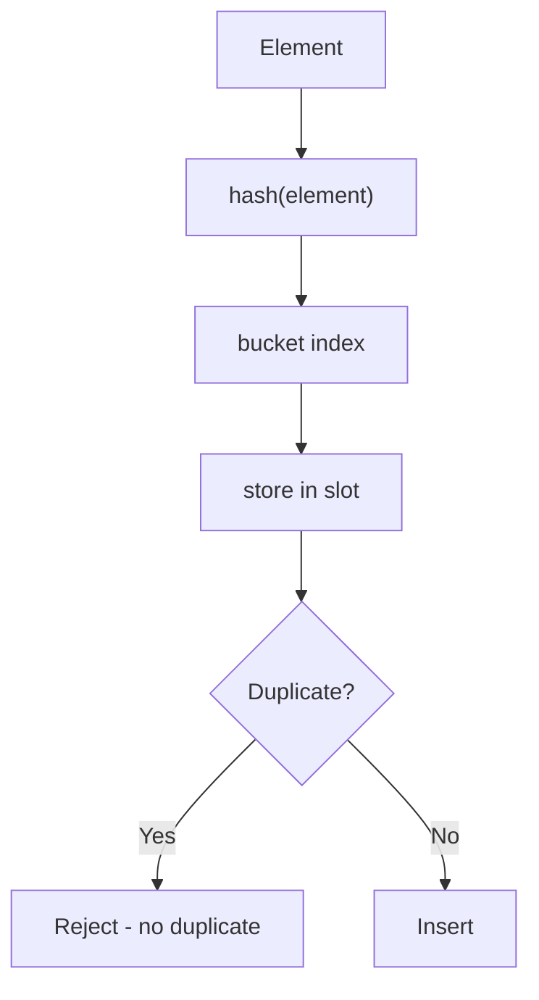
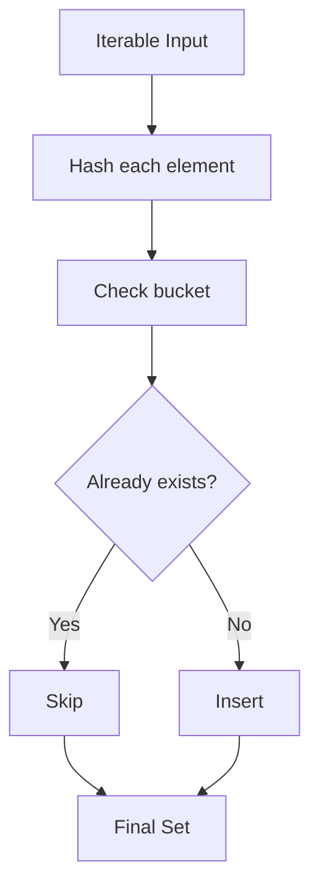
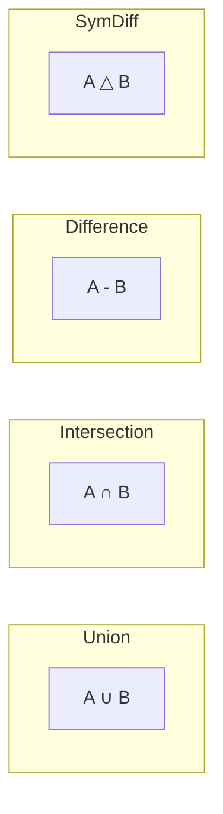

# Sets (Deep Dive)

📄 File: `book/01_python_programming/05_sets.md`

This chapter covers sets from basics to **internals (hash-based uniqueness)** and how to use them efficiently in real AI/data systems.

---

## Study Plan (2–3 days)

* Day 1: Basics + operations + complexity
* Day 2: Patterns (deduplication, membership, set algebra)
* Day 3: Internals + exercises + mini project

---

## 1 — What is a Set?

A Python set is a **mutable, unordered collection of unique hashable elements**.

* Unordered (no index-based access)
* Mutable (add/remove)
* No duplicates (automatic deduplication)
* Fast membership: O(1) average

```python
s = {1, 2, 3}
s.add(4)
```

---

## 2 — Core Operations

```python
s = {1, 2, 3}

s.add(4)           # add element (no-op if exists)
s.remove(2)        # remove (KeyError if missing)
s.discard(99)      # remove if exists (no error)
s.pop()            # remove and return arbitrary element
2 in s             # membership check O(1)
len(s)             # count elements O(1)
```

### Complexity

| Operation       | Complexity |
| --------------- | ---------- |
| Add             | O(1) avg   |
| Remove/Discard  | O(1) avg   |
| Membership `in` | O(1) avg   |
| Union/Intersection | O(n+m) |
| Iterate         | O(n)       |

---

## Diagram — Set Operations



---

## 3 — How Sets Work Internally

A Python set is a **hash table** (similar to dict, but keys only, no values).



### Key Insight

* Elements must be **hashable** (immutable: int, str, tuple, frozenset)
* Lists and dicts cannot be set elements (unhashable)

---

## 4 — Set Creation

```python
# From literal
s1 = {1, 2, 3}

# From iterable (removes duplicates)
s2 = set([1, 2, 2, 3])   # → {1, 2, 3}

# Empty set (NOT {} - that's empty dict!)
s3 = set()

# From string (unique chars)
s4 = set("hello")        # → {'h', 'e', 'l', 'o'}
```

---

## Diagram — Set Creation Flow



---

## 5 — Set Algebra (Critical for Data Engineering)

```python
a = {1, 2, 3}
b = {2, 3, 4}

# Union: all elements in either set
a | b          # {1, 2, 3, 4}
a.union(b)     # same

# Intersection: elements in both
a & b          # {2, 3}
a.intersection(b)

# Difference: in a but not in b
a - b          # {1}
a.difference(b)

# Symmetric difference: in exactly one
a ^ b          # {1, 4}
a.symmetric_difference(b)
```

---

## Diagram — Set Algebra



---

## 6 — Common Patterns

### Deduplication (preserve order with dict)

```python
# Simple dedup - order not guaranteed
lst = [1, 2, 2, 3, 1]
unique = list(set(lst))   # order may change!

# Dedup preserving order (Python 3.7+)
seen = set()
out = []
for x in lst:
    if x not in seen:     # O(1) check
        seen.add(x)
        out.append(x)
# out = [1, 2, 3]
```

### Fast membership (vs list)

```python
# List: O(n) - slow for large n
allowed = [1, 2, 3, 4, 5]
if 3 in allowed:  # scans entire list

# Set: O(1) - instant
allowed = {1, 2, 3, 4, 5}
if 3 in allowed:  # hash lookup
```

### Find common elements

```python
list_a = [1, 2, 3]
list_b = [2, 3, 4]
common = set(list_a) & set(list_b)   # {2, 3}
```

---

## 7 — Frozenset (Immutable Set)

```python
# Frozenset: immutable, hashable - can be dict key or set element
fs = frozenset([1, 2, 3])
d = {fs: "value"}   # valid!
s = {fs}            # set of frozensets
```

---

## Exercises — Sets (with inputs, outputs, hints & explained code)

### 1. Remove Duplicates from List

**Input:**
```python
lst = [1, 2, 2, 3, 1, 4]
```

**Output:**
```python
[1, 2, 3, 4]  # order preserved
```

**Solution:**
```python
lst = [1, 2, 2, 3, 1, 4]

# seen: tracks which elements we've already added
seen = set()

# out: result list with unique elements in order
out = []

for x in lst:
    # O(1) membership check - set is hash table
    if x not in seen:
        seen.add(x)      # mark as seen
        out.append(x)    # add to result

print(out)  # [1, 2, 3, 4]
```

---

### 2. Two Lists — Common Elements

**Input:**
```python
a = [1, 2, 3, 4]
b = [3, 4, 5, 6]
```

**Output:**
```python
{3, 4}
```

**Solution:**
```python
a = [1, 2, 3, 4]
b = [3, 4, 5, 6]

# Convert to sets → intersection is O(min(len(a), len(b)))
common = set(a) & set(b)

print(common)  # {3, 4}
```

---

### 3. Elements in A but Not in B

**Input:**
```python
a = [1, 2, 3, 4]
b = [3, 4, 5]
```

**Output:**
```python
{1, 2}
```

**Solution:**
```python
a = [1, 2, 3, 4]
b = [3, 4, 5]

# Set difference: elements in a that are not in b
diff = set(a) - set(b)

print(diff)  # {1, 2}
```

---

## Interview Questions

1. When would you use a set instead of a list?
2. Why can't you put a list inside a set?
3. What is the time complexity of `x in set` vs `x in list`?
4. Explain frozenset and when to use it.

---

## Mini Project

Build a **log analyzer** that:
* Reads a log file
* Extracts unique IP addresses (use set)
* Counts unique users per hour
* Uses set operations to find IPs that appeared in multiple hours

---

## Key Takeaways

* Set = hash table, O(1) add/remove/membership
* Use for deduplication, fast lookup, set algebra
* Elements must be hashable
* Frozenset for immutable, hashable sets

👉 Sets are essential for **data deduplication** and **fast membership checks** in AI pipelines.

---

## Next Chapter

Proceed to: **06_tuples.md**
