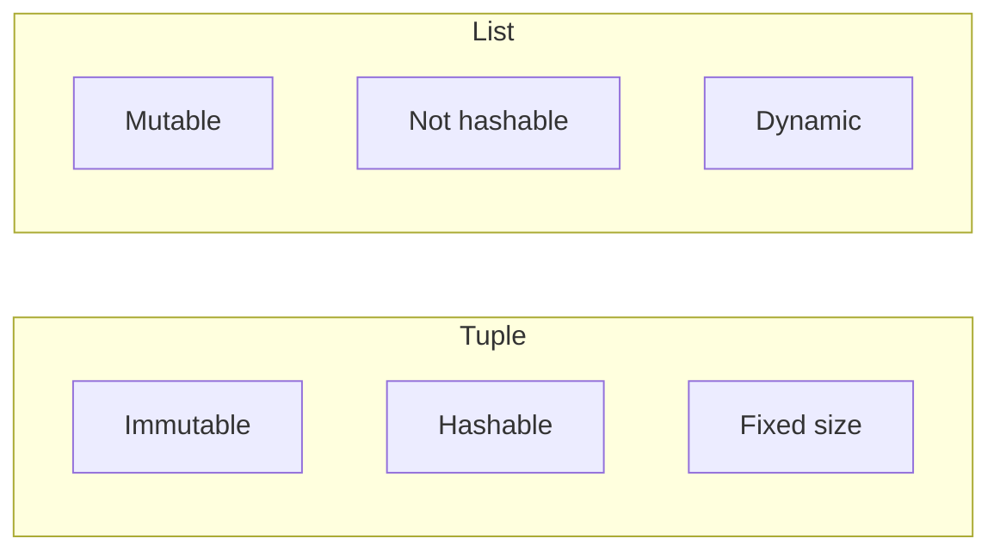
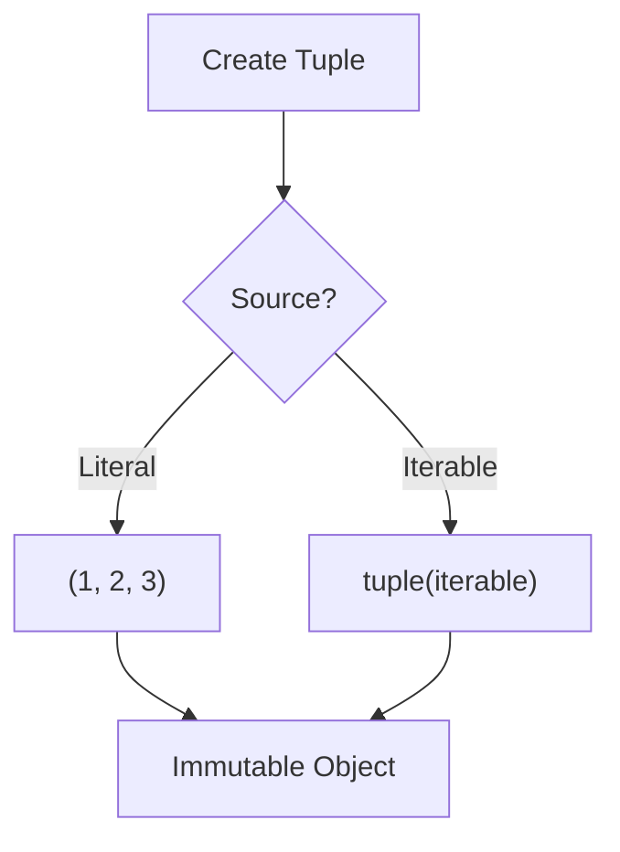
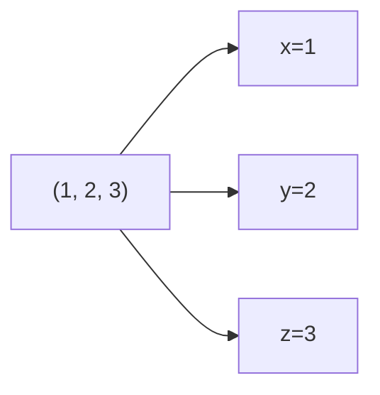

# Tuples (Deep Dive)

📄 File: `book/01_python_programming/06_tuples.md`

This chapter covers tuples from basics to **internals (immutability, hashability)** and how to use them efficiently in real systems.

---

## Study Plan (2 days)

* Day 1: Basics + operations + when to use
* Day 2: Unpacking, named tuples, exercises

---

## 1 — What is a Tuple?

A Python tuple is an **immutable, ordered sequence of elements**.

* Ordered (index-based access)
* Immutable (cannot add/remove/change after creation)
* Hashable (if all elements are hashable) → can be dict key, set element
* Fixed size after creation

```python
t = (1, 2, 3)
t[0]   # 1
```

---

## 2 — Core Operations

```python
t = (1, 2, 3)

t[0]              # access by index O(1)
t[1:3]            # slice → new tuple (2, 3)
len(t)            # length O(1)
2 in t            # membership O(n)
t + (4,)          # concatenation → new tuple
t * 2             # repeat → (1,2,3,1,2,3)
```

### Complexity

| Operation   | Complexity |
| ----------- | ---------- |
| Index access| O(1)       |
| Slice       | O(k)       |
| Membership  | O(n)       |
| Concatenate | O(n+m)     |

---

## Diagram — Tuple vs List



---

## 3 — Why Immutability Matters

```python
# Tuple can be dict key (hashable)
locations = {
    (40.7, -74.0): "New York",
    (37.7, -122.4): "San Francisco",
}

# Tuple can be set element
coords = {(1, 2), (3, 4)}

# List cannot - unhashable
# {(1, 2): "x"}  # OK
# {[1, 2]: "x"}  # TypeError!
```

---

## 4 — Tuple Creation

```python
# Parentheses (comma makes the tuple!)
t1 = (1, 2, 3)
t2 = 1, 2, 3      # same - parentheses optional

# Single element - need trailing comma!
t3 = (1,)         # (1,) - tuple
t4 = (1)          # 1 - just int, not tuple!

# From iterable
t5 = tuple([1, 2, 3])
t6 = tuple("abc")  # ('a', 'b', 'c')
```

---

## Diagram — Tuple Creation



---

## 5 — Unpacking (Critical Pattern)

```python
# Basic unpacking
x, y, z = (1, 2, 3)
# x=1, y=2, z=3

# Swap variables (no temp needed!)
a, b = 1, 2
a, b = b, a   # a=2, b=1

# Ignore values with _
first, _, third = (1, 2, 3)

# * rest - capture remaining
first, *rest = (1, 2, 3, 4)
# first=1, rest=[2, 3, 4]
```

---

## Diagram — Unpacking Flow



---

## 6 — Named Tuples (Better Readability)

```python
from collections import namedtuple

# Define a structure with named fields
Point = namedtuple('Point', ['x', 'y'])
p = Point(10, 20)

# Access by name (not just index)
print(p.x)   # 10
print(p.y)   # 20
print(p[0])  # 10 - index still works
```

---

## 7 — When to Use Tuples vs Lists

| Use Tuple When              | Use List When                |
| --------------------------- | ----------------------------- |
| Immutable data (coords)     | Need to append/remove         |
| Dict keys, set elements     | Order matters + mutability    |
| Function return multiple    | Building collection over time |
| Unpacking                   | In-place modification        |

---

## Exercises — Tuples (with inputs, outputs, hints & explained code)

### 1. Swap Two Variables

**Input:**
```python
a, b = 5, 10
```

**Output:**
```python
a=10, b=5
```

**Solution:**
```python
a, b = 5, 10

# Tuple unpacking: right side evaluated first, then assigned
a, b = b, a

print(a, b)  # 10 5
```

---

### 2. Return Multiple Values from Function

**Input:** Function that computes min and max of a list.

**Output:**
```python
(min_val, max_val)
```

**Solution:**
```python
def min_max(lst):
    # Tuple return - caller can unpack
    return (min(lst), max(lst))

lst = [3, 1, 4, 1, 5]
lo, hi = min_max(lst)
print(lo, hi)  # 1 5
```

---

### 3. Use Tuple as Dict Key

**Input:** Store counts for (user_id, date) pairs.

**Solution:**
```python
# Tuple is hashable → valid dict key
counts = {}
counts[(101, "2025-01-01")] = 5
counts[(101, "2025-01-02")] = 3

# Lookup
print(counts[(101, "2025-01-01")])  # 5
```

---

## Interview Questions

1. Why is `(1)` not a tuple?
2. When would you use tuple instead of list?
3. What makes a tuple hashable?
4. Explain tuple unpacking with `*rest`.

---

## Key Takeaways

* Tuple = immutable, ordered, hashable (if elements are)
* Use for fixed data, dict keys, multiple return values
* Unpacking: `x, y = t` or `first, *rest = t`
* Named tuples for readable structured data

👉 Tuples are essential for **coordinate data**, **dict keys**, and **multi-value returns** in data pipelines.

---

## Next Chapter

Proceed to: **07_memory_model.md**
