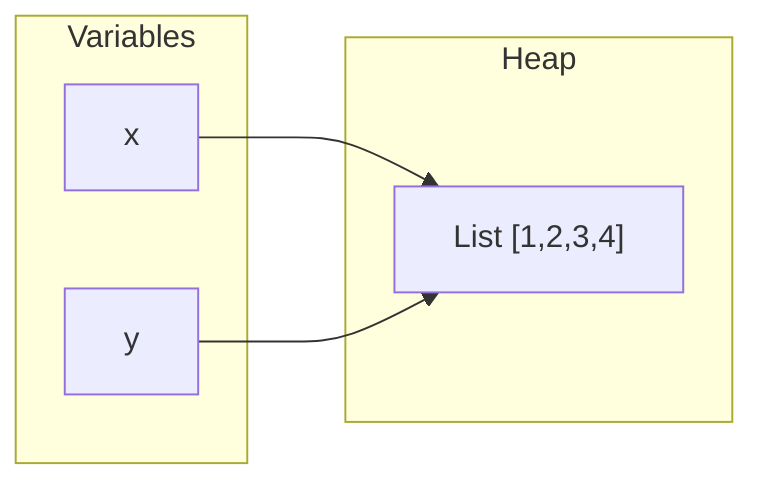
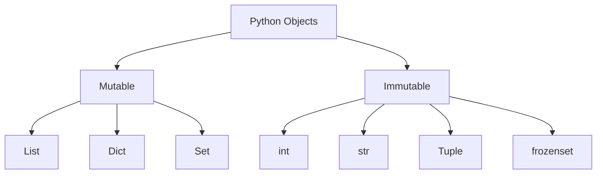
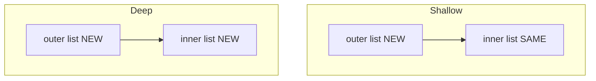
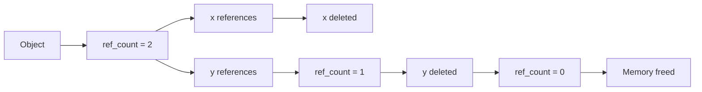

# Python Memory Model (Deep Dive)

📄 File: `book/01_python_programming/07_memory_model.md`

This chapter explains **how Python manages memory** — variables, references, and objects. Critical for understanding performance and debugging.

---

## Study Plan (2–3 days)

* Day 1: Variables, references, objects
* Day 2: id(), is vs ==, mutability
* Day 3: Implications for data engineering

---

## 1 — Variables Are References

In Python, **variables do not store values**. They store **references** (pointers) to objects.

```python
x = [1, 2, 3]   # x refers to a list object
y = x           # y refers to SAME object (not a copy!)
y.append(4)     # modifies the shared object
print(x)        # [1, 2, 3, 4] - x sees the change!
```

---

## Diagram — Reference Model



---

## 2 — id() and Object Identity

```python
a = [1, 2, 3]
b = a
c = [1, 2, 3]

print(id(a) == id(b))   # True - same object
print(id(a) == id(c))   # False - different objects
print(a == c)           # True - same value
```

### Key Insight

* `id(x)` returns the memory address (unique per object)
* `is` checks identity (same object)
* `==` checks value equality

---

## Diagram — id() and References

```mermaid
flowchart TD
    A["a = [1,2,3]"] --> B["Object at 0x7f8a..."]
    C["b = a"] --> B
    D["c = [1,2,3]"] --> E["Object at 0x7f9b..."]
    B -.->|id(a) == id(b)| F[Same]
    B -.->|id(a) != id(c)| G[Different]
```

---

## 3 — is vs ==

```python
# is: same object in memory
# ==: same value

x = [1, 2]
y = [1, 2]
z = x

print(x == y)   # True - same contents
print(x is y)   # False - different objects
print(x is z)   # True - same object

# Use 'is' for None (idiomatic)
if val is None:
    ...
```

---

## 4 — Mutable vs Immutable



### Immutable: New Object on "Change"

```python
s = "hello"
s = s + "!"   # Creates NEW string, s now refers to it
# Original "hello" may be garbage collected
```

### Mutable: In-Place Modification

```python
lst = [1, 2, 3]
lst.append(4)   # Same object, modified in place
```

---

## 5 — Shallow vs Deep Copy

```python
import copy

original = [[1, 2], [3, 4]]

# Shallow copy: new list, but inner lists are shared!
shallow = original.copy()
shallow[0].append(99)   # Modifies original[0] too!

# Deep copy: completely independent
deep = copy.deepcopy(original)
deep[0].append(99)      # original unchanged
```

---

## Diagram — Shallow vs Deep Copy



---

## 6 — Why This Matters for Data Engineering

* **Large datasets**: Avoid accidental shared references → memory bloat
* **Parallel processing**: Each process needs its own copy
* **Caching**: Understand what you're caching (object vs reference)

```python
# BAD: shared default mutable
def append_to(val, lst=[]):   # lst is shared across calls!
    lst.append(val)
    return lst

# GOOD
def append_to(val, lst=None):
    if lst is None:
        lst = []
    lst.append(val)
    return lst
```

---

## 7 — Reference Counting (CPython)

Python uses **reference counting** + **cycle detector** for garbage collection.



---

## Exercises — Memory Model

### 1. Predict Output

```python
a = [1, 2]
b = a
b.append(3)
print(a)
```

**Answer:** `[1, 2, 3]` — a and b refer to same list.

---

### 2. Fix the Bug

```python
matrix = [[0] * 3] * 3   # Creates 3 refs to SAME row!
matrix[0][0] = 1
print(matrix)   # All rows show [1,0,0]
```

**Fix:**
```python
# Each row must be a new list
matrix = [[0] * 3 for _ in range(3)]
matrix[0][0] = 1   # Only first row changes
```

---

## Interview Questions

1. What is the difference between `is` and `==`?
2. Explain Python's reference model.
3. When do you need deep copy?
4. Why is `def f(lst=[])` dangerous?

---

## Key Takeaways

* Variables = references to objects
* `is` = identity, `==` = value
* Mutable default args are a common bug
* Shallow copy shares nested structures

👉 Understanding the memory model prevents subtle bugs in **data pipelines** and **caching layers**.

---

## Next Chapter

Proceed to: **08_slots.md**
