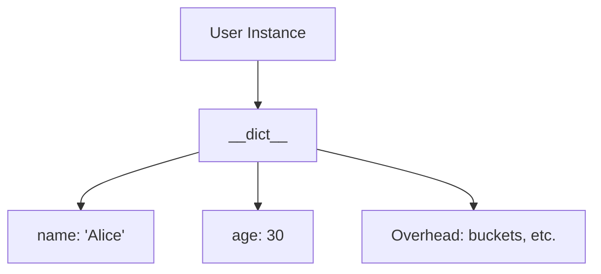
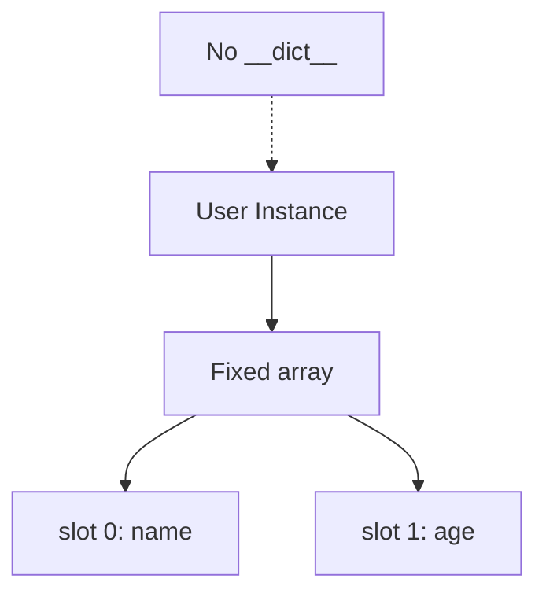
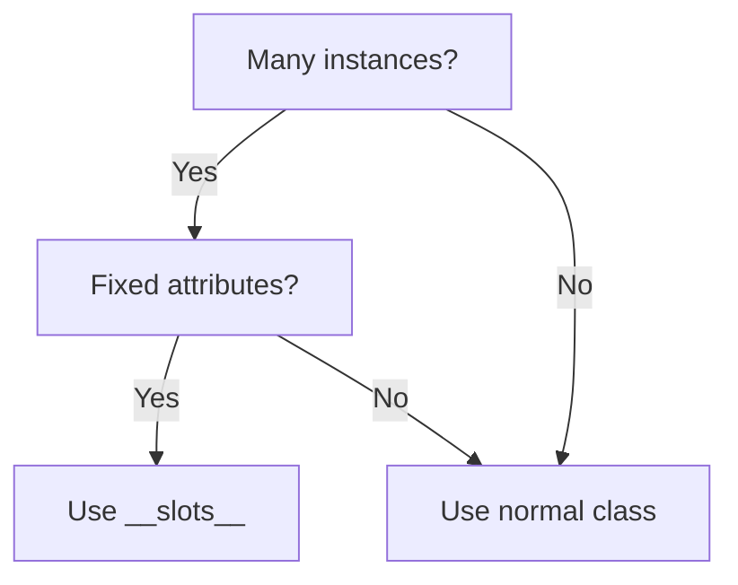

# __slots__ (Memory Optimization)

📄 File: `book/01_python_programming/08_slots.md`

This chapter covers `__slots__` — a Python feature that **reduces memory usage** for classes with many instances. Critical for data-heavy applications.

---

## Study Plan (1–2 days)

* Day 1: What __slots__ does, when to use
* Day 2: Benchmarks, trade-offs, exercises

---

## 1 — The Problem: __dict__ Overhead

By default, every Python object has a `__dict__` that stores attributes:

```python
class User:
    pass

u = User()
u.name = "Alice"
u.age = 30
# __dict__ = {"name": "Alice", "age": 30}
```

### Memory Cost

* Each instance has a dict (hash table)
* Dict has overhead: buckets, hashes, pointers
* For 1 million instances → significant memory

---

## Diagram — Default Object Layout



---

## 2 — __slots__: Fix Attribute Set

```python
class User:
    __slots__ = ("name", "age")   # Only these attributes allowed

u = User()
u.name = "Alice"
u.age = 30
# u.email = "a@b.com"  # AttributeError! Not in slots
```

### What Happens

* No `__dict__` created
* Attributes stored in a fixed-size array
* ~40–50% memory savings for many small instances

---

## Diagram — With __slots__



---

## 3 — Memory Comparison

```python
import sys

class WithDict:
    def __init__(self, x, y):
        self.x = x
        self.y = y

class WithSlots:
    __slots__ = ("x", "y")
    def __init__(self, x, y):
        self.x = x
        self.y = y

d = WithDict(1, 2)
s = WithSlots(1, 2)

print(sys.getsizeof(d))   # ~56 + dict overhead
print(sys.getsizeof(s))   # ~32 (smaller)
```

---

## 4 — Trade-offs

| Benefit              | Cost                        |
| -------------------- | --------------------------- |
| Less memory          | No dynamic attributes       |
| Faster attribute access | No __dict__              |
|                      | No multiple inheritance with slots |
|                      | Must declare all attributes  |

---

## 5 — When to Use __slots__

* **Data classes** with fixed schema (e.g., records, rows)
* **Many small instances** (millions of objects)
* **Performance-critical** attribute access

```python
# Good use case: event records in a stream
class Event:
    __slots__ = ("timestamp", "user_id", "action")
    def __init__(self, timestamp, user_id, action):
        self.timestamp = timestamp
        self.user_id = user_id
        self.action = action
```

---

## 6 — Inheritance with __slots__

```python
class Base:
    __slots__ = ("a",)

class Child(Base):
    __slots__ = ("b",)   # Add new slots, don't repeat "a"

c = Child()
c.a = 1
c.b = 2
```

---

## Diagram — __slots__ Decision Flow



---

## Interview Questions

1. What does __slots__ do?
2. When would you use __slots__?
3. What are the trade-offs?

---

## Key Takeaways

* __slots__ = fixed attribute set, no __dict__
* Saves memory for many small instances
* Use for data records, events, fixed-schema objects

👉 __slots__ matters when building **high-throughput data pipelines** with millions of objects.

---

## Next Chapter

Proceed to: **09_garbage_collection.md**
