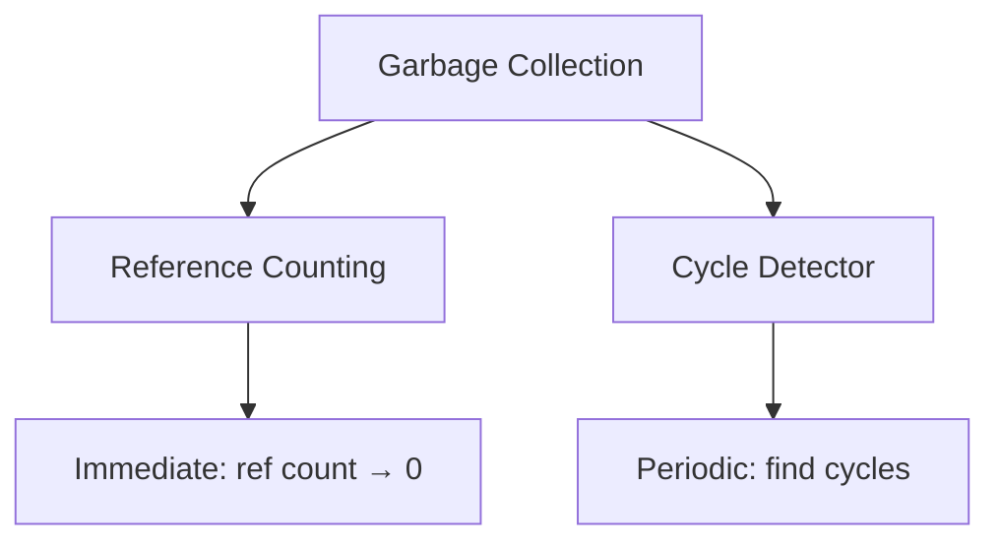
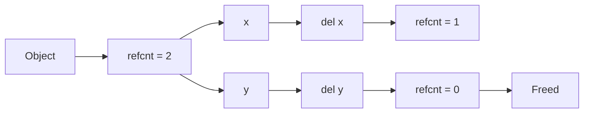
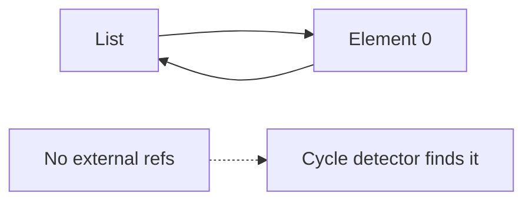
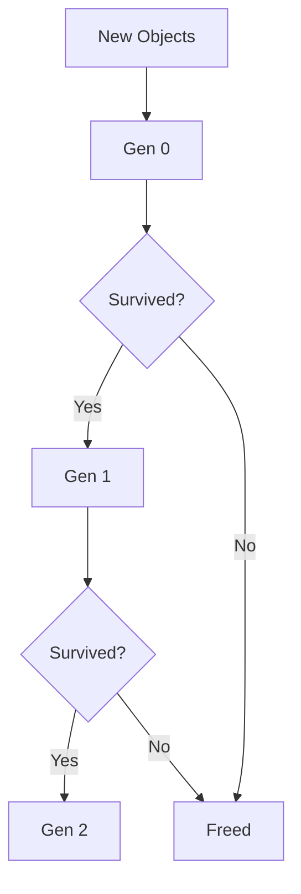

# Garbage Collection (Deep Dive)

📄 File: `book/01_python_programming/09_garbage_collection.md`

This chapter explains **how Python reclaims memory** — reference counting, cycle detection, and when to care.

---

## Study Plan (2 days)

* Day 1: Reference counting, cycles
* Day 2: gc module, tuning, implications

---

## 1 — Two Mechanisms

Python uses **two** garbage collection mechanisms:



---

## 2 — Reference Counting (Primary)

Every object has a `ob_refcnt`. When it reaches 0, memory is freed immediately.

```python
x = [1, 2, 3]   # refcnt = 1
y = x           # refcnt = 2
del x           # refcnt = 1
del y           # refcnt = 0 → freed
```

---

## Diagram — Reference Counting



---

## 3 — Reference Cycles (Problem)

Reference counting **cannot** free cycles:

```python
a = []
a.append(a)   # a references itself!
# refcnt of list = 1, never 0
del a         # No more references from outside, but list still exists
```

---

## Diagram — Reference Cycle



---

## 4 — Cycle Detector (Generational GC)

Python's `gc` module runs a **generational** garbage collector:

* **Generation 0**: New objects
* **Generation 1**: Survived one collection
* **Generation 2**: Long-lived

```python
import gc

# Manually trigger collection
gc.collect()

# Get counts per generation
print(gc.get_count())   # (gen0, gen1, gen2)
```

---

## Diagram — Generational GC



---

## 5 — When to Disable GC

For **short-lived, batch jobs** (e.g., ETL), you might disable GC to avoid pause times:

```python
import gc

gc.disable()   # No automatic GC
# ... run heavy batch ...
gc.enable()    # Re-enable
gc.collect()   # Manual cleanup
```

⚠️ Use only when you understand memory usage.

---

## 6 — Weak References (Advanced)

For caches, use `weakref` to avoid keeping objects alive:

```python
import weakref

obj = SomeClass()
ref = weakref.ref(obj)
ref()   # Returns obj if still alive, else None
del obj
ref()   # None - object was freed
```

---

## 7 — Why This Matters for Data Engineering

* **Large data processing**: Temporary objects → GC pressure
* **Streaming**: Avoid cycles in pipeline objects
* **Caching**: Use weakref for cache that shouldn't prevent GC

---

## Interview Questions

1. How does Python's garbage collection work?
2. What is a reference cycle?
3. When might you disable GC?

---

## Key Takeaways

* Reference counting: immediate free when refcnt=0
* Cycle detector: handles circular references
* Generational GC: reduces pause times
* Disable GC only for controlled batch jobs

👉 Understanding GC helps **tune memory** in data pipelines.

---

## Next Chapter

Proceed to: **10_concurrency.md**
