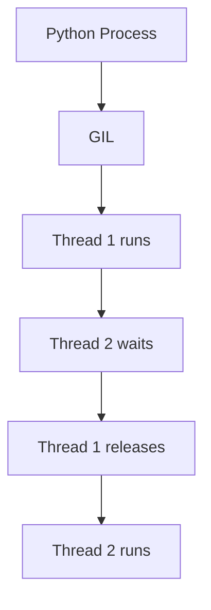
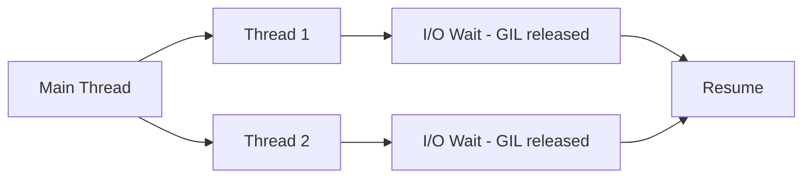
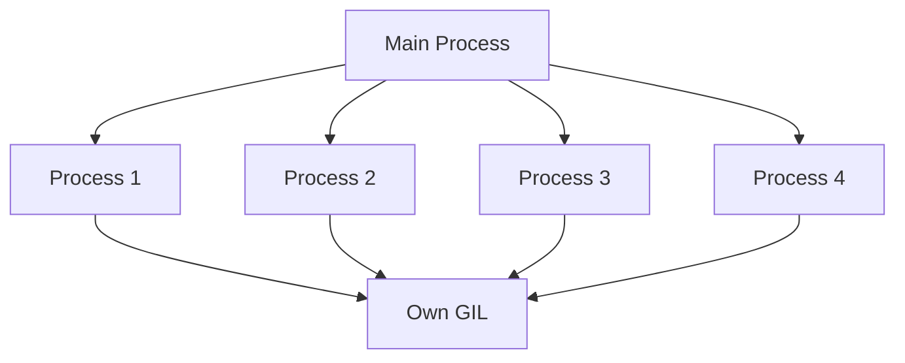
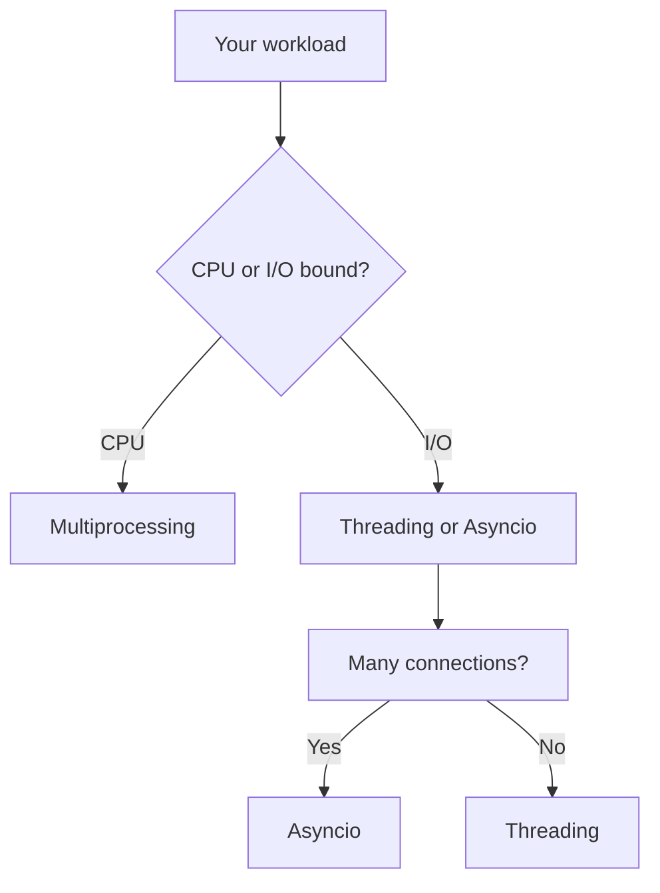

# Concurrency (Threading & Multiprocessing)

📄 File: `book/01_python_programming/10_concurrency.md`

This chapter covers **threading** and **multiprocessing** in Python — essential for parallel data processing and I/O-bound workloads.

---

## Study Plan (3–4 days)

* Day 1: GIL, threading basics
* Day 2: Multiprocessing for CPU-bound
* Day 3: When to use which, patterns
* Day 4: Exercises + mini project

---

## 1 — The Global Interpreter Lock (GIL)

Python has a **GIL** that allows only **one thread** to execute Python bytecode at a time.



### Implication

* **Threading**: Good for **I/O-bound** (network, disk) — threads wait on I/O, release GIL
* **Multiprocessing**: Good for **CPU-bound** — separate processes, separate GILs

---

## 2 — Threading (I/O-Bound)

```python
import threading

def fetch_url(url):
    # Simulate I/O - releases GIL while waiting
    response = requests.get(url)
    print(response.status_code)

# Create threads
t1 = threading.Thread(target=fetch_url, args=("https://api.example.com",))
t2 = threading.Thread(target=fetch_url, args=("https://api.other.com",))

# Start both
t1.start()
t2.start()

# Wait for completion
t1.join()
t2.join()
```

---

## Diagram — Threading Model



---

## 3 — Multiprocessing (CPU-Bound)

```python
from multiprocessing import Process, Pool

def cpu_task(n):
    # Heavy computation - needs own process (own GIL)
    return sum(i * i for i in range(n))

if __name__ == "__main__":
    # Spawn 4 processes
    with Pool(4) as p:
        results = p.map(cpu_task, [1_000_000] * 4)
    print(results)
```

---

## Diagram — Multiprocessing



---

## 4 — Threading: Lock for Shared State

```python
import threading

counter = 0
lock = threading.Lock()

def increment():
    global counter
    for _ in range(100000):
        with lock:           # Acquire lock
            counter += 1     # Critical section
        # Lock released automatically

t1 = threading.Thread(target=increment)
t2 = threading.Thread(target=increment)
t1.start()
t2.start()
t1.join()
t2.join()
print(counter)   # 200000 (correct with lock)
```

---

## 5 — When to Use What

| Workload    | Use              | Why                          |
| ----------- | ---------------- | ---------------------------- |
| I/O-bound   | Threading        | GIL released during I/O      |
| CPU-bound   | Multiprocessing  | Bypass GIL, true parallelism |
| Many I/O    | Asyncio (next ch)| More efficient than threads |

---

## 6 — ThreadPoolExecutor (Concurrent.futures)

```python
from concurrent.futures import ThreadPoolExecutor, as_completed

def fetch(url):
    return requests.get(url).status_code

urls = ["https://a.com", "https://b.com", "https://c.com"]

with ThreadPoolExecutor(max_workers=3) as executor:
    # Submit all tasks
    futures = {executor.submit(fetch, u): u for u in urls}
    for future in as_completed(futures):
        url = futures[future]
        print(f"{url}: {future.result()}")
```

---

## Diagram — Decision Flow



---

## Exercises — Concurrency

### 1. Parallel File Downloads

**Task:** Download 5 URLs in parallel using ThreadPoolExecutor.

**Solution:**
```python
from concurrent.futures import ThreadPoolExecutor
import requests

def download(url):
    return requests.get(url).content

urls = ["https://example.com"] * 5
with ThreadPoolExecutor(5) as ex:
    results = list(ex.map(download, urls))
```

---

### 2. CPU-Bound: Parallel Sum

**Task:** Sum squares of 1..N using 4 processes.

**Solution:**
```python
from multiprocessing import Pool

def sum_squares(n):
    return sum(i*i for i in range(n))

if __name__ == "__main__":
    with Pool(4) as p:
        chunks = [1_000_000] * 4
        partials = p.map(sum_squares, chunks)
    print(sum(partials))
```

---

## Interview Questions

1. What is the GIL?
2. When use threading vs multiprocessing?
3. What is a race condition? How to fix?
4. What is ThreadPoolExecutor?

---

## Key Takeaways

* GIL: one thread runs Python bytecode at a time
* Threading: I/O-bound (GIL released during wait)
* Multiprocessing: CPU-bound (separate processes)
* Use locks for shared mutable state

👉 Concurrency is essential for **parallel data ingestion** and **batch processing**.

---

## Next Chapter

Proceed to: **11_asyncio.md**
