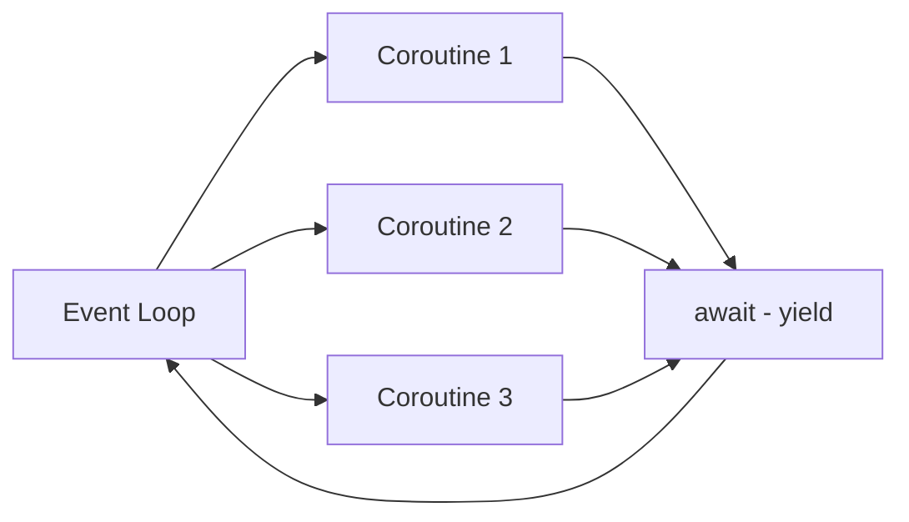
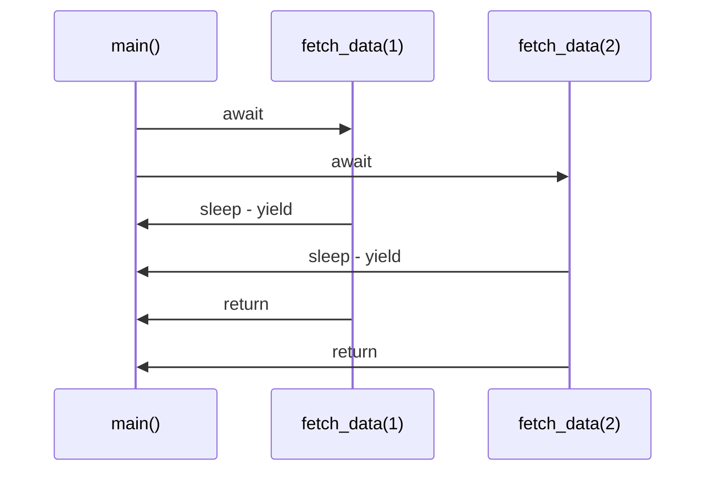
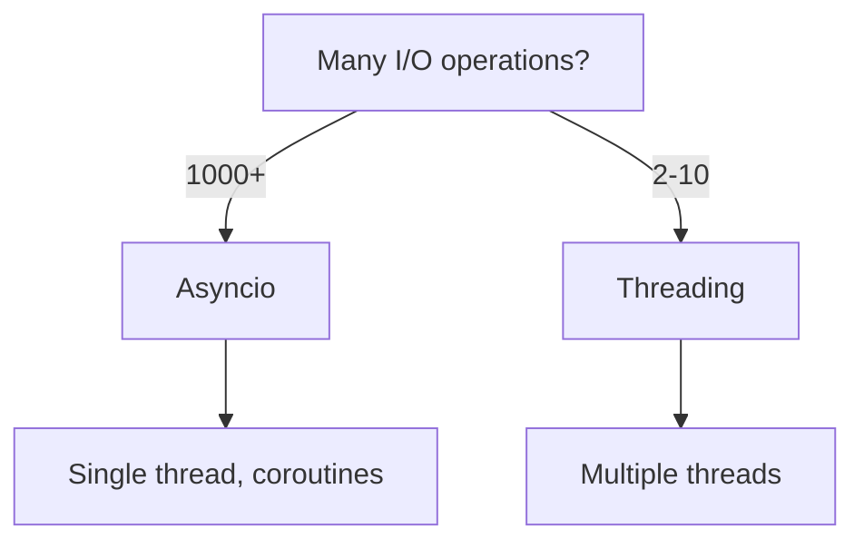

# Asyncio (Async/Await)

📄 File: `book/01_python_programming/11_asyncio.md`

This chapter covers **asyncio** — Python's built-in async framework for **high-concurrency I/O** (APIs, databases, streaming).

---

## Study Plan (3–4 days)

* Day 1: async/await basics, event loop
* Day 2: asyncio.gather, tasks
* Day 3: Real-world: aiohttp, async DB
* Day 4: Exercises + mini project

---

## 1 — Why Asyncio?

For **many concurrent I/O operations** (1000s of API calls), threads are heavy. Asyncio uses **cooperative multitasking** — one thread, many coroutines.



---

## 2 — async and await

```python
import asyncio

async def fetch_data(url):
    # Simulate I/O - yields control while waiting
    await asyncio.sleep(1)
    return f"Data from {url}"

async def main():
    # Run 3 coroutines concurrently
    results = await asyncio.gather(
        fetch_data("url1"),
        fetch_data("url2"),
        fetch_data("url3"),
    )
    print(results)

asyncio.run(main())   # Runs event loop
```

---

## Diagram — async/await Flow



---

## 3 — asyncio.gather (Parallel Execution)

```python
async def fetch(url):
    await asyncio.sleep(0.5)
    return url

async def main():
    urls = ["a", "b", "c", "d", "e"]
    # All 5 run concurrently - total ~0.5s, not 2.5s
    results = await asyncio.gather(*[fetch(u) for u in urls])
    print(results)

asyncio.run(main())
```

---

## 4 — Tasks (Fire and Forget)

```python
async def background_task():
    await asyncio.sleep(5)
    print("Done")

async def main():
    task = asyncio.create_task(background_task())  # Starts immediately
    print("Task started")
    await task   # Wait for completion

asyncio.run(main())
```

---

## 5 — aiohttp (Async HTTP)

```python
import aiohttp
import asyncio

async def fetch(session, url):
    async with session.get(url) as resp:
        return await resp.text()

async def main():
    async with aiohttp.ClientSession() as session:
        tasks = [fetch(session, "https://example.com") for _ in range(10)]
        results = await asyncio.gather(*tasks)
    print(len(results))

asyncio.run(main())
```

---

## 6 — When to Use Asyncio

| Use Asyncio When        | Use Threading When      |
| ----------------------- | ----------------------- |
| 100s–1000s of I/O ops   | Few (2–10) I/O ops      |
| Async-native libraries  | Sync-only libraries     |
| High concurrency        | Simpler code preferred  |

---

## Diagram — Asyncio vs Threading



---

## 7 — Common Pitfalls

```python
# BAD: Blocking call in async - blocks event loop!
async def bad():
    time.sleep(1)   # Blocks everything!

# GOOD: Use async sleep
async def good():
    await asyncio.sleep(1)
```

---

## Exercises — Asyncio

### 1. Concurrent Sleep

**Task:** Run 5 coroutines that each sleep 1 second. Total time should be ~1s.

**Solution:**
```python
import asyncio

async def sleep_task(i):
    await asyncio.sleep(1)
    return i

async def main():
    results = await asyncio.gather(*[sleep_task(i) for i in range(5)])
    print(results)

asyncio.run(main())   # ~1 second total
```

---

### 2. Async API Fetcher

**Task:** Fetch 3 URLs concurrently with aiohttp.

**Solution:**
```python
import aiohttp
import asyncio

async def fetch(session, url):
    async with session.get(url) as r:
        return await r.text()

async def main():
    urls = ["https://httpbin.org/delay/1"] * 3
    async with aiohttp.ClientSession() as session:
        tasks = [fetch(session, u) for u in urls]
        await asyncio.gather(*tasks)

asyncio.run(main())
```

---

## Interview Questions

1. What is the event loop?
2. async vs sync — when to use which?
3. What happens if you use time.sleep() in async?
4. asyncio.gather vs create_task?

---

## Key Takeaways

* Asyncio = cooperative multitasking, single thread
* async/await = define coroutines, await yields control
* gather = run many coroutines concurrently
* Use for high-concurrency I/O (APIs, DB, streaming)

👉 Asyncio powers **high-throughput API pipelines** and **real-time data ingestion**.

---

## Next Chapter

Proceed to: **12_profiling_optimization.md**
