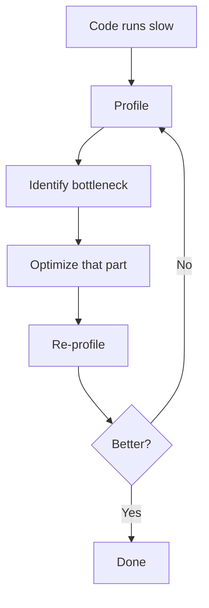
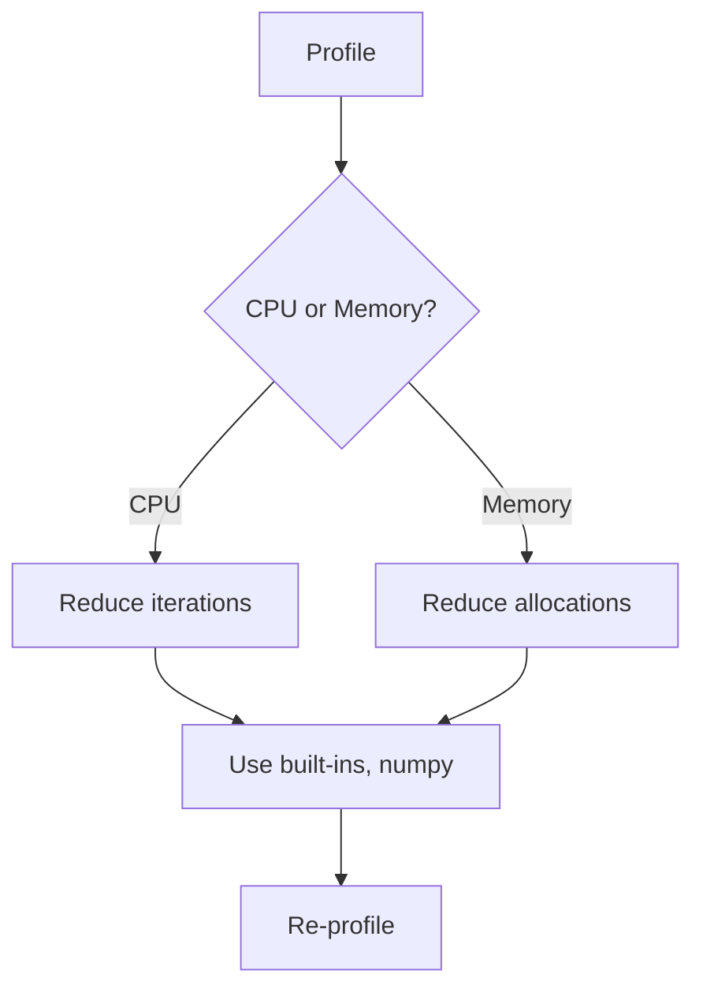

# Profiling and Optimization

📄 File: `book/01_python_programming/12_profiling_optimization.md`

This chapter covers **profiling** (finding bottlenecks) and **optimization** (fixing them) — critical for production data pipelines.

---

## Study Plan (2–3 days)

* Day 1: cProfile, line_profiler
* Day 2: Memory profiling, bottlenecks
* Day 3: Optimization patterns, exercises

---

## 1 — Measure First, Optimize Second



---

## 2 — cProfile (Built-in)

```python
import cProfile

def slow_function():
    return sum(i * i for i in range(1_000_000))

# Profile and print stats
cProfile.run("slow_function()")
```

### Output Interpretation

```
ncalls  tottime  percall  cumtime  percall  filename:lineno(function)
     1    0.05    0.05    0.05    0.05    script.py:3(slow_function)
```

* **tottime**: Time in function excluding subcalls
* **cumtime**: Total time including subcalls

---

## Diagram — cProfile Flow


---

## 3 — line_profiler (Line-by-Line)

```python
# Install: pip install line_profiler
# Run: kernprof -l -v script.py

@profile   # line_profiler decorator
def process_data():
    result = []
    for i in range(10000):
        result.append(i * i)   # Which line is slow?
    return sum(result)
```

---

## 4 — memory_profiler

```python
# pip install memory_profiler
from memory_profiler import profile

@profile
def memory_heavy():
    data = [0] * 10_000_000   # Allocate 80MB
    return sum(data)
```

---

## 5 — Common Bottlenecks & Fixes

| Bottleneck        | Fix                              |
| ----------------- | -------------------------------- |
| Loop with append  | List comprehension, preallocate  |
| Repeated lookups  | Cache in variable                |
| String concat     | Use list + join                  |
| Dict access       | Use .get() or try/except         |

---

## 6 — Optimization Example

```python
# SLOW: Repeated append in loop
result = []
for i in range(1000000):
    result.append(i * 2)

# FASTER: List comprehension
result = [i * 2 for i in range(1000000)]

# FASTER: Preallocate if size known
result = [0] * 1000000
for i in range(1000000):
    result[i] = i * 2
```

---

## Diagram — Optimization Strategy



---

## 7 — Numpy for Numerical Work

```python
# Pure Python - slow
total = sum(i * i for i in range(1_000_000))

# Numpy - 10-100x faster
import numpy as np
arr = np.arange(1_000_000)
total = np.sum(arr * arr)
```

---

## 8 — When to Use Numba

```python
from numba import jit

@jit(nopython=True)
def fast_sum(n):
    s = 0
    for i in range(n):
        s += i * i
    return s

# First call: compiles. Subsequent: native speed.
print(fast_sum(1_000_000))
```

---

## Exercises — Profiling

### 1. Find the Bottleneck

```python
def process(items):
    result = []
    for item in items:
        x = expensive(item)   # Assume this exists
        result.append(x)
    return result
```

**Hint:** Is it the loop, append, or expensive()? Profile to find out.

---

### 2. Optimize String Building

**Before:**
```python
s = ""
for i in range(10000):
    s += str(i)
```

**After:**
```python
s = "".join(str(i) for i in range(10000))
```

---

## Interview Questions

1. How do you profile Python code?
2. What is the difference between tottime and cumtime?
3. When would you use Numba?
4. How do you find memory leaks?

---

## Key Takeaways

* Profile before optimizing
* cProfile for CPU, memory_profiler for memory
* line_profiler for line-level detail
* Numpy/Numba for numerical bottlenecks

👉 Profiling is essential for **production data pipelines** at scale.

---

## Next Chapter

Proceed to: **13_c_extensions_numba.md**
