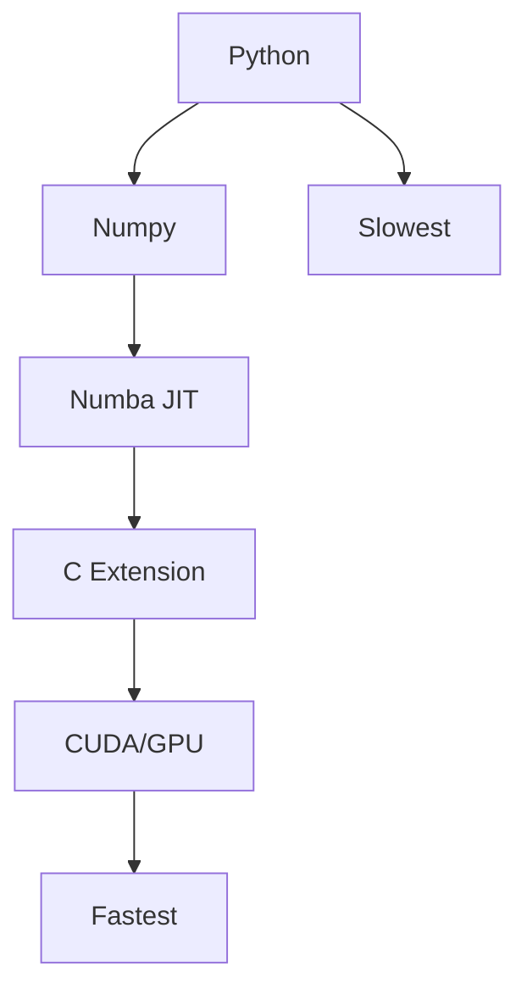

# C Extensions and Numba

📄 File: `book/01_python_programming/13_c_extensions_numba.md`

This chapter covers **performance at the limit** — Numba JIT compilation and C extensions. Essential when Python speed is not enough.

---

## Study Plan (3–4 days)

* Day 1: Numba basics, @jit
* Day 2: Numba with NumPy, nopython mode
* Day 3: C extensions overview (pybind11)
* Day 4: When to use what, exercises

---

## 1 — The Performance Hierarchy



---

## 2 — Numba: JIT Compilation

Numba compiles Python to **machine code** at runtime.

```python
from numba import jit

@jit(nopython=True)   # Pure numeric, no Python objects
def sum_squares(n):
    s = 0
    for i in range(n):
        s += i * i
    return s

# First call: compiles (slow). Next calls: native speed.
print(sum_squares(1_000_000))
```

---

## Diagram — Numba JIT Flow


---

## 3 — nopython Mode (Fastest)

```python
@jit(nopython=True)   # Must use only NumPy types, no Python objects
def fast_add(a, b):
    return a + b

import numpy as np
a = np.array([1.0, 2.0, 3.0])
b = np.array([4.0, 5.0, 6.0])
print(fast_add(a, b))
```

### Restrictions in nopython

* No lists, dicts, or Python objects
* NumPy arrays and scalars only
* Limited control flow

---

## 4 — Numba with NumPy

```python
from numba import jit
import numpy as np

@jit(nopython=True)
def row_sum(matrix):
    n_rows, n_cols = matrix.shape
    result = np.zeros(n_rows)
    for i in range(n_rows):
        for j in range(n_cols):
            result[i] += matrix[i, j]
    return result

m = np.random.rand(1000, 1000)
print(row_sum(m))
```

---

## 5 — Parallel Numba (prange)

```python
from numba import jit, prange

@jit(nopython=True, parallel=True)
def parallel_sum(arr):
    n = len(arr)
    result = 0
    for i in prange(n):   # Parallel loop
        result += arr[i]
    return result
```

---

## 6 — When to Use Numba

| Use Numba When           | Don't Use When              |
| ------------------------ | --------------------------- |
| Loops over arrays        | Code uses Python objects    |
| Numerical kernels        | One-off scripts             |
| Need 10-100x speedup      | Numpy vectorization enough  |

---

## 7 — C Extensions (Overview)

For maximum control, write C/C++ and expose to Python:

```python
# Using pybind11 (modern, easy)
# pip install pybind11

# mymodule.cpp
#include <pybind11/pybind11.h>

int add(int a, int b) {
    return a + b;
}

PYBIND11_MODULE(mymodule, m) {
    m.def("add", &add);
}
```

Build with: `python -m pybind11 --includes` + compiler.

---

## Diagram — C Extension Flow


---

## 8 — Numba vs C Extension

| Numba                    | C Extension                |
| ------------------------ | -------------------------- |
| Pure Python + decorator  | Write C/C++                |
| Quick to try             | More setup                 |
| Good for numeric loops   | Full control               |
| No separate build        | Requires compiler          |

---

## 9 — Real-World: AI Data Engineering

* **Numba**: Custom aggregation kernels, preprocessing loops
* **C extensions**: Integrate existing C libraries (e.g., DuckDB, Arrow)
* **Numpy**: First choice for array ops — vectorized

---

## Exercises — Numba

### 1. JIT a Loop

**Task:** Make this fast with Numba:
```python
def slow():
    s = 0
    for i in range(10_000_000):
        s += i
    return s
```

**Solution:**
```python
from numba import jit

@jit(nopython=True)
def fast():
    s = 0
    for i in range(10_000_000):
        s += i
    return s
```

---

### 2. Numba Matrix Multiply

**Task:** Implement matrix multiply with Numba (for learning; use @ for production).

**Solution:**
```python
from numba import jit
import numpy as np

@jit(nopython=True)
def matmul(a, b):
    n, m = a.shape
    m, p = b.shape
    c = np.zeros((n, p))
    for i in range(n):
        for j in range(p):
            for k in range(m):
                c[i, j] += a[i, k] * b[k, j]
    return c
```

---

## Interview Questions

1. What does Numba do?
2. What is nopython mode?
3. When use Numba vs C extension?
4. What is JIT compilation?

---

## Key Takeaways

* Numba: JIT compile numeric Python to machine code
* nopython=True: fastest, NumPy types only
* prange: parallel loops
* C extensions: for integrating C libs or max control

👉 Numba is the **fast path** for custom numerical kernels in data pipelines.

---

## Next Chapter

You've completed **Python Programming**. Proceed to: **02_algorithms_data_structures**
