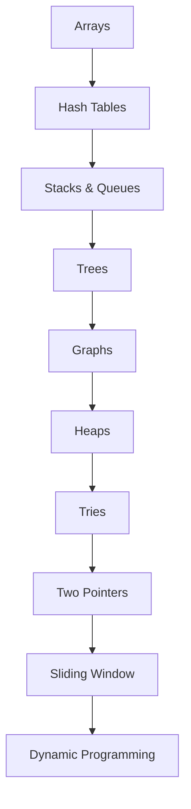

# Algorithms & Data Structures Roadmap

📄 File: `book/02_algorithms_data_structures/00_algorithms_roadmap.md`

This roadmap guides you from **basic data structures** to **interview-ready algorithm mastery** for top AI Data Engineer roles.

---

## Study Plan (8–12 weeks)

* Weeks 1–2: Arrays, Hash Tables, Stacks, Queues
* Weeks 3–4: Trees, Graphs
* Weeks 5–6: Heaps, Tries, Two Pointers, Sliding Window
* Weeks 7–8: Dynamic Programming
* Weeks 9–12: Practice 300+ problems (LeetCode, etc.)

---

## Phase Index

| File | Topic | Key Concepts |
|------|-------|--------------|
| arrays | Arrays | Indexing, prefix sum, binary search |
| hash_tables | Hash Tables | O(1) lookup, collision handling |
| stacks_queues | Stacks & Queues | LIFO, FIFO, monotonic stack |
| trees | Trees | BST, traversal, recursion |
| graphs | Graphs | BFS, DFS, shortest path |
| heaps | Heaps | Priority queue, top-K |
| tries | Tries | Prefix search, autocomplete |
| two_pointers | Two Pointers | Pair sum, palindrome |
| sliding_window | Sliding Window | Subarray, substring |
| dynamic_programming | DP | Memoization, tabulation |

---

## Flow Diagram

---

## Goal

* Solve **300+** algorithm problems
* Focus on **medium** and **hard**
* Master patterns that appear in AI/data interviews

---

## Next Chapter

Start with: **arrays.md**
