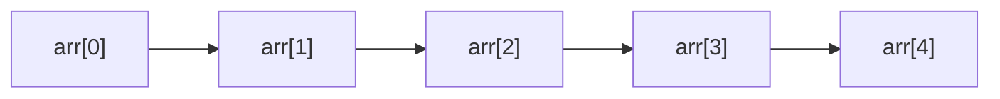
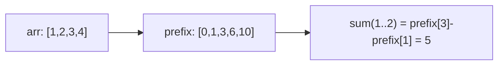

# Arrays (Deep Dive)

📄 File: `book/02_algorithms_data_structures/arrays.md`

This chapter covers **arrays** — the foundation of most data structures. Essential for technical interviews and data processing.

---

## Study Plan (3–4 days)

* Day 1: Basics, indexing, traversal
* Day 2: Prefix sum, binary search
* Day 3: In-place operations, patterns
* Day 4: Exercises + LeetCode practice

---

## 1 — What is an Array?

An array is a **contiguous block of memory** storing elements of the same type, accessible by index.

```python
arr = [10, 20, 30, 40, 50]
arr[0]   # 10 - O(1) access
arr[-1]  # 50 - last element
```

---

## Diagram — Array Memory Layout



---

## 2 — Complexity Cheat Sheet

| Operation | Complexity |
| --------- | ---------- |
| Access by index | O(1) |
| Search (unsorted) | O(n) |
| Search (sorted, binary) | O(log n) |
| Insert at end | O(1)* |
| Insert at middle | O(n) |
| Delete | O(n) |

---

## 3 — Prefix Sum (Critical Pattern)

Prefix sum enables **O(1) range sum** after O(n) preprocessing.

```python
def prefix_sum(arr):
    # prefix[i] = sum(arr[0..i])
    prefix = [0]
    for x in arr:
        prefix.append(prefix[-1] + x)
    return prefix

# Range sum [i, j] = prefix[j+1] - prefix[i]
def range_sum(prefix, i, j):
    return prefix[j + 1] - prefix[i]
```

---

## Diagram — Prefix Sum



---

## 4 — Binary Search (Sorted Arrays)

```python
def binary_search(arr, target):
    left, right = 0, len(arr) - 1
    while left <= right:
        mid = (left + right) // 2
        if arr[mid] == target:
            return mid
        if arr[mid] < target:
            left = mid + 1
        else:
            right = mid - 1
    return -1
```

---

## Diagram — Binary Search

```mermaid
flowchart TD
    A[Sorted Array] --> B{mid == target?}
    B -->|Yes| C[Return mid]
    B -->|No| D{arr[mid] < target?}
    D -->|Yes| E[Search right half]
    D -->|No| F[Search left half]
    E --> B
    F --> B
```

---

## 5 — Two Pointers (In-Place)

```python
# Reverse array in-place
def reverse(arr):
    left, right = 0, len(arr) - 1
    while left < right:
        arr[left], arr[right] = arr[right], arr[left]
        left += 1
        right -= 1
```

---

## 6 — Exercises (with line-by-line comments)

### 1. Maximum Subarray Sum (Kadane's Algorithm)

**Input:** `[-2, 1, -3, 4, -1, 2, 1, -5, 4]`  
**Output:** `6` (subarray [4,-1,2,1])

**Solution:**
```python
def max_subarray(arr):
    # best: best sum seen so far
    best = arr[0]
    # curr: sum of current subarray ending at i
    curr = arr[0]
    for i in range(1, len(arr)):
        # Either extend current subarray or start fresh
        curr = max(arr[i], curr + arr[i])
        best = max(best, curr)
    return best
```

---

### 2. Rotate Array by K

**Input:** `[1,2,3,4,5], k=2`  
**Output:** `[4,5,1,2,3]`

**Solution:**
```python
def rotate(arr, k):
    n = len(arr)
    k = k % n   # Handle k > n
    # Reverse whole, then reverse first k and last n-k
    arr.reverse()
    arr[:k] = reversed(arr[:k])
    arr[k:] = reversed(arr[k:])
```

---

### 3. Find Missing Number (1 to n)

**Input:** `[3, 0, 1]` (n=3, missing 2)  
**Output:** `2`

**Solution:**
```python
def missing_number(arr):
    n = len(arr)
    # Sum of 0..n = n*(n+1)//2
    expected = n * (n + 1) // 2
    actual = sum(arr)
    return expected - actual
```

---

## Interview Questions

1. When is binary search applicable?
2. Explain prefix sum and its use cases.
3. What is Kadane's algorithm?
4. How do you reverse an array in-place?

---

## Key Takeaways

* Access O(1), search O(n) or O(log n) if sorted
* Prefix sum for O(1) range queries
* Binary search for sorted arrays
* Two pointers for in-place operations

---

## Next Chapter

Proceed to: **hash_tables.md**
