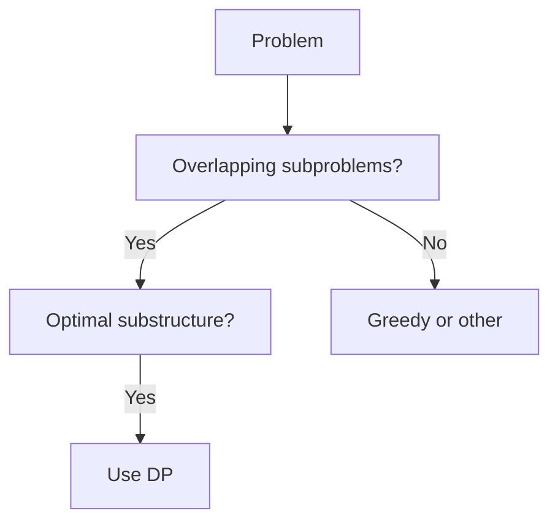
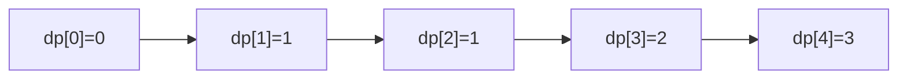

# Dynamic Programming (Deep Dive)

📄 File: `book/02_algorithms_data_structures/dynamic_programming.md`

This chapter covers **dynamic programming** — memoization, tabulation, and classic problems. Critical for interview mastery.

---

## Study Plan (1–2 weeks)

* Week 1: Fibonacci, climbing stairs, coin change
* Week 2: Knapsack, LCS, LIS, edit distance

---

## 1 — What is DP?

**Overlapping subproblems** + **optimal substructure** → store results, avoid recomputation.



---

## 2 — Fibonacci (Memoization)

```python
def fib(n, memo=None):
    if memo is None:
        memo = {}
    if n <= 1:
        return n
    if n in memo:
        return memo[n]
    memo[n] = fib(n-1, memo) + fib(n-2, memo)
    return memo[n]
```

---

## 3 — Fibonacci (Tabulation)

```python
def fib_tab(n):
    if n <= 1:
        return n
    dp = [0] * (n + 1)
    dp[1] = 1
    for i in range(2, n + 1):
        dp[i] = dp[i-1] + dp[i-2]
    return dp[n]
```

---

## Diagram — DP Table (Fibonacci)



---

## 4 — Coin Change (Minimum coins)

```python
def coin_change(coins, amount):
    dp = [float('inf')] * (amount + 1)
    dp[0] = 0
    for i in range(1, amount + 1):
        for c in coins:
            if i >= c:
                dp[i] = min(dp[i], dp[i - c] + 1)
    return dp[amount] if dp[amount] != float('inf') else -1
```

---

## 5 — Climbing Stairs

```python
def climb_stairs(n):
    if n <= 2:
        return n
    prev, curr = 1, 2
    for _ in range(3, n + 1):
        prev, curr = curr, prev + curr
    return curr
```

---

## 6 — Longest Increasing Subsequence (LIS)

```python
def lis(arr):
    if not arr:
        return 0
    dp = [1] * len(arr)
    for i in range(1, len(arr)):
        for j in range(i):
            if arr[j] < arr[i]:
                dp[i] = max(dp[i], dp[j] + 1)
    return max(dp)
```

---

## 7 — 0/1 Knapsack

```python
def knapsack(weights, values, capacity):
    n = len(weights)
    dp = [[0] * (capacity + 1) for _ in range(n + 1)]
    for i in range(1, n + 1):
        for w in range(capacity + 1):
            if weights[i-1] <= w:
                dp[i][w] = max(dp[i-1][w],
                               dp[i-1][w - weights[i-1]] + values[i-1])
            else:
                dp[i][w] = dp[i-1][w]
    return dp[n][capacity]
```

---

## 8 — DP Strategy

1. Define state (what to store)
2. Define recurrence (how states relate)
3. Base case
4. Order of computation (tabulation)

---

## Interview Questions

1. When to use memoization vs tabulation?
2. How to identify DP problem?
3. Space optimization for knapsack?

---

## Key Takeaways

* DP = overlapping subproblems + optimal substructure
* Memoization: top-down, cache results
* Tabulation: bottom-up, fill table

---

## Next Chapter

You've completed **Algorithms & Data Structures**. Proceed to: **03_sql_query_engines**
