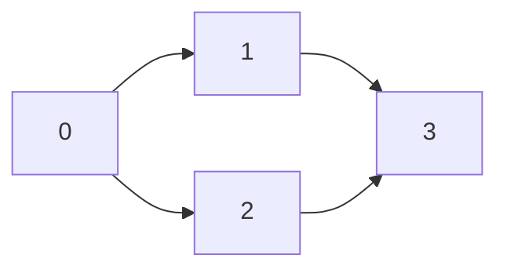
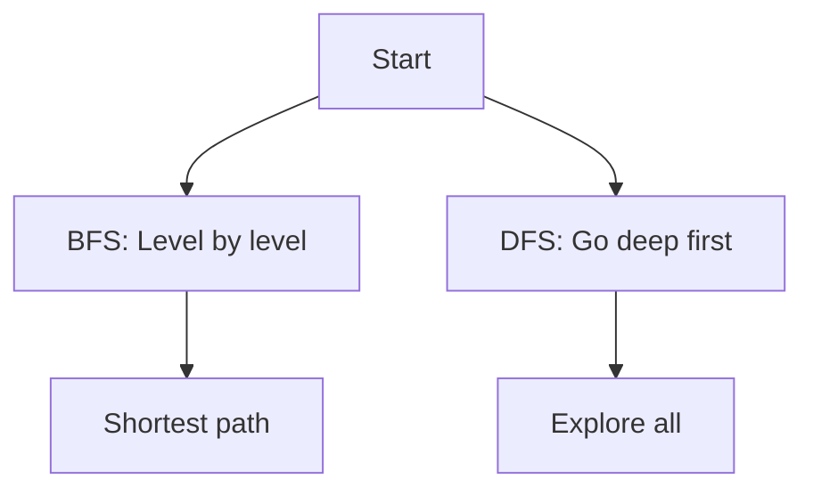

# Graphs (Deep Dive)

📄 File: `book/02_algorithms_data_structures/graphs.md`

This chapter covers **graphs** — BFS, DFS, shortest path. Essential for network analysis and AI systems.

---

## Study Plan (4–5 days)

* Day 1: Representation, BFS, DFS
* Day 2: Shortest path (BFS for unweighted)
* Day 3: Topological sort, cycles
* Day 4–5: Exercises

---

## 1 — Graph Representation

### Adjacency List (Most common)

```python
# graph[i] = list of neighbors of node i
graph = {
    0: [1, 2],
    1: [0, 3],
    2: [0, 3],
    3: [1, 2]
}
```

---

## Diagram — Graph



---

## 2 — BFS (Shortest Path in Unweighted Graph)

```python
from collections import deque

def bfs_shortest(graph, start, end):
    q = deque([(start, 0)])   # (node, distance)
    visited = {start}
    while q:
        node, dist = q.popleft()
        if node == end:
            return dist
        for neighbor in graph[node]:
            if neighbor not in visited:
                visited.add(neighbor)
                q.append((neighbor, dist + 1))
    return -1
```

---

## 3 — DFS (Recursive)

```python
def dfs(graph, node, visited=None):
    if visited is None:
        visited = set()
    visited.add(node)
    for neighbor in graph[node]:
        if neighbor not in visited:
            dfs(graph, neighbor, visited)
    return visited
```

---

## Diagram — BFS vs DFS



---

## 4 — Topological Sort (DAG)

```python
def topological_sort(graph):
    in_degree = {u: 0 for u in graph}
    for u in graph:
        for v in graph[u]:
            in_degree[v] = in_degree.get(v, 0) + 1
    q = deque([u for u in in_degree if in_degree[u] == 0])
    result = []
    while q:
        u = q.popleft()
        result.append(u)
        for v in graph[u]:
            in_degree[v] -= 1
            if in_degree[v] == 0:
                q.append(v)
    return result if len(result) == len(graph) else []
```

---

## 5 — Detect Cycle (DFS)

```python
def has_cycle(graph):
    WHITE, GRAY, BLACK = 0, 1, 2
    color = {u: WHITE for u in graph}
    def dfs(u):
        color[u] = GRAY
        for v in graph.get(u, []):
            if color[v] == GRAY:
                return True
            if color[v] == WHITE and dfs(v):
                return True
        color[u] = BLACK
        return False
    return any(dfs(u) for u in graph if color[u] == WHITE)
```

---

## 6 — Number of Connected Components

```python
def count_components(graph):
    visited = set()
    def dfs(node):
        visited.add(node)
        for neighbor in graph.get(node, []):
            if neighbor not in visited:
                dfs(neighbor)
    count = 0
    for node in graph:
        if node not in visited:
            dfs(node)
            count += 1
    return count
```

---

## Interview Questions

1. BFS vs DFS — when to use which?
2. How to find shortest path in unweighted graph?
3. What is topological sort?

---

## Key Takeaways

* BFS: shortest path, level-order
* DFS: explore, cycle detection
* Topological sort: DAG ordering

---

## Next Chapter

Proceed to: **heaps.md**
