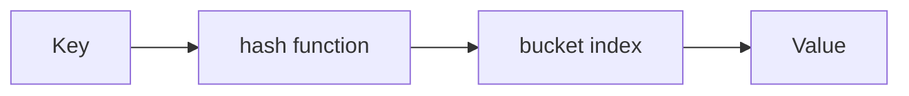
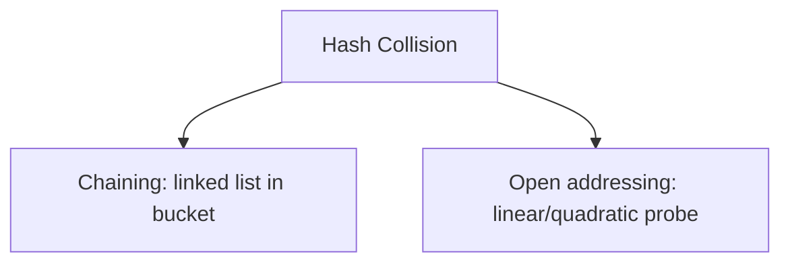

# Hash Tables (Deep Dive)

📄 File: `book/02_algorithms_data_structures/hash_tables.md`

This chapter covers **hash tables** — O(1) lookup, the backbone of Python dicts and sets. Critical for interview problems.

---

## Study Plan (2–3 days)

* Day 1: Basics, collision handling
* Day 2: Frequency count, two-sum patterns
* Day 3: Exercises + interview prep

---

## 1 — What is a Hash Table?

A hash table maps **keys to values** using a hash function. Average O(1) for insert, delete, lookup.

```python
d = {}
d["a"] = 1
d["b"] = 2
print(d["a"])   # 1 - O(1)
```

---

## Diagram — Hash Table Lookup



---

## 2 — Collision Handling

* **Chaining**: Each bucket holds a list of (key, value) pairs
* **Open addressing**: Probe to next slot if occupied



---

## 3 — Common Patterns

### Frequency Count

```python
def freq_count(arr):
    freq = {}
    for x in arr:
        freq[x] = freq.get(x, 0) + 1   # default 0, then +1
    return freq
```

### Two Sum (Find pair that sums to target)

```python
def two_sum(arr, target):
    seen = {}   # value -> index
    for i, x in enumerate(arr):
        need = target - x
        if need in seen:
            return [seen[need], i]
        seen[x] = i
    return []
```

---

## Diagram — Two Sum Flow

```mermaid
flowchart LR
    A[arr[i]] --> B[need = target - arr[i]]
    B --> C{need in seen?}
    C -->|Yes| D[Return [seen[need], i]]
    C -->|No| E[seen[arr[i]] = i]
```

---

## 4 — Group Anagrams

```python
def group_anagrams(strs):
    groups = {}
    for s in strs:
        key = tuple(sorted(s))   # "eat" -> ('a','e','t')
        groups.setdefault(key, []).append(s)
    return list(groups.values())
```

---

## 5 — Exercises (with comments)

### 1. First Non-Repeating Character

**Input:** `"leetcode"`  
**Output:** `'l'`

**Solution:**
```python
def first_unique(s):
    freq = {}
    for c in s:
        freq[c] = freq.get(c, 0) + 1
    for c in s:
        if freq[c] == 1:
            return c
    return None
```

---

### 2. Contains Duplicate

**Input:** `[1,2,3,1]`  
**Output:** `True`

**Solution:**
```python
def has_duplicate(arr):
    seen = set()
    for x in arr:
        if x in seen:
            return True
        seen.add(x)
    return False
```

---

## Interview Questions

1. How does a hash table achieve O(1) average lookup?
2. What is collision? How is it handled?
3. When would you use a hash table vs array?

---

## Key Takeaways

* Hash table = O(1) avg insert/lookup/delete
* Use for frequency, two-sum, grouping
* Python dict and set are hash tables

---

## Next Chapter

Proceed to: **stacks_queues.md**
