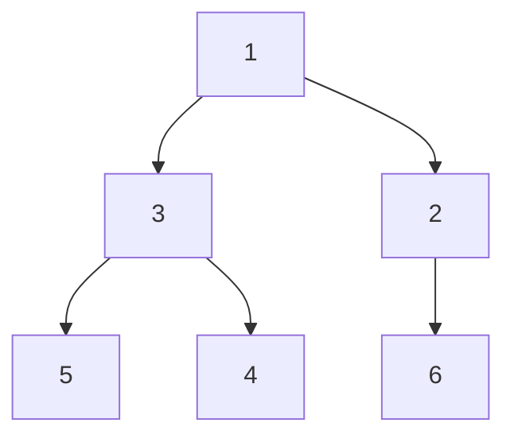

# Heaps (Deep Dive)

📄 File: `book/02_algorithms_data_structures/heaps.md`

This chapter covers **heaps** — priority queues, top-K, merge K sorted lists. Critical for streaming and ranking.

---

## Study Plan (2–3 days)

* Day 1: Min-heap, max-heap, Python heapq
* Day 2: Top-K, Kth largest
* Day 3: Exercises

---

## 1 — What is a Heap?

A **binary heap** is a complete binary tree where parent ≤ children (min-heap) or parent ≥ children (max-heap).

* Extract min/max: O(log n)
* Insert: O(log n)
* Peek: O(1)

---

## Diagram — Min-Heap



---

## 2 — Python heapq (Min-Heap)

```python
import heapq

h = []
heapq.heappush(h, 3)
heapq.heappush(h, 1)
heapq.heappush(h, 2)
print(heapq.heappop(h))   # 1 (smallest)
print(heapq.heappop(h))   # 2
```

---

## 3 — Max-Heap (Negate Values)

```python
import heapq

# heapq is min-heap only. For max-heap, negate.
h = []
heapq.heappush(h, -3)
heapq.heappush(h, -1)
heapq.heappush(h, -2)
print(-heapq.heappop(h))   # 3 (largest)
```

---

## 4 — Kth Largest Element

```python
import heapq

def kth_largest(arr, k):
    # Min-heap of size k. Smallest in heap = kth largest overall.
    h = arr[:k]
    heapq.heapify(h)
    for x in arr[k:]:
        if x > h[0]:
            heapq.heapreplace(h, x)
    return h[0]
```

---

## Diagram — Kth Largest

```mermaid
flowchart LR
    A[Stream] --> B[Min-heap size K]
    B --> C[Heap[0] = Kth largest]
```

---

## 5 — Merge K Sorted Lists

```python
import heapq

def merge_k_sorted(lists):
    # (value, list_idx, element_idx)
    h = [(lst[0], i, 0) for i, lst in enumerate(lists) if lst]
    heapq.heapify(h)
    result = []
    while h:
        val, li, ei = heapq.heappop(h)
        result.append(val)
        if ei + 1 < len(lists[li]):
            heapq.heappush(h, (lists[li][ei + 1], li, ei + 1))
    return result
```

---

## 6 — Top K Frequent Elements

```python
import heapq
from collections import Counter

def top_k_frequent(arr, k):
    freq = Counter(arr)
    # Min-heap of (freq, num). Keep size k.
    h = []
    for num, count in freq.items():
        heapq.heappush(h, (count, num))
        if len(h) > k:
            heapq.heappop(h)
    return [num for _, num in h]
```

---

## Interview Questions

1. When use heap vs sorted array?
2. How to implement max-heap with heapq?
3. Kth largest in O(n log k)?

---

## Key Takeaways

* heapq = min-heap, O(log n) push/pop
* Top-K: heap of size K
* Merge K sorted: heap of heads

---

## Next Chapter

Proceed to: **tries.md**
