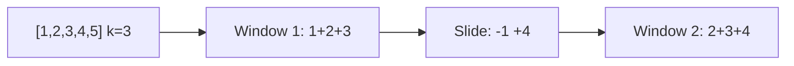

# Sliding Window (Deep Dive)

📄 File: `book/02_algorithms_data_structures/sliding_window.md`

This chapter covers the **sliding window** technique — subarray/substring problems in O(n). Essential for streaming and string problems.

---

## Study Plan (2–3 days)

* Day 1: Fixed-size window
* Day 2: Variable-size window
* Day 3: Exercises

---

## 1 — Fixed-Size Window: Max Sum of K Consecutive

```python
def max_sum_k(arr, k):
    window_sum = sum(arr[:k])
    best = window_sum
    for i in range(k, len(arr)):
        window_sum += arr[i] - arr[i - k]   # slide: add right, remove left
        best = max(best, window_sum)
    return best
```

---

## Diagram — Sliding Window



---

## 2 — Variable Window: Longest Substring Without Repeating

```python
def longest_unique(s):
    seen = {}
    left = 0
    best = 0
    for right, c in enumerate(s):
        if c in seen and seen[c] >= left:
            left = seen[c] + 1
        seen[c] = right
        best = max(best, right - left + 1)
    return best
```

---

## 3 — Minimum Window Substring

```python
from collections import Counter

def min_window(s, t):
    need = Counter(t)
    have = 0
    required = len(need)
    left = 0
    result = ""
    for right, c in enumerate(s):
        if c in need:
            need[c] -= 1
            if need[c] == 0:
                have += 1
        while have == required:
            if not result or right - left + 1 < len(result):
                result = s[left:right+1]
            if s[left] in need:
                need[s[left]] += 1
                if need[s[left]] > 0:
                    have -= 1
            left += 1
    return result
```

---

## 4 — Max Consecutive Ones (Flip K Zeros)

```python
def longest_ones(arr, k):
    left = 0
    zeros = 0
    best = 0
    for right in range(len(arr)):
        if arr[right] == 0:
            zeros += 1
        while zeros > k:
            if arr[left] == 0:
                zeros -= 1
            left += 1
        best = max(best, right - left + 1)
    return best
```

---

## 5 — When to Use Sliding Window

| Pattern | Use When |
| ------- | -------- |
| Fixed   | Subarray of fixed size K |
| Variable| Subarray/substring with constraint |

---

## Interview Questions

1. Fixed vs variable sliding window?
2. How to find longest substring with at most K distinct chars?
3. Time complexity of sliding window?

---

## Key Takeaways

* Fixed: maintain window size, slide one step
* Variable: expand right, shrink left when invalid
* O(n) for many subarray problems

---

## Next Chapter

Proceed to: **dynamic_programming.md**
