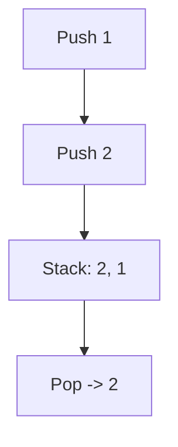
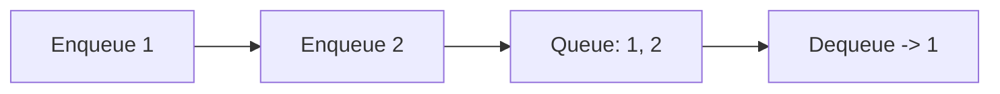
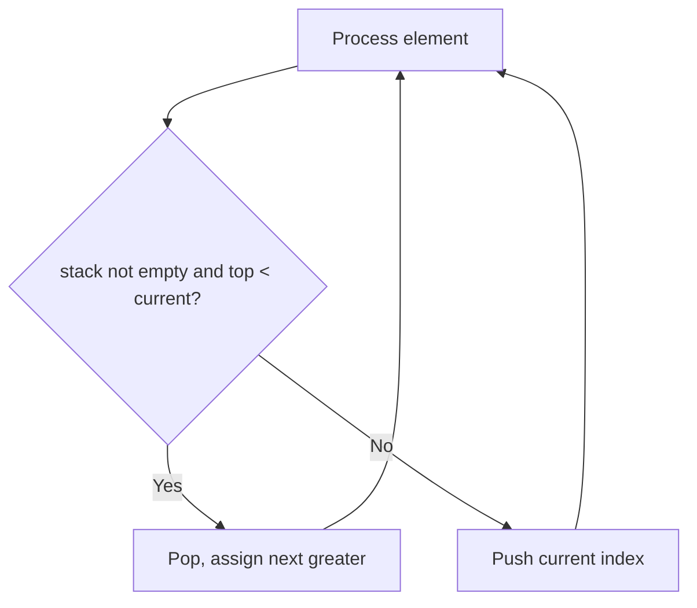

# Stacks and Queues (Deep Dive)

📄 File: `book/02_algorithms_data_structures/stacks_queues.md`

This chapter covers **stacks** (LIFO) and **queues** (FIFO) — fundamental for BFS, DFS, and parsing.

---

## Study Plan (2–3 days)

* Day 1: Stack operations, valid parentheses
* Day 2: Queue, BFS pattern
* Day 3: Monotonic stack, exercises

---

## 1 — Stack (LIFO)

Last In, First Out. Operations: push, pop, peek — all O(1).

```python
stack = []
stack.append(1)   # push
stack.append(2)
top = stack[-1]    # peek
x = stack.pop()   # pop -> 2
```

---

## Diagram — Stack



---

## 2 — Valid Parentheses

```python
def is_valid(s):
    stack = []
    pairs = {')': '(', ']': '[', '}': '{'}
    for c in s:
        if c in '([{':
            stack.append(c)
        else:
            if not stack or stack[-1] != pairs[c]:
                return False
            stack.pop()
    return len(stack) == 0
```

---

## 3 — Queue (FIFO)

First In, First Out. Use `collections.deque` for O(1) append/pop from both ends.

```python
from collections import deque
q = deque()
q.append(1)   # enqueue
q.append(2)
x = q.popleft()   # dequeue -> 1
```

---

## Diagram — Queue



---

## 4 — Monotonic Stack (Next Greater Element)

```python
def next_greater(arr):
    result = [-1] * len(arr)
    stack = []   # indices of elements waiting for next greater
    for i, x in enumerate(arr):
        while stack and arr[stack[-1]] < x:
            idx = stack.pop()
            result[idx] = x
        stack.append(i)
    return result
```

---

## Diagram — Monotonic Stack



---

## 5 — BFS (Queue-Based)

```python
from collections import deque

def bfs(graph, start):
    visited = set()
    q = deque([start])
    visited.add(start)
    while q:
        node = q.popleft()
        # process node
        for neighbor in graph[node]:
            if neighbor not in visited:
                visited.add(neighbor)
                q.append(neighbor)
```

---

## Interview Questions

1. When use stack vs queue?
2. How does a monotonic stack work?
3. Why use deque for BFS?

---

## Key Takeaways

* Stack: LIFO, parentheses, DFS
* Queue: FIFO, BFS
* Monotonic stack: next greater/smaller element

---

## Next Chapter

Proceed to: **trees.md**
