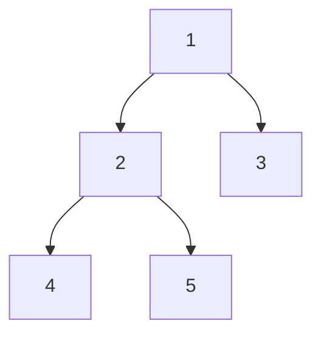
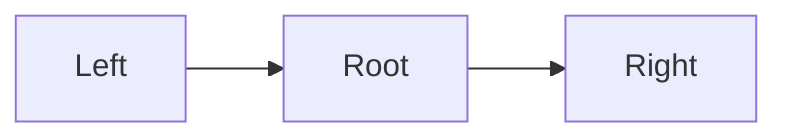

# Trees (Deep Dive)

📄 File: `book/02_algorithms_data_structures/trees.md`

This chapter covers **trees** — binary trees, BST, traversals. Essential for hierarchical data and interview problems.

---

## Study Plan (4–5 days)

* Day 1: Binary tree, traversal (in/pre/post order)
* Day 2: BST, search, insert
* Day 3: Recursion patterns
* Day 4–5: Exercises + LeetCode

---

## 1 — Binary Tree Structure

```python
class TreeNode:
    def __init__(self, val=0, left=None, right=None):
        self.val = val
        self.left = left
        self.right = right
```

---

## Diagram — Binary Tree



---

## 2 — Traversals

### In-Order (Left, Root, Right) — BST gives sorted order

```python
def inorder(root):
    if not root:
        return []
    return inorder(root.left) + [root.val] + inorder(root.right)
```

### Pre-Order (Root, Left, Right)

```python
def preorder(root):
    if not root:
        return []
    return [root.val] + preorder(root.left) + preorder(root.right)
```

### Post-Order (Left, Right, Root)

```python
def postorder(root):
    if not root:
        return []
    return postorder(root.left) + postorder(root.right) + [root.val]
```

---

## Diagram — In-Order Traversal



---

## 3 — Binary Search Tree (BST)

* Left subtree: all values < root
* Right subtree: all values > root

```python
def search_bst(root, target):
    if not root or root.val == target:
        return root
    if target < root.val:
        return search_bst(root.left, target)
    return search_bst(root.right, target)
```

---

## 4 — Max Depth (Recursion)

```python
def max_depth(root):
    if not root:
        return 0
    return 1 + max(max_depth(root.left), max_depth(root.right))
```

---

## 5 — Level Order (BFS)

```python
from collections import deque

def level_order(root):
    if not root:
        return []
    result = []
    q = deque([root])
    while q:
        level = []
        for _ in range(len(q)):
            node = q.popleft()
            level.append(node.val)
            if node.left:
                q.append(node.left)
            if node.right:
                q.append(node.right)
        result.append(level)
    return result
```

---

## 6 — Exercises (with comments)

### 1. Validate BST

**Solution:**
```python
def is_valid_bst(root, lo=float('-inf'), hi=float('inf')):
    if not root:
        return True
    if not (lo < root.val < hi):
        return False
    return (is_valid_bst(root.left, lo, root.val) and
            is_valid_bst(root.right, root.val, hi))
```

---

### 2. Lowest Common Ancestor

**Solution:**
```python
def lca(root, p, q):
    if not root or root == p or root == q:
        return root
    left = lca(root.left, p, q)
    right = lca(root.right, p, q)
    if left and right:
        return root
    return left or right
```

---

## Interview Questions

1. In-order traversal of BST gives what?
2. How to find LCA in a binary tree?
3. Recursive vs iterative traversal?

---

## Key Takeaways

* In-order BST = sorted order
* Recursion is natural for trees
* BFS for level-order

---

## Next Chapter

Proceed to: **graphs.md**
