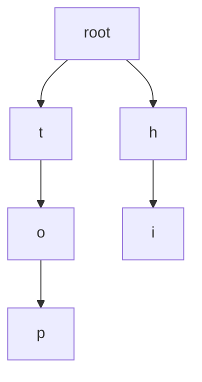
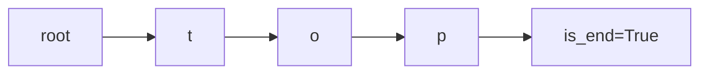

# Tries (Prefix Trees) (Deep Dive)

📄 File: `book/02_algorithms_data_structures/tries.md`

This chapter covers **tries** — prefix trees for autocomplete, prefix search. Used in search engines and LLM tokenization.

---

## Study Plan (2–3 days)

* Day 1: Trie structure, insert, search
* Day 2: Prefix search, autocomplete
* Day 3: Exercises

---

## 1 — What is a Trie?

A **trie** stores strings by sharing common prefixes. Each node has children for next character.



---

## 2 — Trie Implementation

```python
class TrieNode:
    def __init__(self):
        self.children = {}
        self.is_end = False

class Trie:
    def __init__(self):
        self.root = TrieNode()

    def insert(self, word):
        node = self.root
        for c in word:
            if c not in node.children:
                node.children[c] = TrieNode()
            node = node.children[c]
        node.is_end = True

    def search(self, word):
        node = self.root
        for c in word:
            if c not in node.children:
                return False
            node = node.children[c]
        return node.is_end

    def starts_with(self, prefix):
        node = self.root
        for c in prefix:
            if c not in node.children:
                return False
            node = node.children[c]
        return True
```

---

## Diagram — Trie Insert "top"



---

## 3 — Autocomplete (All words with prefix)

```python
def autocomplete(self, prefix):
    node = self.root
    for c in prefix:
        if c not in node.children:
            return []
        node = node.children[c]
    result = []
    def dfs(n, path):
        if n.is_end:
            result.append(prefix + path)
        for c, child in n.children.items():
            dfs(child, path + c)
    dfs(node, "")
    return result
```

---

## 4 — Use Cases in AI/Data

* **Autocomplete**: Typeahead search
* **Tokenization**: BPE/WordPiece use trie-like structures
* **Prefix matching**: Log analysis, IP routing

---

## Interview Questions

1. When use trie vs hash table?
2. Space complexity of trie?
3. How does autocomplete work with trie?

---

## Key Takeaways

* Trie = prefix tree, O(m) insert/search (m = word length)
* Good for prefix search, autocomplete
* Used in tokenizers and search

---

## Next Chapter

Proceed to: **two_pointers.md**
