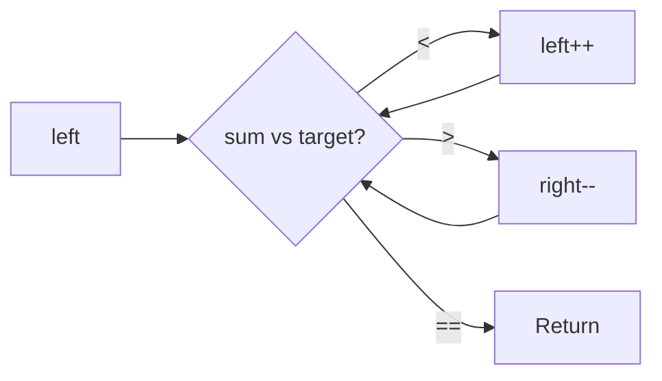

# Two Pointers (Deep Dive)

📄 File: `book/02_algorithms_data_structures/two_pointers.md`

This chapter covers the **two pointers** technique — pair sum, palindrome, merge. O(n) solutions for many array problems.

---

## Study Plan (2–3 days)

* Day 1: Sorted array — pair sum, 3-sum
* Day 2: Palindrome, in-place
* Day 3: Exercises

---

## 1 — Pair Sum (Sorted Array)

**Problem:** Find two numbers that sum to target. Array is sorted.

```python
def two_sum_sorted(arr, target):
    left, right = 0, len(arr) - 1
    while left < right:
        s = arr[left] + arr[right]
        if s == target:
            return [left, right]
        if s < target:
            left += 1
        else:
            right -= 1
    return []
```

---

## Diagram — Two Pointers (Sorted)



---

## 2 — 3-Sum (Unique Triplets)

```python
def three_sum(arr):
    arr.sort()
    result = []
    for i in range(len(arr) - 2):
        if i > 0 and arr[i] == arr[i-1]:
            continue
        left, right = i + 1, len(arr) - 1
        target = -arr[i]
        while left < right:
            s = arr[left] + arr[right]
            if s == target:
                result.append([arr[i], arr[left], arr[right]])
                while left < right and arr[left] == arr[left+1]:
                    left += 1
                left += 1
                right -= 1
            elif s < target:
                left += 1
            else:
                right -= 1
    return result
```

---

## 3 — Valid Palindrome

```python
def is_palindrome(s):
    left, right = 0, len(s) - 1
    while left < right:
        if not s[left].isalnum():
            left += 1
            continue
        if not s[right].isalnum():
            right -= 1
            continue
        if s[left].lower() != s[right].lower():
            return False
        left += 1
        right -= 1
    return True
```

---

## 4 — Container With Most Water

```python
def max_area(height):
    left, right = 0, len(height) - 1
    best = 0
    while left < right:
        area = (right - left) * min(height[left], height[right])
        best = max(best, area)
        if height[left] < height[right]:
            left += 1
        else:
            right -= 1
    return best
```

---

## 5 — Remove Duplicates (In-Place, Sorted)

```python
def remove_duplicates(arr):
    if not arr:
        return 0
    write = 1
    for read in range(1, len(arr)):
        if arr[read] != arr[read - 1]:
            arr[write] = arr[read]
            write += 1
    return write
```

---

## Interview Questions

1. When is two pointers applicable?
2. Two sum sorted vs unsorted — difference?
3. How to avoid duplicates in 3-sum?

---

## Key Takeaways

* Two pointers: O(n) for sorted arrays
* Left/right move based on comparison
* Use for pair sum, palindrome, merge

---

## Next Chapter

Proceed to: **sliding_window.md**
