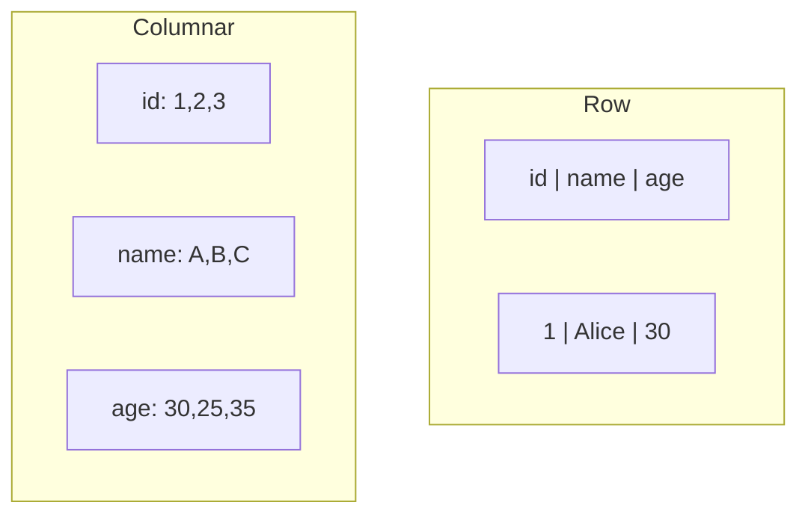

# Columnar Storage

📄 File: `book/03_sql_query_engines/columnar_storage.md`

This chapter covers **columnar storage** — why Parquet/Arrow are fast for analytics. Foundation for DuckDB, Spark, data lakes.

---

## Study Plan (1–2 days)

* Day 1: Row vs columnar
* Day 2: Parquet, compression

---

## 1 — Row vs Columnar



---

## 2 — Why Columnar for Analytics?

* **Selective reads**: Read only needed columns
* **Compression**: Same type → better compression
* **Vectorization**: Process column in batches

---

## 3 — Parquet

* Columnar format
* Row groups, column chunks
* Compression: Snappy, GZIP, etc.

```python
import pyarrow.parquet as pq
table = pq.read_table('data.parquet')
```

---

## Key Takeaways

* Columnar = read only needed columns
* Better compression, vectorization
* Parquet = standard columnar format

---

## Next Chapter

Proceed to: **duckdb.md**
