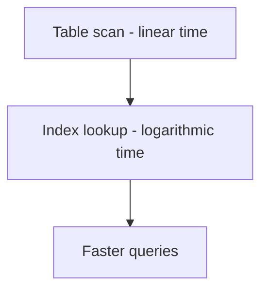
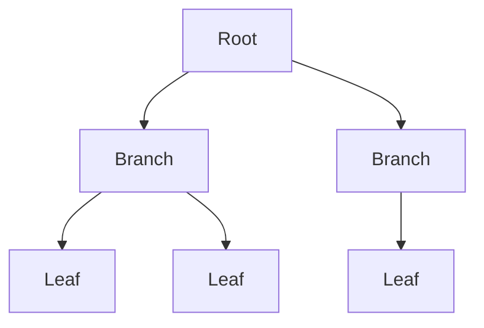
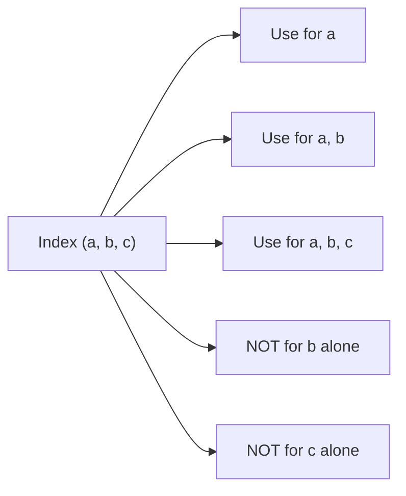
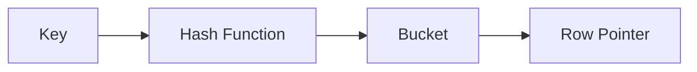

# Indexes (Deep Dive)

📄 File: `book/03_sql_query_engines/indexes.md`

This chapter covers **indexes** — B-tree, hash, composite, and covering indexes. Critical for query performance in data systems. Understanding indexes is essential for tuning production databases and data warehouses.

---

## Study Plan (3–5 days)

* Day 1: What indexes are, why they matter, B-tree fundamentals
* Day 2: Composite indexes, leftmost prefix rule, covering indexes
* Day 3: Hash indexes, when to use which
* Day 4: Query planning, EXPLAIN, index maintenance
* Day 5: Exercises, real-world tuning scenarios

---

## 1 — What is an Index?

An index is a **data structure** that speeds up lookups on one or more columns. Without an index, the database must scan every row (full table scan). With an index, it can jump directly to relevant rows.

**Trade-off**: Indexes speed up **reads** but slow down **writes** (inserts, updates, deletes) because the index must be updated.



### Internal Implementation

* **Without index**: Database reads every block of the table from disk until it finds matching rows. For a table with N rows, this is O(N) I/O in the worst case.
* **With index**: Database uses the index structure (e.g., B-tree) to find the disk location of matching rows. For a B-tree, this is O(log N) lookups.

### Why It Matters in Real Systems

* In production, a query that takes 30 seconds with a full scan can drop to milliseconds with the right index.
* AI data pipelines often query large fact tables by date, user_id, or event_type — these columns should be indexed.
* Data warehouses (Snowflake, BigQuery, Redshift) use different index strategies (e.g., zone maps, min-max) but the principle is the same: avoid reading unnecessary data.

---

## 2 — B-Tree Index (Default in Most Databases)

A **B-tree** (Balanced Tree) is a self-balancing tree structure. It keeps data sorted and allows searches, inserts, and deletes in logarithmic time.

### Structure

* **Root node**: Top of the tree
* **Branch nodes**: Internal nodes with key ranges
* **Leaf nodes**: Contain actual row pointers (or key values) and are linked for range scans



### When B-Tree Excels

* **Equality**: `WHERE email = 'a@b.com'`
* **Range**: `WHERE date BETWEEN '2025-01-01' AND '2025-01-31'`
* **ORDER BY**: Index is already sorted
* **Prefix match**: `WHERE name LIKE 'John%'` (not `LIKE '%John'`)

### Complexity

* Lookup: O(log N)
* Range scan: O(log N + K) where K = number of rows in range
* Insert/Delete: O(log N)

```sql
-- Create single-column index
CREATE INDEX idx_users_email ON users(email);

-- Create composite index (order matters!)
CREATE INDEX idx_orders_user_date ON orders(user_id, created_at);
```

---

## 3 — Composite Index (Order Matters!)

A **composite index** is an index on multiple columns. The **leftmost prefix rule** determines which queries can use it.

### Leftmost Prefix Rule

An index on `(a, b, c)` can be used for:

* `WHERE a = ?`
* `WHERE a = ? AND b = ?`
* `WHERE a = ? AND b = ? AND c = ?`
* `ORDER BY a`, `ORDER BY a, b`, `ORDER BY a, b, c`

It **cannot** be used for:

* `WHERE b = ?` (skips `a`)
* `WHERE c = ?` (skips `a` and `b`)
* `WHERE a = ? AND c = ?` (skips `b` — only partial use)



### Why Order Matters

The index is stored sorted by (a, b, c). So it's like a phone book: sorted by last name, then first name. You can't efficiently find everyone with first name "John" without scanning — you need last name first.

### Example

```sql
-- Good: uses index on (user_id, created_at)
SELECT * FROM orders WHERE user_id = 123 AND created_at > '2025-01-01';

-- Bad: cannot use index for created_at alone
SELECT * FROM orders WHERE created_at > '2025-01-01';
```

---

## 4 — Covering Index (Index-Only Scan)

A **covering index** includes all columns needed by the query. The database can satisfy the query from the index alone without touching the table (heap).

```sql
-- If we only need user_id and amount
CREATE INDEX idx_orders_covering ON orders(user_id, created_at) INCLUDE (amount);

-- Query can be satisfied from index only
SELECT user_id, amount FROM orders WHERE user_id = 123;
```

### Benefit

* Avoids **heap fetches** — no need to read the main table
* Fewer I/O operations, faster queries

---

## 5 — Hash Index

* **Structure**: Hash function maps key → bucket. Each bucket holds row pointers.
* **Good for**: Equality only (`WHERE id = 123`)
* **Not good for**: Range queries, ORDER BY, LIKE with leading wildcard



### B-Tree vs Hash

| Feature       | B-Tree     | Hash        |
| ------------- | ---------- | ----------- |
| Equality      | Yes        | Yes (faster)|
| Range         | Yes        | No          |
| ORDER BY      | Yes        | No          |
| Prefix LIKE   | Yes        | No          |
| Typical use   | General    | Primary key |

---

## 6 — When to Index

| Index When                    | Don't Index When           |
| ----------------------------- | -------------------------- |
| Frequent WHERE column         | Small tables (< 1000 rows) |
| JOIN key (foreign key)        | High write, low read       |
| ORDER BY, GROUP BY column     | Low cardinality (e.g., gender) |
| Columns in covering index     | Columns rarely in predicates |

### When Indexes Hurt

* **Too many indexes**: Every insert/update/delete must update all indexes.
* **Low cardinality**: Index on a column with few distinct values (e.g., boolean) may not help — optimizer might choose table scan anyway.
* **Small tables**: Index overhead exceeds scan cost.

---

## 7 — EXPLAIN and Query Planning

Use `EXPLAIN` (or `EXPLAIN ANALYZE`) to see whether the optimizer uses your index.

```sql
-- PostgreSQL
EXPLAIN (ANALYZE, BUFFERS) SELECT * FROM users WHERE email = 'a@b.com';

-- Look for:
-- Index Scan using idx_users_email on users
-- vs
-- Seq Scan on users  (bad — not using index)
```

### Key Terms

* **Seq Scan**: Full table scan — no index used
* **Index Scan**: Uses index to find rows
* **Index Only Scan**: Uses covering index, no heap access
* **Bitmap Index Scan**: For multiple conditions, builds bitmap from index then fetches rows

---

## 8 — Index Maintenance

* **Rebuild**: Recreate index from scratch (e.g., after bulk load). Frees bloat.
* **Reindex**: Same as rebuild in most systems.
* **Statistics**: Update table statistics so optimizer makes good choices. `ANALYZE table_name;`

---

## 9 — Exercises (with Line-by-Line Comments)

### Exercise 1: Design Composite Index

**Scenario**: Table `events(user_id, event_type, created_at)`. Common query: `WHERE user_id = ? AND created_at BETWEEN ? AND ?` and `ORDER BY created_at`.

**Solution**:

```sql
-- Index (user_id, created_at) — user_id first for equality, created_at for range and ORDER BY
CREATE INDEX idx_events_user_date ON events(user_id, created_at);
```

### Exercise 2: Covering Index

**Scenario**: Query `SELECT user_id, SUM(amount) FROM orders WHERE user_id = ? GROUP BY user_id`. Only needs user_id and amount.

**Solution**:

```sql
-- Covering index: (user_id) INCLUDE (amount) — or (user_id, amount) if supported
CREATE INDEX idx_orders_user_amount ON orders(user_id) INCLUDE (amount);
```

---

## 10 — Interview Questions with In-Depth Answers

### Q1: B-tree vs Hash index — when to use which?

**Answer**:

* **B-tree**: Use when you need range queries, ORDER BY, or prefix matches. Default choice for most applications. Supports `=`, `<`, `>`, `BETWEEN`, `LIKE 'prefix%'`.
* **Hash**: Use only for equality lookups (e.g., primary key by ID) when you never need ranges. Slightly faster for `=` but cannot support range or sort. PostgreSQL's hash index is less commonly used; many systems use B-tree for primary keys too for flexibility.

**In production**: Most OLTP systems use B-tree for everything. Hash is niche (e.g., in-memory caches, some NoSQL).

---

### Q2: Composite index column order — how do you decide?

**Answer**:

Apply the **leftmost prefix rule** and **selectivity**:

1. **Equality before range**: Put equality columns first (`WHERE a = ? AND b > ?` → index `(a, b)`).
2. **High selectivity first**: Put the column that filters the most rows first (e.g., `user_id` before `status` if user_id narrows to 100 rows and status to 10,000).
3. **ORDER BY**: If the query has `ORDER BY b`, having `(a, b)` allows index to satisfy both WHERE and ORDER BY when `a` is in WHERE.

**Example**: For `WHERE country = 'US' AND created_at > '2025-01-01' ORDER BY created_at`, use `(country, created_at)` — equality first, then range/sort.

---

### Q3: When does an index hurt performance?

**Answer**:

1. **Write-heavy tables**: Every insert/update/delete must update the index. Many indexes = many writes per row.
2. **Small tables**: Full scan is cheap; index lookup overhead (random I/O) can be worse.
3. **Low selectivity**: If a predicate matches most rows (e.g., `WHERE status = 'active'` when 95% are active), the optimizer may prefer a seq scan — reading index + heap can be more I/O than just scanning the table.
4. **Bloated indexes**: After many deletes, indexes can become fragmented. Rebuild/reindex to reclaim space and improve performance.

---

### Q4: What is a covering index and why is it useful?

**Answer**:

A covering index includes all columns required by the query. The database can answer the query from the index alone without accessing the main table (heap). This avoids **heap fetches** — random I/O to read full rows. For queries that need few columns, a covering index can make them 2–10x faster by reducing I/O.

---

## Key Takeaways

* Index = data structure for fast lookup; trade-off is write cost
* B-tree: general-purpose, supports range and sort
* Hash: equality only
* Composite: leftmost prefix rule; column order matters
* Covering index: index-only scan, fewer I/O
* Use EXPLAIN to verify index usage
* Index when: frequent predicates, JOIN keys, ORDER BY; avoid when: small tables, high writes, low cardinality

---

## Next Chapter

Proceed to: **duckdb.md**
