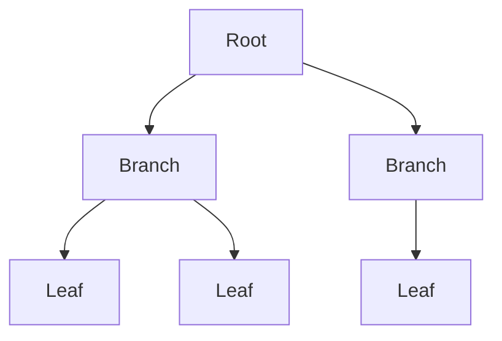

# Indexes

📄 File: `book/03_sql_query_engines/indexes.md`

This chapter covers **indexes** — B-tree, hash, composite. Critical for query performance in data systems.

---

## Study Plan (2–3 days)

* Day 1: B-tree index, when to index
* Day 2: Composite index, covering index
* Day 3: Query planning, EXPLAIN

---

## 1 — What is an Index?

An index is a **data structure** that speeds up lookups on one or more columns.

```mermaid
flowchart TD
    A[Table scan O(n)] --> B[Index lookup O(log n)]
    B --> C[Faster queries]
```

---

## 2 — B-Tree Index (Default)

* Sorted structure
* Good for: =, <, >, BETWEEN, ORDER BY
* O(log n) lookup

```sql
CREATE INDEX idx_users_email ON users(email);
CREATE INDEX idx_orders_user_date ON orders(user_id, created_at);
```

---

## 3 — Composite Index (Order Matters!)

```sql
-- Index on (a, b) can be used for:
-- WHERE a = ?
-- WHERE a = ? AND b = ?
-- ORDER BY a, b
-- NOT for: WHERE b = ? alone

CREATE INDEX idx_ab ON t(a, b);
```

---

## Diagram — B-Tree Index



---

## 4 — When to Index

| Index When              | Don't Index When      |
| ---------------------- | --------------------- |
| Frequent WHERE/JOIN col | Small tables          |
| ORDER BY, GROUP BY col  | High write, low read  |
| Foreign keys           | Low cardinality cols  |

---

## 5 — EXPLAIN (Query Plan)

```sql
EXPLAIN SELECT * FROM users WHERE email = 'a@b.com';
-- Look for: Index Scan vs Seq Scan
```

---

## Interview Questions

1. B-tree vs hash index?
2. Composite index column order?
3. When does index hurt performance?

---

## Key Takeaways

* Index speeds up reads, slows writes
* Composite: leftmost prefix rule
* Use EXPLAIN to verify index usage

---

## Next Chapter

Proceed to: **duckdb.md**
