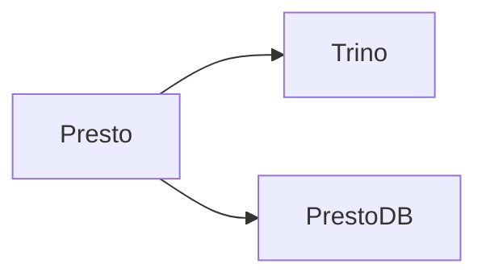

# Presto

📄 File: `book/03_sql_query_engines/presto.md`

This chapter covers **Presto** — the open-source predecessor of Trino. Understanding the lineage helps with ecosystem knowledge.

---

## Study Plan (1 day)

---

## 1 — Presto vs Trino

* **Presto**: Original project (Facebook/Meta)
* **Trino**: Community fork (PrestoSQL → Trino)
* **PrestoDB**: Another fork maintained by Presto Foundation

---

## 2 — When You See "Presto"

In practice, many companies use **Trino** (the actively developed fork). Concepts are the same: distributed SQL, connectors, coordinator/worker architecture.

---

## Key Takeaways

* Presto → Trino (community fork)
* Same architecture, similar SQL
* Trino is the main successor

---

## Next Chapter

Proceed to: **spark_sql.md**
