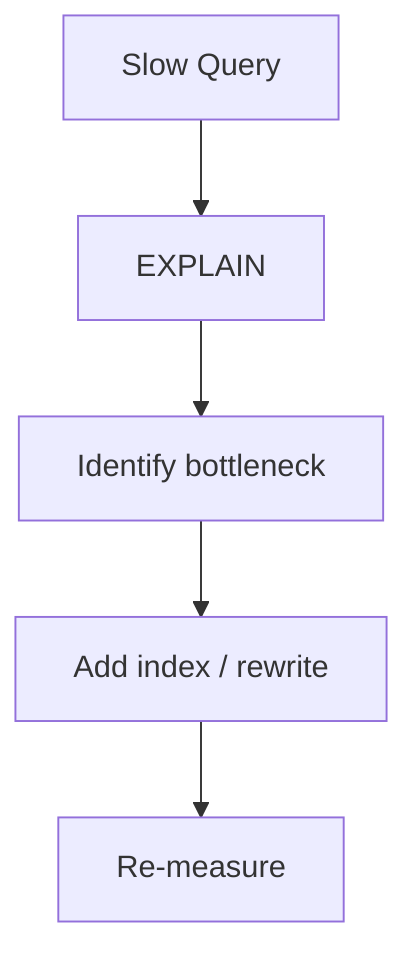

# Query Optimization

📄 File: `book/03_sql_query_engines/query_optimization.md`

This chapter covers **query optimization** — techniques to make SQL faster. Essential for production data pipelines.

---

## Study Plan (2 days)

* Day 1: Index usage, predicate pushdown
* Day 2: Join order, partitioning

---

## 1 — Optimization Strategies



---

## 2 — Predicate Pushdown

Push filters **down** to the data source (e.g., Parquet row groups) to reduce I/O.

```sql
-- Good: filter early
SELECT * FROM (SELECT * FROM large_table WHERE date = '2025-01-01') t
WHERE region = 'US';
```

---

## 3 — Avoid SELECT *

```sql
-- Bad: reads all columns
SELECT * FROM users WHERE id = 1;

-- Better: only needed columns
SELECT id, name FROM users WHERE id = 1;
```

---

## 4 — Join Order

Optimizer usually picks join order, but large table first can matter for some engines.

---

## 5 — Partition Pruning

If table is partitioned by `date`, filter on `date` to skip partitions:

```sql
SELECT * FROM sales WHERE date BETWEEN '2025-01-01' AND '2025-01-31';
```

---

## Key Takeaways

* Use EXPLAIN to understand plans
* Predicate pushdown reduces I/O
* Partition pruning skips data

---

## Next Chapter

Proceed to: **columnar_storage.md**
