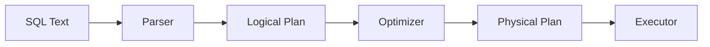

# Query Planning

📄 File: `book/03_sql_query_engines/query_planning.md`

This chapter covers **query planning** — how SQL engines turn a query into an execution plan. Critical for debugging slow queries.

---

## Study Plan (2 days)

* Day 1: Parsing, logical plan
* Day 2: Physical plan, cost estimation

---

## 1 — Query Execution Pipeline



---

## 2 — Logical vs Physical Plan

* **Logical**: What to do (join, filter, aggregate)
* **Physical**: How to do it (hash join vs merge join, index scan vs seq scan)

```sql
EXPLAIN (ANALYZE, FORMAT TEXT) SELECT * FROM a JOIN b ON a.id = b.id;
```

---

## 3 — Key Operators

| Operator    | Description              |
| ---------- | ------------------------ |
| Seq Scan   | Full table scan          |
| Index Scan | Use index to find rows   |
| Hash Join  | Build hash table, probe  |
| Merge Join | Sort both, merge         |
| Nested Loop| For each row, scan other |

---

## 4 — Cost Estimation

Planners estimate cost (I/O, CPU) and choose cheapest plan. Use EXPLAIN to see chosen plan.

---

## Key Takeaways

* Parser → Logical → Optimizer → Physical → Execute
* EXPLAIN shows the plan
* Understand Seq Scan vs Index Scan

---

## Next Chapter

Proceed to: **query_optimization.md**
