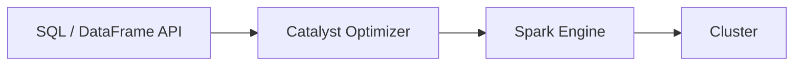

# Spark SQL

📄 File: `book/03_sql_query_engines/spark_sql.md`

This chapter covers **Spark SQL** — SQL on Apache Spark. The workhorse for big data analytics and ML pipelines.

---

## Study Plan (3–4 days)

* Day 1: SparkSession, DataFrames
* Day 2: SQL queries, UDFs
* Day 3: Parquet, partitioning
* Day 4: Exercises

---

## 1 — Spark SQL Overview

Spark SQL lets you run SQL on Spark's distributed engine. DataFrames = distributed tables.



---

## 2 — Basic Usage

```python
from pyspark.sql import SparkSession

spark = SparkSession.builder.getOrCreate()

# Read Parquet
df = spark.read.parquet("s3://bucket/data/")

# SQL
df.createOrReplaceTempView("events")
result = spark.sql("""
    SELECT user_id, COUNT(*) as cnt
    FROM events
    GROUP BY user_id
""")
```

---

## 3 — DataFrame API

```python
df = spark.read.parquet("data.parquet")
df.filter(df.date > "2025-01-01") \
  .groupBy("user_id") \
  .agg({"amount": "sum"}) \
  .show()
```

---

## 4 — Why Spark SQL for AI Data Engineering?

* **Scale**: Petabyte-scale datasets
* **Unified**: Batch + streaming (Structured Streaming)
* **ML integration**: Spark MLlib, feature store
* **Lakehouse**: Delta, Iceberg support

---

## Key Takeaways

* Spark SQL = SQL on Spark
* DataFrames = distributed tables
* Core of big data pipelines

---

## Next Chapter

You've completed **SQL & Query Engines**. Proceed to: **04_data_engineering_systems**
