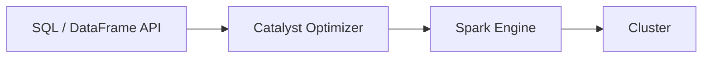
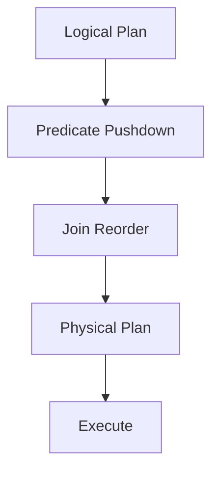

# Spark SQL (Deep Dive)

📄 File: `book/03_sql_query_engines/spark_sql.md`

This chapter provides an **in-depth** treatment of Spark SQL — SQL on Apache Spark. The workhorse for big data analytics, ETL, and ML pipelines at petabyte scale.

---

## Study Plan (1–2 weeks)

* Week 1: SparkSession, DataFrames, SQL, Catalyst optimizer
* Week 2: UDFs, window functions, Parquet, partitioning, tuning

---

## 1 — Spark SQL Overview

Spark SQL lets you run **SQL** and use the **DataFrame API** on Spark's distributed engine. Under the hood, both compile to the same execution plan via the **Catalyst** optimizer.



### Internal Implementation

* **Logical plan**: Parsed SQL or DataFrame operations represented as a tree
* **Catalyst**: Applies optimization rules (predicate pushdown, constant folding, join reordering)
* **Physical plan**: Converted to RDD operations (map, shuffle, etc.)
* **Tungsten**: Columnar execution, off-heap memory for efficiency

### Why It Matters in Real Systems

* **Unified**: Same engine for batch ETL, ad-hoc SQL, and streaming
* **Scale**: Runs on clusters; processes terabytes to petabytes
* **Ecosystem**: Delta Lake, Iceberg, Hive tables — all queryable via Spark SQL

---

## 2 — SparkSession and DataFrames

### Creating SparkSession

```python
from pyspark.sql import SparkSession

# Builder pattern: configure then getOrCreate
spark = SparkSession.builder \
    .appName("AI Data Pipeline") \
    .config("spark.sql.adaptive.enabled", "true") \
    .config("spark.sql.shuffle.partitions", "200") \
    .getOrCreate()

# getOrCreate: reuses existing session if one exists (e.g., in notebooks)
```

### Reading Data

```python
# Parquet: columnar, predicate pushdown, partition pruning
df = spark.read.parquet("s3://bucket/events/")

# With partition filter: only reads matching partitions
df = spark.read.parquet("s3://bucket/events/") \
    .filter("date >= '2025-01-01'")

# CSV with schema
from pyspark.sql.types import StructType, StructField, StringType, IntegerType, DoubleType
schema = StructType([
    StructField("user_id", IntegerType(), False),
    StructField("event", StringType(), True),
    StructField("amount", DoubleType(), True),
])
df = spark.read.option("header", "true").schema(schema).csv("s3://bucket/data.csv")

# Hive table (if Hive metastore configured)
df = spark.table("default.events")
```

### Writing Data

```python
# Overwrite
df.write.mode("overwrite").parquet("s3://bucket/output/")

# Append
df.write.mode("append").parquet("s3://bucket/output/")

# Partitioned write: creates subdirs date=2025-01-01, etc.
df.write.mode("overwrite").partitionBy("date").parquet("s3://bucket/output/")

# Bucketed write: for efficient joins
df.write.mode("overwrite") \
    .bucketBy(32, "user_id") \
    .sortBy("created_at") \
    .saveAsTable("events_bucketed")
```

---

## 3 — SQL Queries

### Temp Views and Global Temp Views

```python
# Temp view: session-scoped, for SQL
df.createOrReplaceTempView("events")

# SQL query
result = spark.sql("""
    SELECT user_id, 
           COUNT(*) as event_count,
           SUM(amount) as total_amount
    FROM events
    WHERE date BETWEEN '2025-01-01' AND '2025-01-31'
    GROUP BY user_id
    HAVING COUNT(*) > 10
""")

# Global temp view: shared across sessions (database: global_temp)
df.createGlobalTempView("events_global")
spark.sql("SELECT * FROM global_temp.events_global LIMIT 10")
```

### Window Functions

```python
from pyspark.sql import functions as F
from pyspark.sql.window import Window

# Define window: partition by user, order by date
w = Window.partitionBy("user_id").orderBy("created_at")

# Row number, lag, running sum
df.withColumn("row_num", F.row_number().over(w)) \
  .withColumn("prev_amount", F.lag("amount", 1).over(w)) \
  .withColumn("running_sum", F.sum("amount").over(w)) \
  .show()
```

---

## 4 — Catalyst Optimizer

Catalyst applies **rule-based** and **cost-based** optimizations:

* **Predicate pushdown**: Push `WHERE` to data source (Parquet row group pruning)
* **Projection pushdown**: Read only referenced columns
* **Constant folding**: `WHERE 1=1` eliminated
* **Join reordering**: Choose order to minimize shuffle
* **Adaptive Query Execution (AQE)**: Runtime optimization — coalesce partitions, optimize skew joins



---

## 5 — UDFs (User-Defined Functions)

### Pandas UDF (Vectorized — Preferred)

```python
from pyspark.sql.functions import pandas_udf
from pyspark.sql.types import DoubleType
import pandas as pd

# Vectorized: processes batches as Pandas Series
@pandas_udf(DoubleType())
def normalize(s: pd.Series) -> pd.Series:
    return (s - s.mean()) / s.std()

df.withColumn("amount_norm", normalize("amount"))
```

### Row-at-a-Time UDF (Slower)

```python
from pyspark.sql.functions import udf
from pyspark.sql.types import StringType

@udf(StringType())
def clean_text(s):
    return s.lower().strip() if s else None

df.withColumn("event_clean", clean_text("event"))
```

**Note**: Pandas UDFs use Arrow for efficient serialization; row UDFs serialize each row — avoid for large data.

---

## 6 — Joins and Broadcast

### Broadcast Join (Small Table)

```python
# If one table is small (< 10MB default), broadcast to all executors
# No shuffle for the small table
from pyspark.sql.functions import broadcast

large_df.join(broadcast(small_df), "user_id")
```

### Partitioning for Joins

```python
# Co-locate by join key to avoid shuffle
df1 = df1.repartition("user_id")
df2 = df2.repartition("user_id")
df1.join(df2, "user_id")  # Can use sort-merge join without shuffle
```

---

## 7 — Interview Questions with In-Depth Answers

### Q1: How does Spark SQL differ from plain SQL on a database?

**Answer**:

Spark SQL runs on a **distributed** cluster — data is partitioned across nodes, and queries are executed in parallel. A database typically has a single node (or primary) for execution. Spark SQL: (1) reads from distributed storage (HDFS, S3), (2) compiles to a DAG of stages and tasks, (3) executes tasks on executors. It's optimized for **analytical** workloads (full scans, aggregations) rather than transactional OLTP. Spark also supports **lazy evaluation** — the query plan is optimized before execution.

---

### Q2: What is predicate pushdown and why does it matter?

**Answer**:

**Predicate pushdown** means pushing filter conditions (e.g., `WHERE date = '2025-01-01'`) down to the data source. For Parquet, this enables **row group pruning** — Parquet stores min/max per row group, so Spark can skip entire row groups that don't match the predicate without reading them. This dramatically reduces I/O. For JDBC sources, predicate pushdown can push filters to the database (e.g., `WHERE` in the SQL query) so less data is transferred.

---

### Q3: When would you use a Pandas UDF vs a row UDF?

**Answer**:

**Pandas UDF** (vectorized): Processes a batch of rows as a Pandas Series. Uses Arrow for efficient transfer. Much faster for large datasets. Use when you need custom logic that can be expressed in Pandas/NumPy.

**Row UDF**: Processes one row at a time. Serialization overhead per row. Use only for small datasets or when vectorization isn't possible. Prefer built-in Spark functions or Pandas UDFs when possible.

---

### Q4: How does Spark SQL handle schema evolution?

**Answer**:

Spark supports **schema merging** for Parquet: when reading, set `mergeSchema=True` to combine schemas from different files. For Delta Lake and Iceberg, schema evolution is built-in (add column, rename, etc.). For other formats, you may need to define a superset schema and use `coalesce` or `when/otherwise` to handle missing columns.

---

## Key Takeaways

* Spark SQL = SQL + DataFrame API on Spark
* Catalyst optimizes logical plans; Tungsten executes efficiently
* Predicate pushdown reduces I/O; use Parquet for best support
* Pandas UDFs for custom logic; avoid row UDFs at scale
* Broadcast join for small tables; partition by join key for large joins

---

## Next Chapter

You've completed **SQL & Query Engines**. Proceed to: **04_data_engineering_systems**
