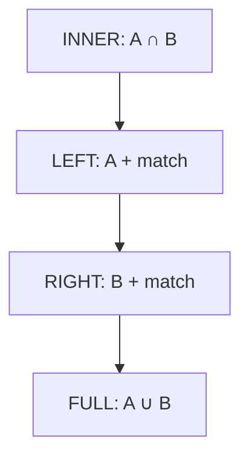

# SQL Fundamentals

📄 File: `book/03_sql_query_engines/sql_fundamentals.md`

This chapter covers **SQL fundamentals** — SELECT, JOINs, aggregations. The foundation for all data engineering and analytics.

---

## Study Plan (1 week)

* Day 1–2: SELECT, WHERE, ORDER BY
* Day 3–4: JOINs (INNER, LEFT, etc.)
* Day 5–6: GROUP BY, aggregations
* Day 7: Exercises + mini project

---

## 1 — SELECT Basics

```sql
-- Select all columns
SELECT * FROM users;

-- Select specific columns
SELECT id, name, email FROM users;

-- Filter with WHERE
SELECT * FROM users WHERE age > 25;

-- Sort with ORDER BY
SELECT * FROM users ORDER BY created_at DESC;

-- Limit results
SELECT * FROM users LIMIT 10;
```

---

## Diagram — SQL Query Flow


---

## 2 — JOINs

```sql
-- INNER JOIN: only matching rows
SELECT u.name, o.amount
FROM users u
INNER JOIN orders o ON u.id = o.user_id;

-- LEFT JOIN: all from left, match from right (NULL if no match)
SELECT u.name, o.amount
FROM users u
LEFT JOIN orders o ON u.id = o.user_id;

-- RIGHT JOIN: all from right
-- FULL OUTER JOIN: all from both
```

---

## Diagram — JOIN Types



---

## 3 — Aggregations

```sql
-- COUNT, SUM, AVG, MIN, MAX
SELECT
    COUNT(*) AS total_users,
    AVG(age) AS avg_age,
    SUM(amount) AS total_sales
FROM users u
JOIN orders o ON u.id = o.user_id;

-- GROUP BY
SELECT country, COUNT(*) AS user_count
FROM users
GROUP BY country;

-- HAVING (filter after aggregation)
SELECT country, COUNT(*) AS cnt
FROM users
GROUP BY country
HAVING COUNT(*) > 100;
```

---

## 4 — Subqueries

```sql
-- In WHERE
SELECT * FROM users
WHERE id IN (SELECT user_id FROM orders WHERE amount > 100);

-- In FROM (derived table)
SELECT country, avg_orders
FROM (
    SELECT user_id, COUNT(*) AS avg_orders
    FROM orders
    GROUP BY user_id
) t
JOIN users u ON t.user_id = u.id;
```

---

## 5 — Exercises (with comments)

### 1. Second Highest Salary

```sql
-- Use subquery + LIMIT OFFSET or MAX with exclusion
SELECT MAX(salary) AS SecondHighestSalary
FROM employees
WHERE salary < (SELECT MAX(salary) FROM employees);
```

---

### 2. Duplicate Emails

```sql
SELECT email
FROM users
GROUP BY email
HAVING COUNT(*) > 1;
```

---

## Interview Questions

1. INNER vs LEFT JOIN — when to use which?
2. WHERE vs HAVING?
3. How to find Nth highest value?

---

## Key Takeaways

* SELECT, FROM, WHERE, GROUP BY, HAVING, ORDER BY, LIMIT
* JOINs: INNER, LEFT, RIGHT, FULL
* Aggregations: COUNT, SUM, AVG, MIN, MAX

---

## Next Chapter

Proceed to: **advanced_sql.md**
