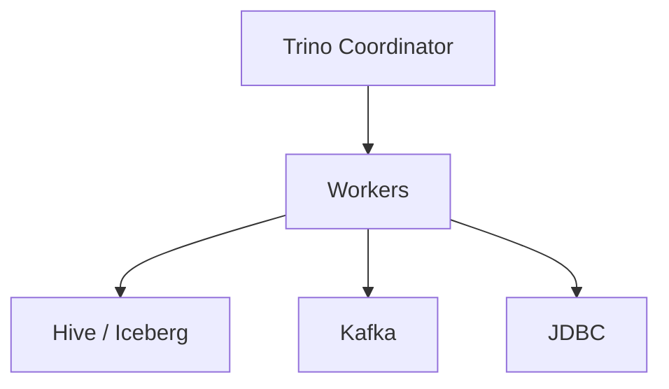

# Trino

📄 File: `book/03_sql_query_engines/trino.md`

This chapter covers **Trino** — distributed SQL query engine. Query data lakes, Hive, Kafka, and more with one engine.

---

## Study Plan (2–3 days)

* Day 1: Architecture, connectors
* Day 2: Query patterns, tuning
* Day 3: Exercises

---

## 1 — What is Trino?

Trino (formerly Presto SQL) is a **distributed** SQL engine for querying multiple data sources.



---

## 2 — Key Features

* **Federated queries**: Join Hive + Kafka + Postgres
* **ANSI SQL**: Standard syntax
* **Massively parallel**: Scale out workers

---

## 3 — Connectors

* Hive, Iceberg, Delta Lake
* Kafka, Redis
* PostgreSQL, MySQL
* S3, GCS

---

## 4 — Example

```sql
-- Query Iceberg table on S3
SELECT * FROM iceberg.default.events
WHERE date = DATE '2025-01-01'
LIMIT 100;
```

---

## Key Takeaways

* Trino = distributed federated SQL
* One query across many sources
* Used for data lake analytics

---

## Next Chapter

Proceed to: **presto.md**
