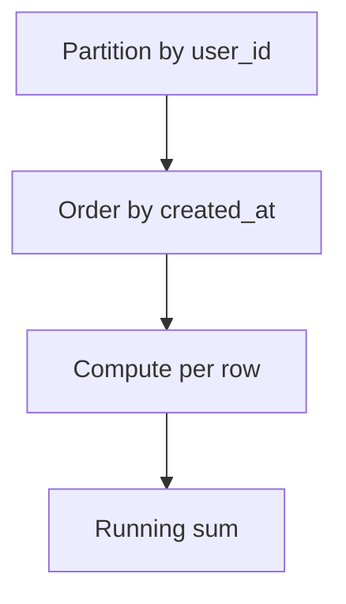

# Window Functions

📄 File: `book/03_sql_query_engines/window_functions.md`

This chapter covers **window functions** — ROW_NUMBER, RANK, LAG, LEAD. Critical for analytics and data pipelines.

---

## Study Plan (3–4 days)

* Day 1: OVER, PARTITION BY, ORDER BY
* Day 2: ROW_NUMBER, RANK, DENSE_RANK
* Day 3: LAG, LEAD, running sums
* Day 4: Exercises

---

## 1 — What is a Window Function?

A window function computes a value **per row** based on a **window** of rows (partition + order).

```sql
SELECT
    user_id,
    amount,
    SUM(amount) OVER (PARTITION BY user_id ORDER BY created_at) AS running_total
FROM orders;
```

---

## Diagram — Window Function



---

## 2 — ROW_NUMBER, RANK, DENSE_RANK

```sql
SELECT
    name,
    score,
    ROW_NUMBER() OVER (ORDER BY score DESC) AS row_num,   -- 1,2,3,4
    RANK() OVER (ORDER BY score DESC) AS rank,            -- 1,2,2,4
    DENSE_RANK() OVER (ORDER BY score DESC) AS dense_rank -- 1,2,2,3
FROM students;
```

---

## 3 — LAG and LEAD

```sql
-- Previous row value
SELECT
    date,
    revenue,
    LAG(revenue) OVER (ORDER BY date) AS prev_revenue,
    revenue - LAG(revenue) OVER (ORDER BY date) AS diff
FROM daily_sales;

-- Next row value
SELECT
    date,
    LEAD(revenue) OVER (ORDER BY date) AS next_revenue
FROM daily_sales;
```

---

## 4 — Running Sum / Moving Average

```sql
SELECT
    date,
    amount,
    SUM(amount) OVER (ORDER BY date ROWS BETWEEN UNBOUNDED PRECEDING AND CURRENT ROW) AS running_sum,
    AVG(amount) OVER (ORDER BY date ROWS BETWEEN 6 PRECEDING AND CURRENT ROW) AS ma_7d
FROM sales;
```

---

## 5 — Top N Per Group

```sql
WITH ranked AS (
    SELECT *,
        ROW_NUMBER() OVER (PARTITION BY department ORDER BY salary DESC) AS rn
    FROM employees
)
SELECT * FROM ranked WHERE rn <= 3;
```

---

## Interview Questions

1. ROW_NUMBER vs RANK vs DENSE_RANK?
2. When use LAG/LEAD?
3. Frame: ROWS vs RANGE?

---

## Key Takeaways

* Window = PARTITION BY + ORDER BY + frame
* ROW_NUMBER: unique rank
* LAG/LEAD: access adjacent rows
* Running sums: UNBOUNDED PRECEDING

---

## Next Chapter

Proceed to: **indexes.md**
