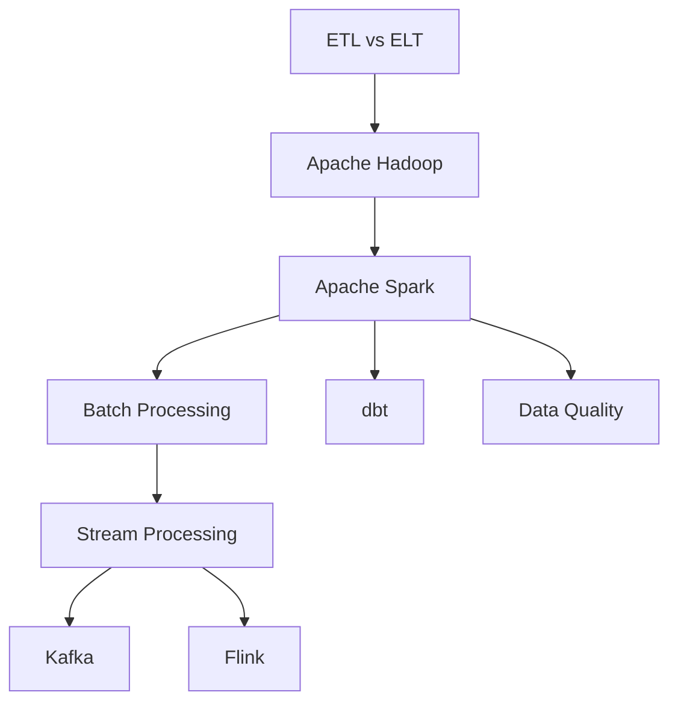

# Data Engineering Systems Roadmap

📄 File: `book/04_data_engineering_systems/00_data_engineering_roadmap.md`

This roadmap guides you through **data engineering systems** — the pipelines and frameworks that move and transform data at scale for AI systems.

---

## Study Plan (6–8 weeks)

* Weeks 1–2: Hadoop, Spark (foundational big data)
* Weeks 3–4: Kafka, Flink (streaming)
* Weeks 5–6: dbt, data quality
* Weeks 7–8: Production patterns, tuning

---

## Phase Index

| File | Topic | Key Concepts |
|------|-------|--------------|
| etl_vs_elt | ETL vs ELT | Extract, transform, load order |
| apache_hadoop | Apache Hadoop | HDFS, MapReduce, YARN, Hive |
| apache_spark | Apache Spark | RDD, DataFrame, partitioning, shuffle |
| batch_processing | Batch Processing | Scheduled jobs, idempotency |
| stream_processing | Stream Processing | Unbounded data, windowing |
| apache_kafka | Apache Kafka | Topics, partitions, consumer groups |
| apache_flink | Apache Flink | Event time, state, exactly-once |
| dbt | dbt | SQL transforms, tests, incremental |
| spark_internals | Spark Internals | DAG, stages, shuffle |
| data_quality_tools | Data Quality | Validation, monitoring |
| great_expectations | Great Expectations | Expectations, checkpoints |
| soda | Soda | SQL-based checks |

---

## Flow Diagram

---

## Big Data Frameworks (Must Know)

* **Apache Hadoop**: HDFS, MapReduce, YARN — foundational, still in use
* **Apache Spark**: In-memory, fast — primary engine for most new workloads
* **Apache Kafka**: Event streaming — real-time pipelines
* **Apache Flink**: True streaming — low-latency, stateful

---

## Next Chapter

Start with: **etl_vs_elt.md**
