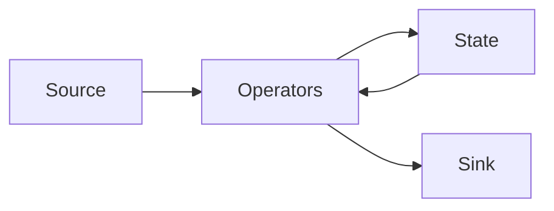
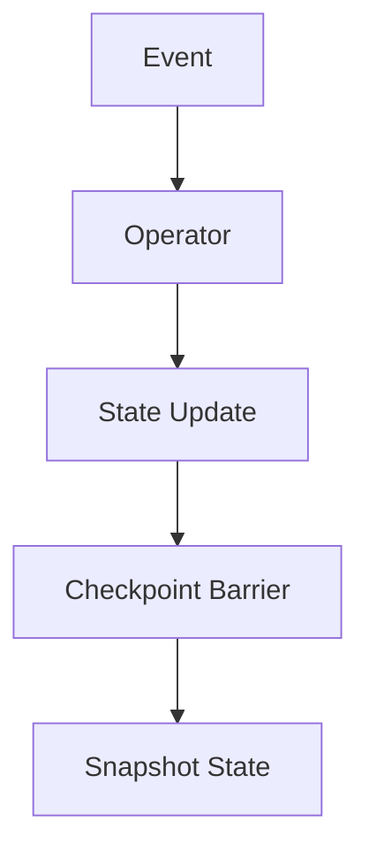

# Apache Flink (Deep Dive)

📄 File: `book/04_data_engineering_systems/apache_flink.md`

This chapter covers **Apache Flink** — true stream processing with event time, state, and exactly-once. For low-latency, stateful streaming.

---

## Study Plan (1 week)

* Day 1–2: DataStream API, sources/sinks
* Day 3–4: State, checkpoints
* Day 5–6: Windowing, CEP
* Day 7: Exercises

---

## 1 — What is Flink?

Flink is a **stateful** stream processor. Handles event time, watermarks, and exactly-once semantics natively.



---

## 2 — Flink vs Spark Streaming

| Flink | Spark Streaming |
| ----- | ---------------- |
| True streaming | Micro-batch |
| Event time native | Processing time default |
| Low latency (ms) | Higher latency |
| Stateful | Stateless by default |

---

## 3 — Basic Flink Job (Java/Python)

```python
# PyFlink example
from pyflink.datastream import StreamExecutionEnvironment

# Create execution environment
env = StreamExecutionEnvironment.get_execution_environment()

# Add source: read from Kafka/socket
ds = env.from_collection([1, 2, 3, 4, 5])

# Transform: map each element
mapped = ds.map(lambda x: x * 2)

# Sink: print
mapped.print()

# Execute
env.execute("Flink Job")
```

---

## 4 — State and Checkpoints

* **State**: Operator state (e.g., running count)
* **Checkpoints**: Periodic snapshots for recovery
* **Exactly-once**: Replay from checkpoint on failure



---

## 5 — Windowing (Event Time)

```python
# Keyed stream, tumbling window of 5 minutes
stream.key_by(lambda x: x["user_id"]) \
    .window(TumblingEventTimeWindows.of(Time.minutes(5))) \
    .sum("amount")
```

---

## 6 — Why Flink for AI Data Engineering?

* **Real-time features**: Aggregate events in event time
* **Fraud detection**: Stateful pattern matching
* **Exactly-once**: Critical for financial/audit

---

## Interview Questions

1. Flink vs Spark Streaming?
2. How does Flink achieve exactly-once?
3. Event time vs processing time in Flink?

---

## Key Takeaways

* Flink = true streaming, stateful
* Event time + watermarks
* Checkpoints for exactly-once

---

## Next Chapter

Proceed to: **spark_internals.md**
