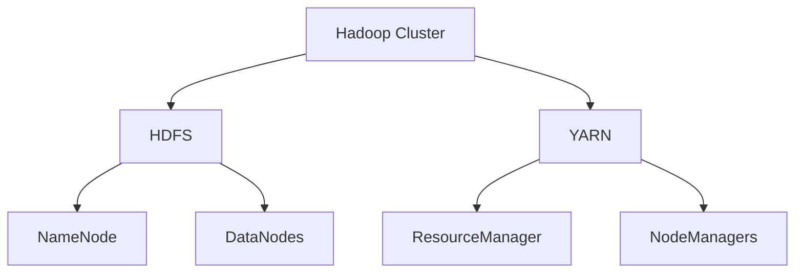
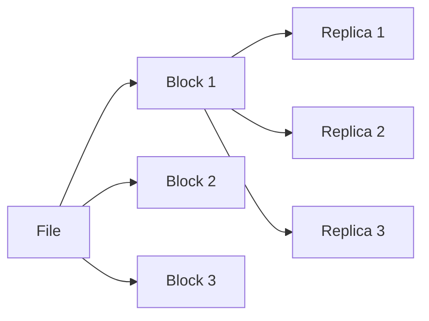
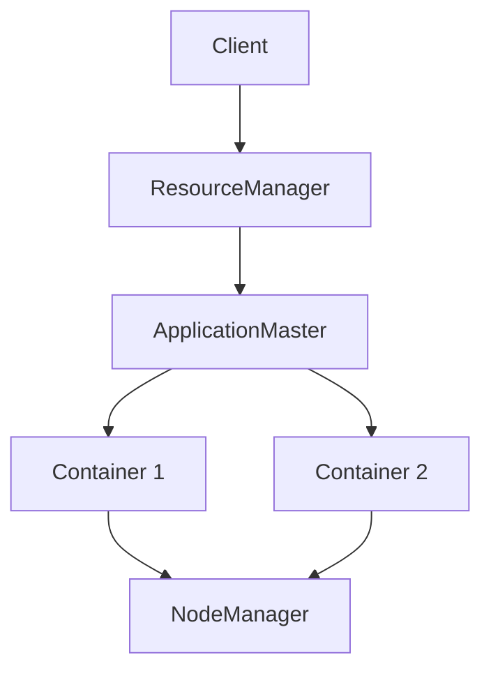
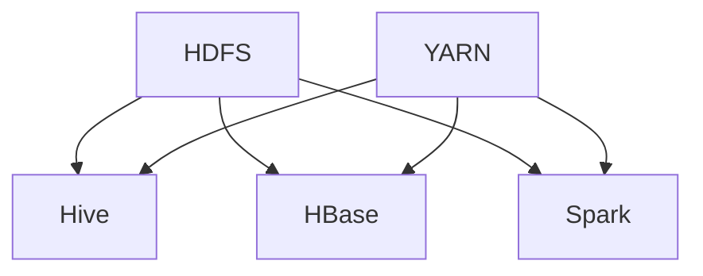

# Apache Hadoop (Deep Dive)

📄 File: `book/04_data_engineering_systems/apache_hadoop.md`

This chapter provides an **in-depth** treatment of Apache Hadoop — the foundational big data framework. Understanding Hadoop is essential for legacy systems, HDFS, YARN, and the ecosystem (Hive, HBase) that many enterprises still run.

---

## Study Plan (2–3 weeks)

* Week 1: HDFS, MapReduce, architecture
* Week 2: YARN, Hive, HBase
* Week 3: Hadoop vs Spark, migration, production patterns

---

## 1 — What is Hadoop?

Apache Hadoop is a **distributed storage and processing** framework for big data. Core components:

* **HDFS (Hadoop Distributed File System)**: Distributed storage — files split into blocks, replicated across nodes
* **MapReduce**: Distributed compute — map and reduce phases, writes to disk between stages
* **YARN**: Resource manager — schedules jobs, allocates containers



### Internal Implementation

* **NameNode**: Metadata for HDFS — which blocks are where. Single point of metadata (High Availability setups use standby)
* **DataNode**: Stores actual data blocks, reports to NameNode
* **ResourceManager**: Allocates resources (CPU, memory) to applications
* **NodeManager**: Runs on each node, manages containers (executors)

### Why It Matters in Real Systems

* **Legacy**: Many enterprises have years of data in HDFS. Understanding HDFS is required for migration and integration.
* **Hive, HBase**: Built on HDFS. Hive = SQL on HDFS; HBase = distributed key-value store.
* **YARN**: Spark, Flink, Hive run on YARN. Understanding YARN helps with cluster resource management.

---

## 2 — HDFS (Hadoop Distributed File System)

### Design Principles

* **Write-once, read-many**: Optimized for batch reads, not random writes
* **Large files**: Typical block size 128MB or 256MB — minimizes metadata
* **Replication**: Default 3 replicas for fault tolerance
* **Rack awareness**: Replicas spread across racks for failure isolation

### Block and Replication

```
File: /data/events.parquet (500 MB)
Block 1 (128 MB) → DN1, DN2, DN3
Block 2 (128 MB) → DN2, DN3, DN4
Block 3 (128 MB) → DN3, DN4, DN1
Block 4 (116 MB) → DN4, DN1, DN2
```



### HDFS Commands

```bash
# List directory
hdfs dfs -ls /data/

# Put file
hdfs dfs -put local.csv /data/

# Get file
hdfs dfs -get /data/events.parquet .

# Create directory
hdfs dfs -mkdir -p /data/events/

# Check block locations
hdfs fsck /data/events.parquet -files -blocks -locations
```

### Read Path

1. Client asks NameNode for block locations
2. NameNode returns list of DataNodes holding each block
3. Client reads from nearest DataNode (or same rack)
4. If block is corrupted, client tries next replica

### Write Path

1. Client asks NameNode for block allocation
2. NameNode assigns DataNodes (considering replication, rack diversity)
3. Client writes pipeline: DN1 → DN2 → DN3 (for 3 replicas)
4. Data flows through pipeline; each DN acknowledges
5. NameNode commits metadata when block is complete

---

## 3 — MapReduce

MapReduce is a **programming model** for distributed processing: **Map** (process each record) → **Shuffle** (group by key) → **Reduce** (aggregate).

### Map Phase

* Input: Key-value pairs (e.g., line number, line content)
* Output: Key-value pairs (e.g., word, 1)
* Runs in parallel on each split (block)

### Shuffle

* **Sort and merge**: Map outputs sorted by key
* **Partition**: Sent to reducer by `hash(key) % num_reducers`
* **Copy**: Reducers fetch their partition from mappers
* **Spill to disk**: MapReduce writes intermediate data to disk (unlike Spark's in-memory)

### Reduce Phase

* Input: All values for a key (grouped)
* Output: Aggregated result (e.g., word, count)
* Runs in parallel — one reducer per partition

### Word Count Example

```python
# Mapper: emit (word, 1) for each word
def mapper(line):
    for word in line.split():
        yield (word, 1)

# Reducer: sum counts per word
def reducer(key, values):
    yield (key, sum(values))
```

### MapReduce vs Spark

| Aspect        | MapReduce        | Spark              |
| ------------- | ----------------- | ------------------ |
| Intermediate  | Disk              | Memory (RDD)       |
| Latency       | High (disk I/O)   | Lower (in-memory)  |
| Iterative     | Poor (re-read)    | Good (cache)       |
| API           | Map/Reduce only   | Rich (RDD, SQL)    |
| Ecosystem     | Hive, HBase, etc. | Spark SQL, MLlib   |

**Spark was designed to address MapReduce's disk-bound, high-latency limitations.**

---

## 4 — YARN (Yet Another Resource Negotiator)

YARN separates **resource management** from **application logic**. Applications (Spark, Flink, Hive) request containers; YARN allocates them.

### Components

* **ResourceManager**: Global scheduler, allocates resources
* **NodeManager**: Per-node agent, runs containers
* **ApplicationMaster**: Per-application — negotiates resources, manages tasks



### Container

* A **container** is an allocation of CPU and memory on a node
* Spark executor = container
* YARN decides where to place containers based on resource availability and locality

---

## 5 — Hive (SQL on Hadoop)

Hive translates **SQL** to **MapReduce** (or Tez/Spark) jobs. Data stored in HDFS as files (e.g., Parquet, ORC).

### Key Concepts

* **Table**: Metadata (schema, location) + data in HDFS
* **Partition**: Subdirectory by column (e.g., `date=2025-01-01`)
* **Bucket**: Hash partition within a partition — for joins and sampling

```sql
-- Create partitioned table
CREATE TABLE events (
    user_id INT,
    event_type STRING,
    amount DOUBLE
)
PARTITIONED BY (date STRING)
STORED AS PARQUET
LOCATION '/data/events/';

-- Query with partition pruning
SELECT * FROM events WHERE date = '2025-01-01';
```

### Hive vs Spark SQL

* **Hive**: Mature, used with HDFS, supports many formats. Can use Tez or Spark as engine.
* **Spark SQL**: In-memory, faster for iterative workloads. Can read Hive tables.

---

## 6 — HBase (Distributed Key-Value Store)

HBase is a **NoSQL** store on HDFS. Sparse, distributed, sorted map. Good for random read/write (unlike HDFS).

* **Row key**: Primary key, sorted
* **Column family**: Group of columns
* **Cell**: Row + column + timestamp → value
* **Use case**: Real-time read/write, time-series, counters

---

## 7 — Hadoop Ecosystem Summary



| Component | Purpose                    |
| --------- | -------------------------- |
| HDFS      | Storage                    |
| YARN      | Resource management        |
| MapReduce | Batch processing (legacy)  |
| Hive      | SQL on HDFS                |
| HBase     | NoSQL key-value            |
| Spark     | Fast in-memory processing   |

---

## 8 — When to Use Hadoop vs Spark

* **Hadoop (HDFS + MapReduce)**: Legacy systems, batch ETL that already runs on Hive, cost-sensitive (disk is cheaper than RAM).
* **Spark**: New workloads, iterative processing, ML, streaming, when you need low latency. Spark can read from HDFS and run on YARN — often used together.

---

## 9 — Interview Questions with In-Depth Answers

### Q1: How does HDFS achieve fault tolerance?

**Answer**:

HDFS replicates each block (default 3 copies) across different DataNodes. Replicas are placed with **rack awareness**: first replica on same node as writer, second on different rack, third on same rack as second but different node. If a DataNode fails, the NameNode detects it (heartbeat timeout) and triggers replication of under-replicated blocks from remaining replicas. The NameNode itself can be run in HA mode with a standby that takes over if the active fails.

---

### Q2: Why does MapReduce write to disk between stages?

**Answer**:

MapReduce was designed for **very large** datasets that don't fit in memory. Writing to disk ensures that (1) the system can handle datasets larger than cluster RAM, (2) if a reducer fails, the mapper output is still on disk and can be re-read without re-running mappers. The trade-off is **latency** — Spark keeps data in memory for faster iterative and multi-stage jobs, but requires sufficient RAM.

---

### Q3: What is the role of YARN?

**Answer**:

YARN is the **resource manager** for the cluster. It allocates CPU and memory to applications (Spark, Hive, Flink, etc.) in the form of **containers**. Each application has an **ApplicationMaster** that requests containers from YARN; YARN's ResourceManager decides which nodes get which containers based on availability, locality, and fairness. This allows multiple frameworks to share the same cluster instead of each having its own dedicated cluster.

---

### Q4: Hive partition vs bucket — when to use each?

**Answer**:

* **Partition**: Divides data by column value (e.g., `date`, `country`). Creates subdirectories. Use for **partition pruning** — queries that filter by partition column can skip entire directories. Good for high-cardinality columns used in WHERE.
* **Bucket**: Hash-partitions within a partition. Same number of buckets for each partition. Use for **joins** — if both tables are bucketed by join key, Hive can do a map-side join (sort-merge) without shuffling. Also good for **sampling** (e.g., `TABLESAMPLE(BUCKET 1 OUT OF 4)`).

---

## Key Takeaways

* Hadoop = HDFS (storage) + MapReduce (compute) + YARN (resource management)
* HDFS: replicated blocks, write-once, large files
* MapReduce: map → shuffle → reduce; disk I/O between stages
* YARN: allocates containers for Spark, Hive, etc.
* Hive: SQL on HDFS; HBase: NoSQL on HDFS
* Spark often replaces MapReduce for compute but still uses HDFS and YARN

---

## Next Chapter

Proceed to: **spark_internals.md**
