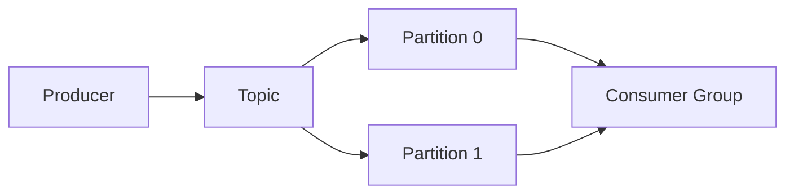
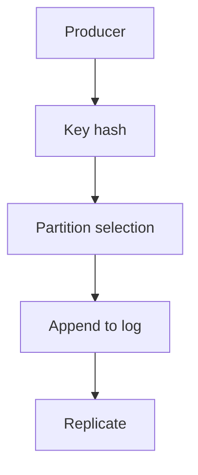
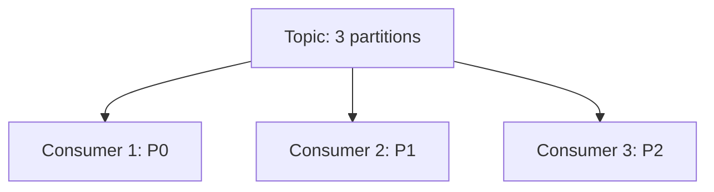

# Apache Kafka (Deep Dive)

📄 File: `book/04_data_engineering_systems/apache_kafka.md`

This chapter covers **Apache Kafka** — the distributed event streaming platform. Essential for real-time data pipelines and AI inference event streams.

---

## Study Plan (1 week)

* Day 1–2: Topics, partitions, producers
* Day 3–4: Consumers, consumer groups
* Day 5–6: Schema registry, Kafka Connect
* Day 7: Exercises + mini project

---

## 1 — What is Kafka?

Kafka is a **distributed log** — append-only, partitioned, replicated. Producers write; consumers read.



---

## 2 — Core Concepts

| Concept | Description |
| ------- | ----------- |
| **Topic** | Named stream of events |
| **Partition** | Ordered log within topic |
| **Offset** | Position in partition |
| **Consumer Group** | Consumers share partitions |

---

## 3 — Producer (Python)

```python
from kafka import KafkaProducer
import json

# Create producer; bootstrap_servers = broker addresses
producer = KafkaProducer(
    bootstrap_servers=["localhost:9092"],
    value_serializer=lambda v: json.dumps(v).encode("utf-8"),
)

# Send message; topic name, value, optional key for partitioning
producer.send("events", {"user_id": 1, "action": "click"})

# Flush: ensure all buffered messages are sent
producer.flush()
```

---

## Diagram — Producer Flow



---

## 4 — Consumer (Python)

```python
from kafka import KafkaConsumer

# Create consumer; group_id = consumer group (load balancing)
consumer = KafkaConsumer(
    "events",
    bootstrap_servers=["localhost:9092"],
    group_id="ai-pipeline",
    auto_offset_reset="earliest",  # Start from beginning if no offset
)

# Iterate messages; each msg has topic, partition, offset, value
for msg in consumer:
    print(msg.value)
```

---

## 5 — Partitions and Parallelism

* More partitions = more parallelism
* Key determines partition (same key → same partition)
* Consumer group: each partition assigned to one consumer



---

## 6 — Why Kafka for AI Data Engineering?

* **Real-time**: Stream events to inference, feature store
* **Durability**: Log persists; replay for training
* **Decoupling**: Producers/consumers independent
* **Scale**: Millions of messages/sec

---

## 7 — Schema Registry (Avro)

* Store schemas centrally
* Producers/consumers validate against schema
* Enables evolution without breaking consumers

---

## Interview Questions

1. What causes rebalancing in consumer groups?
2. Exactly-once semantics — how?
3. Kafka vs message queue (RabbitMQ)?

---

## Mini Project

Build producer that sends user events; consumer that aggregates by user in 1-min windows.

---

## Key Takeaways

* Kafka = distributed log, not queue
* Partitions enable parallelism
* Consumer groups share load
* Durable, replayable

---

## Next Chapter

Proceed to: **apache_flink.md**
