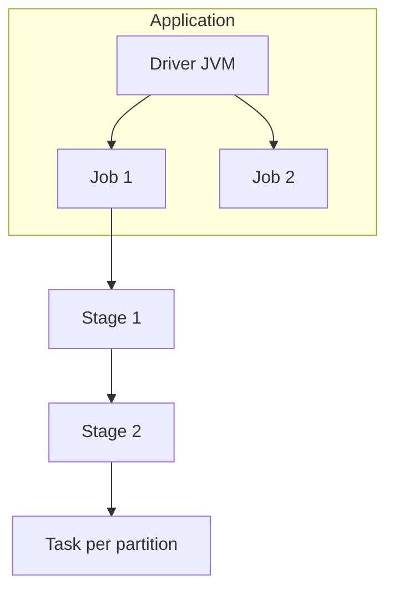
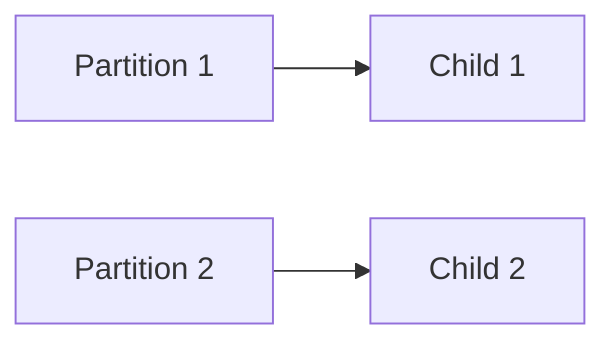
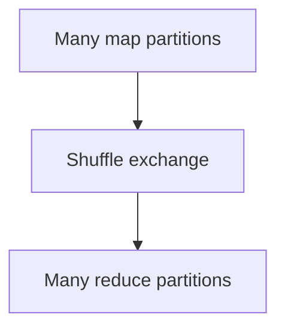
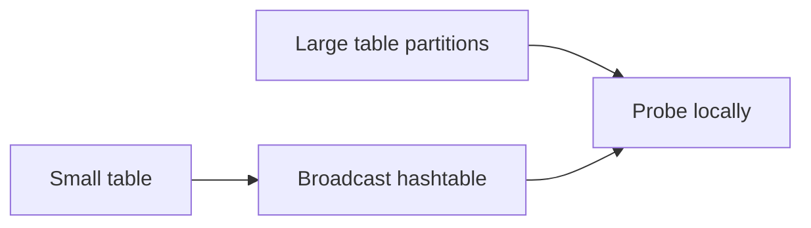
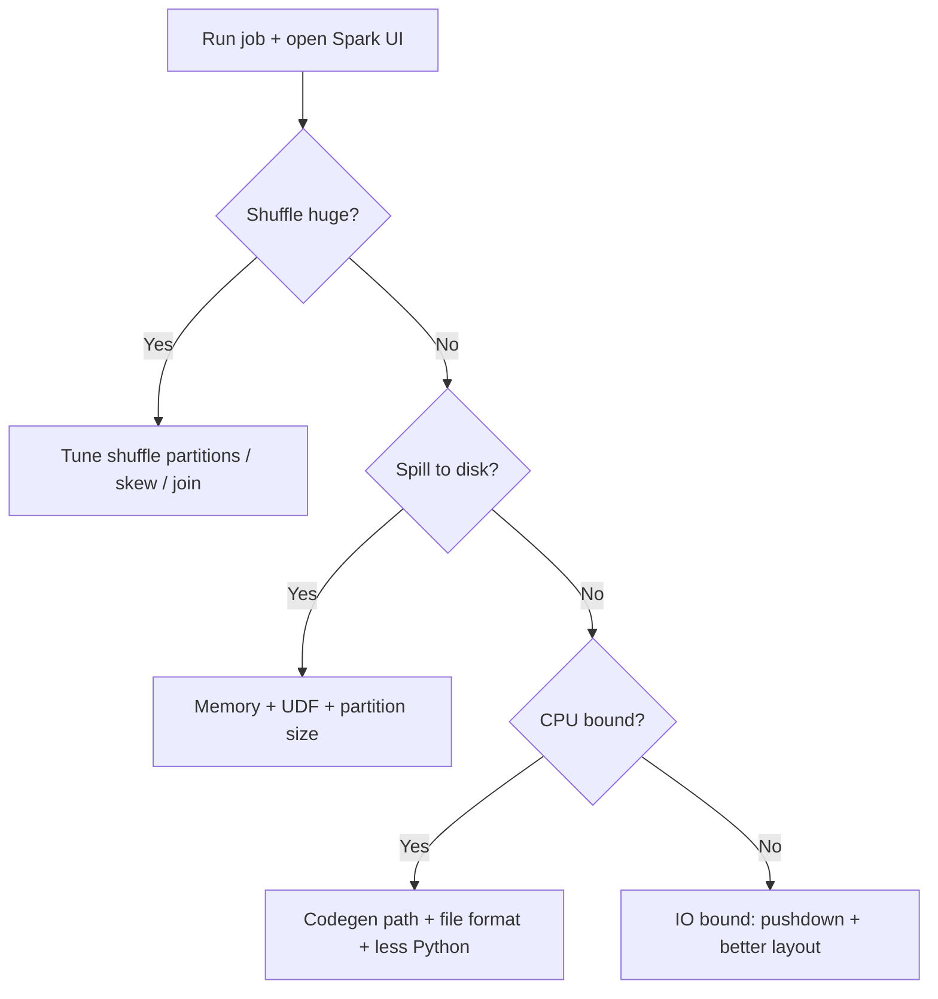

# Apache Spark (Top 1% Deep Dive)

📄 File: `book/04_data_engineering_systems/apache_spark.md`

This chapter is written for engineers who need **production-grade mastery** of Spark: from first principles through **Catalyst**, **Tungsten**, **join physics**, **memory**, **skew**, **AQE**, and **interview traps**. Use it alongside `spark_internals.md` and `spark_sql.md`.

---

## Study Plan (4–6 weeks)

* **Week 1**: Jobs, stages, tasks, narrow vs wide, shuffle mechanics
* **Week 2**: DataFrame/SQL, Catalyst rules, join strategies, broadcast
* **Week 3**: Memory model, serialization, cache/persist/checkpoint, Spark UI
* **Week 4**: Skew, AQE, partitioning (`repartition` vs `coalesce`), bucketing
* **Week 5**: Streaming semantics, checkpoints, exactly-once (high level)
* **Week 6**: Tuning checklist, failure modes, interview deep dives

---

## Part A — Mental Model: Application → Job → Stage → Task



| Term | Meaning |
|------|---------|
| **Application** | Your `spark-submit` or notebook session; one **Driver** + many **Executors** |
| **Job** | Triggered by an **action** (`count`, `write`, `collect`). One action can spawn multiple jobs in edge cases |
| **Stage** | Set of **pipelined** narrow transformations ending at a **shuffle** (or start/end of job) |
| **Task** | Processes **one partition** on one executor thread |

**Why it matters**: When the Spark UI shows “Stage 2 took 40 min”, you are debugging **shuffle + skew + partition count**, not “Spark is slow” generically.

---

## Part B — Narrow vs Wide Dependencies (Core Interview Topic)

### Narrow (pipeline-able)

Parent partition feeds **at most one** child partition. Examples: `filter`, `map`, `withColumn`, `select`, `union` (if aligned — be careful), `explode` (still often narrow if no shuffle after).

Spark **fuses** these into **pipelines** in one task (Whole-Stage Codegen — see Part F).



### Wide (shuffle)

Parent partitions feed **multiple** child partitions. Examples: `groupBy`, `distinct`, `join` (usually), `repartition`, `orderBy` (global sort).

Shuffle = **hash partition** by key (or range for sort) → **write shuffle files** → **fetch** on reduce side.



### Interview trap: `groupByKey` vs `reduceByKey` (RDD)

* **`groupByKey`**: sends **all values** for a key across the network → massive shuffle.
* **`reduceByKey`**: **combines locally** on the map side (combiner), then shuffle **smaller** data.

**Rule**: Prefer **map-side reduction** before shuffle whenever semantics allow.

---

## Part C — Shuffle Mechanics (What Actually Happens)

1. **Map side**: Each task writes **shuffle blocks** to local disk (by default), indexed by `(shuffleId, mapId, reducePartitionId)`.
2. **Reduce side**: Each reduce task **pulls** remote blocks (via Netty), **merges** (sort-merge depending on operator), computes result.

**Costs**:

* **Disk I/O** on map and reduce
* **Network** cross-rack if locality is poor
* **CPU** serialization + compression
* **Garbage collection** pressure on large records

**Configs people actually tune** (names are Spark 3.x style):

* `spark.sql.shuffle.partitions` — default **200**; often wrong for your cluster size and data volume.
* `spark.shuffle.compress` — usually `true` (less network, more CPU).
* `spark.shuffle.spill.compress` — spill file compression.
* `spark.reducer.maxSizeInFlight` / `spark.shuffle.maxChunksBeingTransferred` — fetch parallelism vs memory risk.

**Heuristic**: Target **~128MB–256MB per partition** after shuffle (not a law — measure with Spark UI).

---

## Part D — Join Algorithms (Top 1% Must Know)

Spark SQL picks a physical join at planning time (with AQE possibly changing it at runtime — Part H).

### 1) Broadcast Hash Join (BHJ)

* **When**: One side is **small enough** to fit broadcast thresholds (and statistics available).
* **How**: Driver (or executors) ships a **hashtable** of the small table to every executor; large side streams partition-local and probes hash table.
* **Shuffle**: **None** for the join itself (huge win).



**Interview question**: “Why can broadcast still OOM the driver?”

**Answer**: Collecting the broadcast builds an in-memory structure on the driver if built there; also **collecting** a big “small” table blows driver heap. **Mitigation**: lower `spark.sql.autoBroadcastJoinThreshold` intentionally, or pre-filter the small side, or disable broadcast via hint if statistics lie.

### 2) Shuffle Hash Join

* **When**: Both sides large, and one side still fits **in memory per partition** after shuffle (planner decision).
* **Shuffle**: **Both sides** shuffled by join key.
* **Risk**: **OOM** if partitions are huge post-shuffle (skew).

### 3) Sort-Merge Join (SMJ)

* **When**: Large joins; Spark sorts both sides by join key after shuffle and merges.
* **Shuffle**: Yes.
* **Pros**: **Streaming** through sorted runs — less memory than hash if implemented as merge.
* **Cons**: Sort cost; still suffers if **one key dominates** (skew).

### Practical tuning

* **Skew** can force a single reduce task to hold “the world” for a hot key → **straggler** + OOM.
* **AQE skew join** (Part H) can split hot keys into sub-partitions.

---

## Part E — Catalyst Optimizer (Beyond Buzzwords)

Catalyst turns **unoptimized logical plan** → **optimized logical plan** → **physical plan** → **executed plan**.

### High-value rules (what “good” looks like)

* **Predicate pushdown** to sources (Parquet, JDBC, Delta, Iceberg) to skip row groups / push filters.
* **Column pruning**: read only columns needed.
* **Constant folding** and boolean simplification.
* **Join reordering** (cost-based in some cases; statistics help).

### How to inspect (mandatory skill)

```python
df = spark.table("sales").filter("dt = '2025-01-01'").select("user_id", "amount")
df.explain(True)  # Parsed, Analyzed, Optimized, Physical — verbose
```

**Interview tip**: Be able to read `explain` and identify:

* `Exchange` (shuffle)
* `BroadcastExchange`
* `SortMergeJoin` vs `BroadcastHashJoin`
* `FileScan` with `PushedFilters` / `PartitionFilters`

---

## Part F — Tungsten and Whole-Stage Codegen

**Tungsten** is the execution engine focused on:

* **Off-heap** / binary in-memory representation (less Java object overhead)
* **Vectorized** operators where applicable
* **Whole-Stage Codegen**: fuse multiple operators into **generated JVM bytecode** (one loop instead of many virtual calls)

**Why it matters**: DataFrame/SQL can be **orders of magnitude faster** than naive RDD `map` chains due to CPU efficiency + vectorization + fewer allocations.

**Interview trap**: “Is DataFrame always faster than RDD?”

**Answer**: Usually **yes** for structured data due to Catalyst + Tungsten. Exceptions: **UDF-heavy** Python pipelines may spend time **serializing to Python**; prefer **Spark SQL functions** or **Pandas UDFs (Arrow)** for hot paths.

---

## Part G — Partitioning: `repartition` vs `coalesce` (Classic Trap)

### `repartition(n)`

* **Always shuffles** (full shuffle) to redistribute into `n` partitions.
* Use when you need **even distribution** or to **increase** parallelism.

### `coalesce(n)`

* Tries to **reduce** partitions **without shuffle** by merging adjacent partitions on the same executor.
* **Cannot** increase partitions without shuffle semantics you expect — use `repartition` to grow.

**Production pattern**:

* After a heavy filter that leaves data tiny: `coalesce` before write to avoid **many small files**.
* Before a wide aggregation on skewed data: fix skew first; blind `repartition(4000)` can **worse** overhead.

```python
# Many small output files? Often coalesce (or repartition) right before write
df_out.coalesce(64).write.mode("overwrite").parquet("s3://bucket/out/")
```

---

## Part H — Adaptive Query Execution (AQE) (Spark 3+)

AQE **reoptimizes** the query **during execution** using runtime statistics.

Typical wins:

* **Coalescing shuffle partitions** after shuffle when partitions are too small
* **Switching join strategy** (e.g., detect one side smaller than thought)
* **Skew join optimization** (split hot keys)

**Interview answer**: “What breaks AQE?”

* Missing/bad **table statistics** (Hive metastore stats not updated)
* Overly aggressive **caching** changing visibility of stats
* Some **hints** forcing suboptimal plans

Enable/disable (usually enabled by default in Spark 3.2+ depending on distro):

```python
spark.conf.set("spark.sql.adaptive.enabled", "true")
```

---

## Part I — Data Skew (Where Jobs Die in Production)

### Symptoms

* One task runs **hours**; others finish quickly
* Spark UI: one reducer **shuffle read** enormous
* GC pauses / OOM on specific executors

### Mitigations (know 3+)

1. **Salt the key** (two-phase aggregation):

```python
from pyspark.sql import functions as F

salt = 10
df_s = df.withColumn("_salt", (F.rand() * salt).cast("int"))
# aggregate per (key, salt) then drop salt and aggregate again
```

2. **AQE skew join** (let Spark split skewed partition)
3. **Isolate hot keys**: detect top keys (`approx_count_distinct` + `groupBy` on suspicious columns) and route hot keys to separate logic
4. **Broadcast** if the large side is only large due to **one** bad dimension table explode — fix upstream modeling
5. **Bucketing** (stable hash pre-layout) for repeated joins (advanced)

---

## Part J — Memory Model (OOM Interviews)

Executor memory is split conceptually into:

* **Execution memory**: shuffles, joins, sorts, aggregations
* **Storage memory**: `cache`/`persist`
* **Reserved / overhead**: off-heap buffers, metaspace, etc.

**Unified Memory Manager** allows execution and storage to borrow from each other within bounds — caching a huge DataFrame can **steal** execution memory and cause **spill** or OOM.

### Common OOM causes

* **Collecting** huge results to driver (`collect`, `toLocalIterator` misuse)
* **Broadcast** too large
* **Huge partitions** after skew
* **Cartesian joins** (hint: `crossJoin` explosions)
* **Python UDF** forcing expensive conversions

### Practical configs (starting points, always validate)

* `spark.executor.memory`
* `spark.executor.memoryOverhead` (especially with containers / PySpark)
* `spark.driver.memory` (any wide collect / broadcast build)
* `spark.memory.fraction` / `spark.memory.storageFraction` (older tuning; newer versions differ — check your Spark version docs)

---

## Part K — `cache`, `persist`, `checkpoint` (Tricky Semantics)

### `cache()` / `persist(level)`

* Persists **RDD/DataFrame** lineage shortcut after first compute
* **Still lineage** unless checkpointed — recomputation rules differ by storage level
* **Risk**: Stale cache if upstream data changed — **unpersist** when refreshing ETL slices

### Storage levels (examples)

* `MEMORY_ONLY`
* `MEMORY_AND_DISK` (spill if not enough RAM — often safest default for big data)
* `DISK_ONLY`

### `checkpoint()` (reliable, truncates lineage)

* Writes to **reliable filesystem** (HDFS/S3) and cuts lineage — recomputation stops at checkpoint
* **Caveat**: in DataFrame API you must enable checkpoint directory:

```python
spark.sparkContext.setCheckpointDir("s3://bucket/checkpoints/")
df.checkpoint()
```

**Interview**: “cache vs checkpoint?”

* **cache** = speed, still lineage, ephemeral cluster loss loses cache
* **checkpoint** = truncate lineage, durable, good for **iterative** graphs / extremely long DAGs

---

## Part L — Serialization (Java vs Kryo)

Default Java serialization can be **slow** and **fat**.

**Kryo** often reduces bytes and CPU:

```python
spark.conf.set("spark.serializer", "org.apache.spark.serializer.KryoSerializer")
# Register classes in Scala/Java apps for best results
```

**PySpark note**: Python worker serialization dominates many workloads — reduce Python UDFs, use SQL/Column API, Arrow.

---

## Part M — Reading Spark UI Like a Staff Engineer

What to check first:

1. **Stages**: which stage has max duration?
2. **Tasks**: max **duration** vs median → skew
3. **Shuffle Read/Write** sizes per task
4. **Spill** metrics (memory → disk)
5. **GC time**

**Golden sentence for interviews**: “I’d confirm whether we’re **shuffle-bound**, **CPU-bound**, or **IO-bound**, then pick partition count, join strategy, file layout, or UDF removal accordingly.”

---

## Part N — File Layout and Lakehouse Interop (Production Reality)

* Prefer **columnar** formats: **Parquet**, **Delta**, **Iceberg**
* Partition by **low-cardinality** predicate columns used in filters (`dt`, `region`) — not high cardinality like `user_id` unless you know why
* Avoid **tiny files** (scheduler overhead) — compact jobs, `coalesce`, or Delta `OPTIMIZE` / Iceberg compaction
* **Predicate pushdown** + **partition pruning** are “free performance” if layout matches queries

---

## Part O — Structured Streaming (What Interviewers Probe)

Micro-batch model:

* **Trigger** interval / continuous processing (CP) depending on version/features
* **Output modes**: `append`, `complete`, `update`
* **Checkpoint dir** stores offset + state — required for failure recovery

**Exactly-once** to sinks is **sink-dependent** (Kafka, Delta, etc.) — be precise in interviews: Spark gives **exactly-once semantics** relative to **checkpointed state** + **idempotent sinks**, not magic.

---

## Part P — Extended Code Patterns (Commented)

### 1) Safe write with predictable files

```python
# repartition so each task writes ~ target file size (rule-of-thumb tuning)
df_out.repartition(128).write.mode("overwrite").partitionBy("dt").parquet("s3://bucket/facts/")
```

### 2) Broadcast join hint (when stats are wrong)

```python
from pyspark.sql.functions import broadcast
# forces broadcast of small — verify small is actually small
big.join(broadcast(small), "key")
```

### 3) Salting skeleton (two-phase)

```python
from pyspark.sql import functions as F
S = 8
df2 = df.withColumn("_s", (F.rand() * S).cast("int"))
agg1 = df2.groupBy("key", "_s").agg(F.sum("v").alias("v"))
final = agg1.groupBy("key").agg(F.sum("v").alias("v"))
```

---

## Part Q — Massive Interview Bank (With Depth)

### Q1: `repartition` vs `coalesce`?

**Answer**: `repartition` **shuffles** and can increase/decrease partitions evenly. `coalesce` reduces partitions **without shuffle** by merging splits — great after filters to cut small files, bad if you need a global redistribution.

### Q2: Why `groupByKey` bad?

**Answer**: It shuffles **all values** per key. `reduceByKey`/`aggregateByKey` combine **map-side** first → less network traffic.

### Q3: What is a shuffle dependency?

**Answer**: Dependency requiring **all-to-all** data movement across partitions to satisfy partitioning requirements (hash/range), creating a **stage boundary**.

### Q4: Driver OOM scenarios?

**Answer**: `collect`, large `broadcast`, big `take` on wide rows, accidental `toPandas()` on huge data, logging huge strings, broad variables captured in closures shipped to tasks.

### Q5: How Spark recovers from executor loss?

**Answer**: Rerun failed tasks; recompute missing cached partitions from **lineage** unless persisted reliably; shuffle files may need recompute depending on what was lost and fetch failures.

### Q6: Sort-merge vs hash join trade-offs?

**Answer**: SMJ is common for large joins; avoids holding entire partition hash map in memory in many implementations; still needs sort. Shuffle hash join can be fast if memory permits but skew-sensitive.

### Q7: What is AQE?

**Answer**: Runtime reoptimization using shuffle statistics; can coalesce partitions, convert joins, mitigate skew.

### Q8: How to choose `spark.sql.shuffle.partitions`?

**Answer**: Start from cluster cores and target partition size; validate with Spark UI; increase if tasks too big / GC; decrease if too many tiny tasks. Often **not** 200 in serious clusters.

### Q9: Can `union` cause shuffle?

**Answer**: `union` itself is narrow, but downstream operations may shuffle; also **duplicate column layout** mistakes can cause unexpected plans. Always validate `explain`.

### Q10: PySpark slower — why?

**Answer**: Python worker IPC, UDF row conversion, GIL-bound Python logic. Mitigate with SQL, Arrow, Pandas UDFs, or Scala/JVM for hot paths.

### Q11: What is speculative execution?

**Answer**: If a task is **straggling**, Spark may launch a **duplicate** copy of the same task on another executor; whoever finishes first wins, the other is killed. Helps with **slow nodes**, **bad disks**, or transient issues. Can waste resources if misconfigured — tune `spark.speculation` and thresholds when stragglers are common.

### Q12: What is dynamic allocation?

**Answer**: Spark **adds or removes executors** during the application based on load (`spark.dynamicAllocation.enabled`). Good for **multi-tenant** clusters and variable workloads; requires cluster manager support (YARN/K8s) and careful min/max executor bounds so you do not **thrash** or starve other jobs.

### Q13: `count` is slow on DataFrame — why?

**Answer**: `count` is an **action** that may scan **all data** unless metadata/statistics can short-circuit (rare for raw files). For “quick estimate”, use **sampling**, **SQL ANALYZE TABLE** stats, or table formats that expose **metadata row counts** (some lakehouse stats — still verify).

### Q14: Cartesian product — how does it happen and how to detect?

**Answer**: Join without join condition, wrong `on=` keys, or exploding joins. `explain` shows `CartesianProduct`. Fix with proper keys, pre-aggregations, or **semi/anti joins** (`left_semi`) when filtering existence.

---

## Part R — Tuning Workflow (What You Do on Monday)



1. Capture **event timeline** (SQL / stages / tasks).
2. Identify **top stage** by duration and **shuffle bytes**.
3. Check **task duration distribution** (skew).
4. Fix **plan** (`explain`) then **layout** (files/partitions) then **cluster config**.

---

## Key Takeaways (Top 1% Checklist)

* **Jobs/stages/tasks** + **narrow vs wide** explain 80% of performance debugging
* **Shuffle** is the usual villain: partition count, skew, join choice
* **Catalyst + Tungsten** are why DataFrame/SQL wins over naive RDD
* **`repartition` vs `coalesce`** is a deliberate choice, not interchangeable
* **Memory**: unified manager interactions; cache can hurt execution
* **Skew** needs **measurement** (UI) + **techniques** (salt / AQE / isolation)
* **Always** validate with **`explain`** and **Spark UI**

---

## Next Chapter

Proceed to: **apache_hadoop.md** (HDFS, MapReduce, YARN) or **spark_internals.md** (even deeper shuffle/files)
