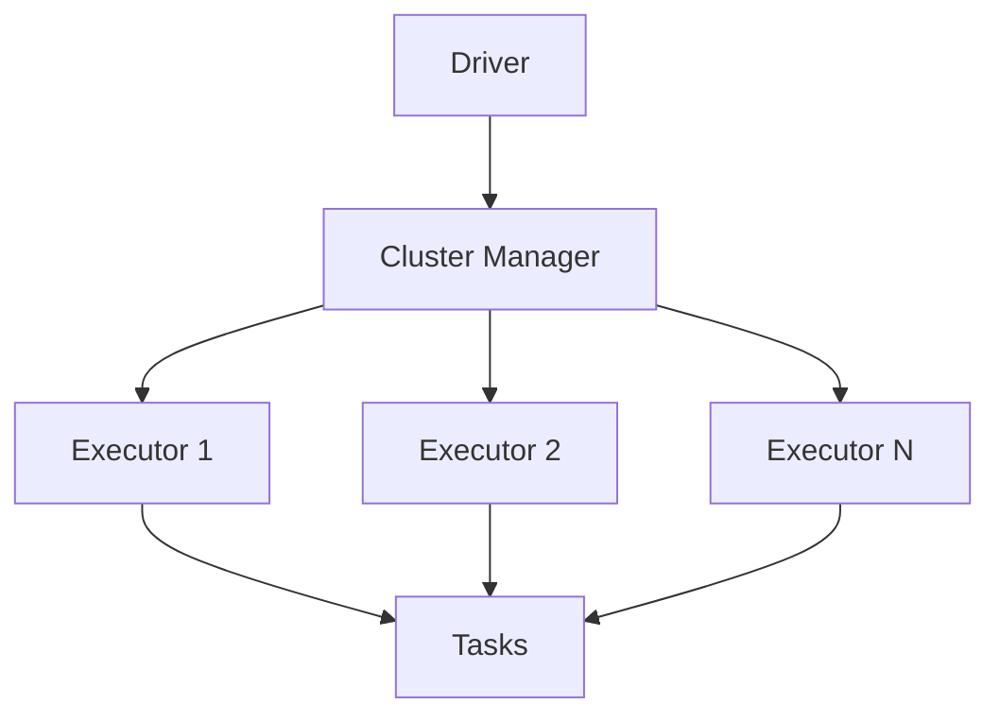
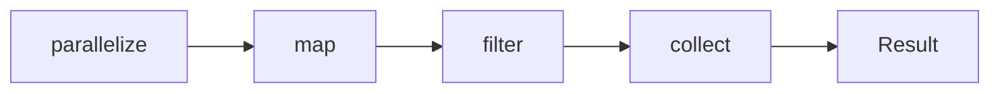
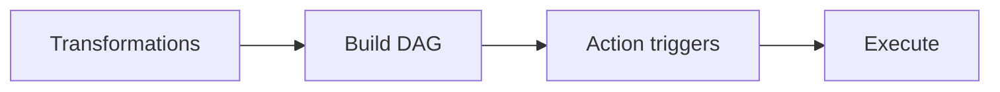

# Apache Spark (Deep Dive)

📄 File: `book/04_data_engineering_systems/apache_spark.md`

This chapter covers **Apache Spark** — the distributed compute engine for big data. Essential for AI training data pipelines and analytics at scale.

---

## Study Plan (1–2 weeks)

* Week 1: RDDs, DataFrames, transformations
* Week 2: Spark SQL, partitioning, tuning

---

## 1 — What is Spark?

Spark is a **distributed in-memory** compute engine. Process data across a cluster without writing to disk between steps.



---

## 2 — Core Concepts

### RDD (Resilient Distributed Dataset)

* Immutable, partitioned collection
* Can be recomputed if lost (lineage)
* Low-level API

```python
# Create RDD from list
rdd = sc.parallelize([1, 2, 3, 4, 5])

# Transform: map (each element → new element)
# Each x is multiplied by 2; result is new RDD
doubled = rdd.map(lambda x: x * 2)

# Action: collect (bring results to driver)
# Triggers computation; returns list to driver
result = doubled.collect()  # [2, 4, 6, 8, 10]
```

---

## Diagram — RDD Lineage



---

## 3 — DataFrame API (Preferred)

```python
from pyspark.sql import SparkSession

# Create session; getOrCreate reuses existing
spark = SparkSession.builder.appName("AI Pipeline").getOrCreate()

# Read Parquet; path can be S3, local, etc.
df = spark.read.parquet("s3://bucket/data/")

# Transform: filter rows where date column > '2025-01-01'
filtered = df.filter(df["date"] > "2025-01-01")

# Aggregate: group by user_id, count rows per group
agg = filtered.groupBy("user_id").count()

# Action: show first 10 rows (triggers execution)
agg.show(10)
```

---

## 4 — Lazy Evaluation

* Transformations (map, filter, groupBy) are **lazy** — no work until action
* Spark builds execution plan; optimizes before running



---

## 5 — Why Spark for AI Data Engineering?

* **Scale**: Petabyte datasets for training
* **Unified**: Batch + streaming (Structured Streaming)
* **ML**: Spark MLlib, feature transformations
* **Lakehouse**: Delta, Iceberg native support

---

## 6 — Partitioning (Critical for Performance)

```python
# Repartition: shuffle data into N partitions
# Use when you need even distribution
df_repartitioned = df.repartition(16)

# Partition by column: co-locate same key
# Good for joins on partition key
df_partitioned = df.repartition("user_id")
```

---

## 7 — Exercises (with line-by-line comments)

### Read CSV and Filter

```python
# Read CSV with header; inferSchema guesses types
df = spark.read.option("header", "true").csv("data.csv")

# Filter: keep rows where amount > 100
filtered = df.filter(df["amount"] > 100)

# Select specific columns
result = filtered.select("user_id", "amount")

# Show result (action)
result.show()
```

---

## Interview Questions

1. RDD vs DataFrame — when to use which?
2. What is lazy evaluation?
3. How does Spark handle failures?
4. Shuffle — what causes it?

---

## Mini Project

Build a pipeline that: reads Parquet from S3, aggregates by date, writes to Delta Lake.

---

## Key Takeaways

* Spark = distributed in-memory compute
* Lazy evaluation; actions trigger execution
* DataFrame API preferred over RDD
* Partitioning affects performance

---

## Next Chapter

Proceed to: **spark_internals.md**
