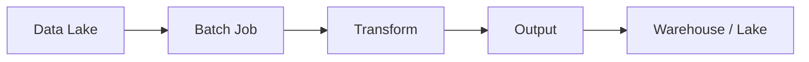
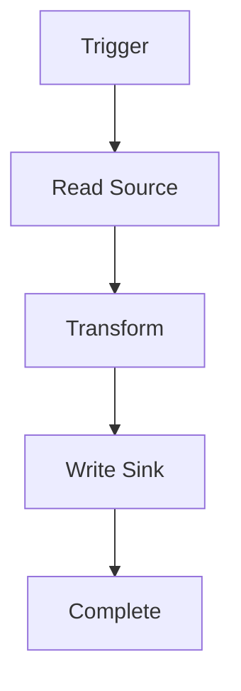
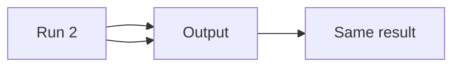

# Batch Processing (Deep Dive)

📄 File: `book/04_data_engineering_systems/batch_processing.md`

This chapter covers **batch processing** — processing data in large chunks. Foundation for ETL, training data preparation, and analytics.

---

## Study Plan (2–3 days)

* Day 1: Batch vs streaming, patterns
* Day 2: Spark batch, partitioning
* Day 3: Idempotency, backfills

---

## 1 — What is Batch Processing?

Process **finite** datasets in **scheduled** jobs. Opposite of streaming (continuous, unbounded).



---

## 2 — Batch vs Streaming

| Batch | Streaming |
| ----- | --------- |
| Finite data | Unbounded stream |
| Scheduled (hourly, daily) | Continuous |
| High throughput | Low latency |
| Spark, Hive | Kafka, Flink |

---

## 3 — Batch Pipeline Pattern

```python
# 1. Read: load data from source (e.g., Parquet)
df = spark.read.parquet("s3://bucket/raw/date=2025-01-01/")

# 2. Transform: clean, aggregate, join
cleaned = df.filter(df["amount"].isNotNull())
agg = cleaned.groupBy("user_id").agg(
    F.sum("amount").alias("total"),
    F.count("*").alias("count"),
)

# 3. Write: save to destination (overwrite or append)
agg.write.mode("overwrite").parquet("s3://bucket/processed/date=2025-01-01/")
```

---

## Diagram — Batch Job Lifecycle



---

## 4 — Partitioning for Batch

* **Input partitioning**: Read only needed partitions (e.g., date)
* **Output partitioning**: Write by partition key for efficient reads

```python
# Read only specific partition
df = spark.read.parquet("s3://bucket/raw/").filter("date = '2025-01-01'")

# Write partitioned
df.write.partitionBy("date").parquet("s3://bucket/out/")
```

---

## 5 — Idempotency (Critical)

* Running job twice = same result
* Use overwrite by partition, or upsert with dedup keys



---

## 6 — Why Batch for AI Data Engineering?

* **Training data**: Daily batch of features, labels
* **Embeddings**: Batch embed documents for RAG index
* **Analytics**: Aggregate metrics for dashboards

---

## Interview Questions

1. Batch vs streaming — when to use which?
2. How to achieve idempotency?
3. How to handle late-arriving data?

---

## Key Takeaways

* Batch = finite, scheduled
* Partition for efficiency
* Idempotency for reliability

---

## Next Chapter

Proceed to: **stream_processing.md**
