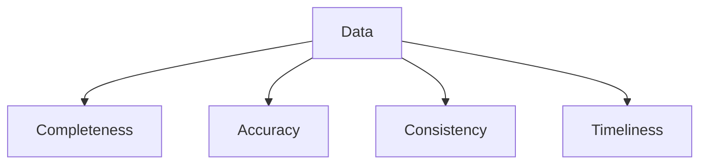

# Data Quality Tools (Deep Dive)

📄 File: `book/04_data_engineering_systems/data_quality_tools.md`

This chapter covers **data quality** — validation, monitoring, and testing. Critical for reliable AI pipelines and training data.

---

## Study Plan (2–3 days)

* Day 1: Quality dimensions, Great Expectations
* Day 2: Soda, dbt tests
* Day 3: Monitoring, alerting

---

## 1 — Data Quality Dimensions

| Dimension | Example |
| --------- | ------- |
| **Completeness** | No nulls in key columns |
| **Accuracy** | Values in valid range |
| **Consistency** | Same format across sources |
| **Timeliness** | Data arrives on schedule |



---

## 2 — Great Expectations

* Define **expectations** (assertions) on data
* Run as part of pipeline; fail if violated

```python
import great_expectations as gx

# Create context
context = gx.get_context()

# Create validator from DataFrame
validator = context.sources.pandas_default.read_dataframe(df)

# Add expectations: column user_id must exist and have no nulls
validator.expect_column_to_exist("user_id")
validator.expect_column_values_to_not_be_null("user_id")

# Validate
results = validator.validate()
```

---

## 3 — dbt Tests

```yaml
# schema.yml
models:
  - name: orders
    columns:
      - name: id
        tests: [unique, not_null]
      - name: amount
        tests:
          - accepted_range:
              min: 0
              max: 1000000
```

---

## 4 — Soda (SQL-based)

```yaml
# checks.yml
checks for orders:
  - row_count > 0
  - missing_count(user_id) = 0
  - invalid_count(amount) = 0:
      valid min: 0
      valid max: 1000000
```

---

## 5 — Why Data Quality for AI?

* **Garbage in, garbage out**: Bad data → bad model
* **Drift detection**: Monitor feature distributions
* **Compliance**: PII, audit requirements

---

## Interview Questions

1. How do you ensure data quality?
2. Great Expectations vs dbt tests?
3. How to handle schema evolution?

---

## Key Takeaways

* Quality = completeness, accuracy, consistency
* Validate in pipeline (GE, dbt, Soda)
* Monitor for drift

---

## Next Chapter

Proceed to: **great_expectations.md**
