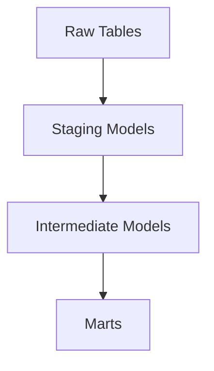
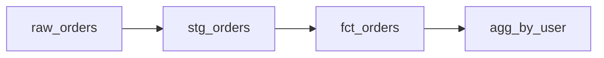

# dbt (Data Build Tool) (Deep Dive)

📄 File: `book/04_data_engineering_systems/dbt.md`

This chapter covers **dbt** — transform data in the warehouse using SQL. Essential for analytics engineering and ELT pipelines.

---

## Study Plan (1 week)

* Day 1–2: Models, ref, source
* Day 3–4: Tests, documentation
* Day 5–6: Incremental, snapshots
* Day 7: Exercises

---

## 1 — What is dbt?

dbt runs **SQL transformations** in your data warehouse. You write SELECT; dbt runs it and materializes results.



---

## 2 — Project Structure

```
my_project/
├── dbt_project.yml    # Config
├── models/
│   ├── staging/       # Clean raw data
│   ├── intermediate/ # Business logic
│   └── marts/        # Final tables
└── seeds/             # CSV reference data
```

---

## 3 — Model (SQL + Config)

```sql
-- models/staging/stg_orders.sql
-- ref: reference another model (builds DAG)
-- This model depends on raw_orders
{{ config(materialized='view') }}

SELECT
    id,
    user_id,
    amount,
    created_at::date AS order_date  -- Cast to date
FROM {{ ref('raw_orders') }}
WHERE amount > 0  -- Filter invalid
```

---

## Diagram — dbt DAG



---

## 4 — Tests

```yaml
# schema.yml
version: 2
models:
  - name: stg_orders
    columns:
      - name: id
        tests:
          - unique      # No duplicates
          - not_null    # No nulls
      - name: user_id
        tests:
          - relationships:
              to: ref('stg_users')
              field: id  # FK valid
```

---

## 5 — Incremental Models

```sql
-- Only process new rows
{{ config(
    materialized='incremental',
    unique_key='id',
) }}

SELECT * FROM {{ source('raw', 'events') }}

WHERE updated_at > (SELECT max(updated_at) FROM {{ this }})

```

---

## 6 — Why dbt for AI Data Engineering?

* **Feature tables**: Transform raw → features
* **Documentation**: Auto-doc from SQL
* **Testing**: Ensure data quality
* **Version control**: SQL as code

---

## Interview Questions

1. dbt vs Airflow — different roles?
2. Incremental vs full refresh?
3. How does dbt build the DAG?

---

## Key Takeaways

* dbt = SQL transforms in warehouse
* ref() and source() for dependencies
* Tests ensure quality
* Incremental for scale

---

## Next Chapter

Proceed to: **apache_flink.md**
