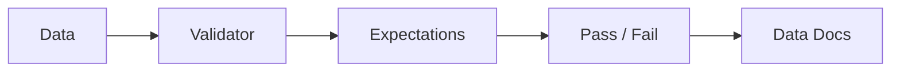

# Great Expectations (Deep Dive)

📄 File: `book/04_data_engineering_systems/great_expectations.md`

This chapter covers **Great Expectations** — data validation and documentation. Essential for trustworthy AI data pipelines.

---

## Study Plan (2–3 days)

* Day 1: Expectations, validators
* Day 2: Checkpoints, integration
* Day 3: Data docs, profiling

---

## 1 — What is Great Expectations?

Define **expectations** (assertions) on data. Run as tests; get HTML docs.



---

## 2 — Core Concepts

| Concept | Description |
| ------- | ----------- |
| **Expectation** | Assertion (e.g., column not null) |
| **Validator** | Runs expectations on data |
| **Checkpoint** | Run validator + actions |
| **Data Docs** | HTML report |

---

## 3 — Common Expectations

```python
# Column exists
validator.expect_column_to_exist("user_id")

# No nulls
validator.expect_column_values_to_not_be_null("user_id")

# Unique
validator.expect_column_values_to_be_unique("user_id")

# In set
validator.expect_column_values_to_be_in_set("status", ["active", "inactive"])

# Range
validator.expect_column_values_to_be_between("amount", min_value=0, max_value=1000000)

# Regex
validator.expect_column_values_to_match_regex("email", r"^[\w\.-]+@[\w\.-]+\.\w+$")
```

---

## 4 — Checkpoint (Automated Run)

```python
# Create checkpoint: run suite on datasource
checkpoint = context.add_or_update_checkpoint(
    name="daily_check",
    validator=validator,
)

# Run
result = checkpoint.run()
```

---

## 5 — Data Docs

* Auto-generated HTML
* Shows which expectations passed/failed
* Share with stakeholders

---

## Interview Questions

1. When to use GE vs dbt tests?
2. How to handle schema evolution?
3. Profiling vs expectations?

---

## Key Takeaways

* GE = expectations as code
* Integrate in pipeline
* Data docs for visibility

---

## Next Chapter

Proceed to: **soda.md**
