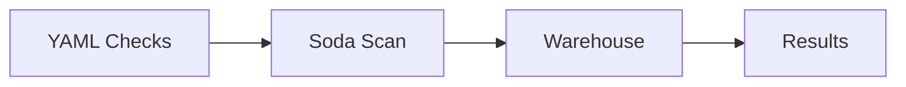

# Soda (Deep Dive)

📄 File: `book/04_data_engineering_systems/soda.md`

This chapter covers **Soda** — SQL-based data quality checks. Lightweight alternative for warehouse-native validation.

---

## Study Plan (1–2 days)

* Day 1: Soda Core, checks
* Day 2: Soda Cloud, monitoring

---

## 1 — What is Soda?

Soda runs **SQL-based checks** on your data. Define in YAML; run via CLI or scheduler.



---

## 2 — Check Definition

```yaml
# checks.yml
checks for orders:
  # Row count must be positive
  - row_count > 0

  # No nulls in user_id
  - missing_count(user_id) = 0

  # Amount in valid range
  - invalid_count(amount) = 0:
      valid min: 0
      valid max: 1000000

  # Custom SQL
  - schema:
      name: columns exist
      fail query: |
        SELECT column_name FROM information_schema.columns
        WHERE table_name = 'orders' AND column_name NOT IN ('id','user_id','amount')
```

---

## 3 — Running Scans

```bash
# Run scan against warehouse
soda scan -d postgres_conn -c checks.yml
```

---

## 4 — Soda vs Great Expectations

| Soda | Great Expectations |
| ---- | ------------------ |
| SQL-native | Python/Spark |
| YAML config | Python API |
| Lightweight | Rich profiling |

---

## 5 — Why Soda for AI Data Engineering?

* **Warehouse-native**: No Spark/Python needed
* **Fast**: Direct SQL on warehouse
* **Simple**: YAML, easy to adopt

---

## Interview Questions

1. Soda vs Great Expectations?
2. How to add custom checks?

---

## Key Takeaways

* Soda = SQL-based data quality
* YAML checks
* Warehouse-native

---

## Next Chapter

You've completed **Data Engineering Systems**. Proceed to: **05_data_storage_lakehouse**
