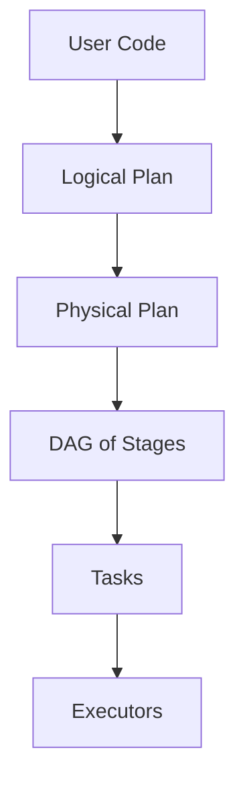
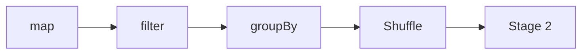
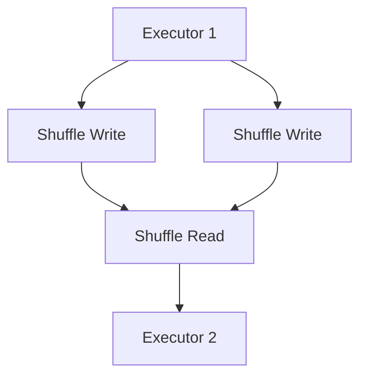

# Spark Internals (Deep Dive)

📄 File: `book/04_data_engineering_systems/spark_internals.md`

This chapter covers **Spark internals** — DAG, stages, tasks, shuffle. Critical for tuning and debugging production pipelines.

---

## Study Plan (3–4 days)

* Day 1: DAG, stages, tasks
* Day 2: Shuffle, partitioning
* Day 3: Memory, execution model
* Day 4: Tuning, debugging

---

## 1 — Execution Model

---

## 2 — DAG (Directed Acyclic Graph)

* Spark builds a DAG of RDD/DataFrame operations
* **Narrow dependency**: No shuffle (map, filter)
* **Wide dependency**: Shuffle (groupBy, join)

---

## 3 — Stages and Tasks

* **Stage**: Set of tasks with no shuffle between them
* **Task**: Unit of work sent to executor
* Shuffle = stage boundary

---

## 4 — Shuffle (Expensive!)

* **Shuffle write**: Partition data by key, write to disk
* **Shuffle read**: Fetch partitions from other executors
* Causes network I/O, disk I/O

---

## 5 — Reducing Shuffle

* **Co-locate**: Partition both sides of join by same key
* **Broadcast join**: Small table → broadcast, no shuffle
* **Repartition early**: Avoid multiple shuffles

---

## 6 — Memory Management

* **Execution memory**: Computations (shuffle, joins)
* **Storage memory**: Cached RDDs
* **Unified**: Spark 2.0+ shares pool

---

## Interview Questions

1. What causes a shuffle?
2. Narrow vs wide dependency?
3. How to avoid shuffle in a join?

---

## Key Takeaways

* DAG → stages → tasks
* Shuffle = stage boundary, expensive
* Broadcast join for small tables

---

## Next Chapter

Proceed to: **data_quality_tools.md**
