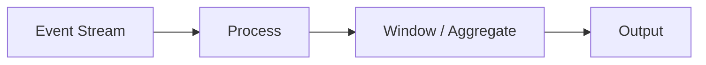
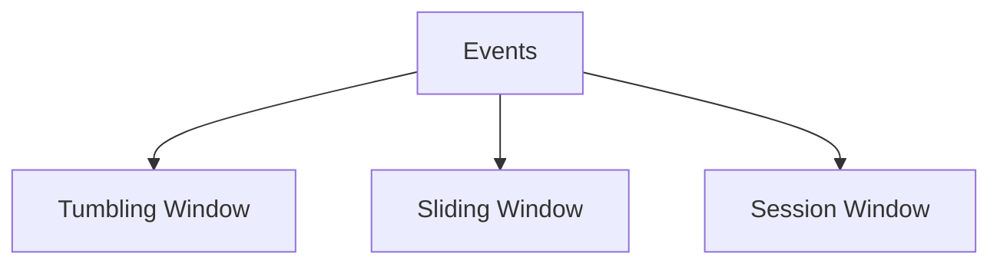

# Stream Processing (Deep Dive)

📄 File: `book/04_data_engineering_systems/stream_processing.md`

This chapter covers **stream processing** — continuous, low-latency data processing. Essential for real-time AI features and inference pipelines.

---

## Study Plan (1 week)

* Day 1–2: Stream concepts, Kafka
* Day 3–4: Flink, Spark Streaming
* Day 5: Windowing, exactly-once
* Day 6–7: Exercises

---

## 1 — What is Stream Processing?

Process **unbounded** data as it arrives. Low latency (seconds), continuous.



---

## 2 — Stream vs Batch

| Stream | Batch |
| ------ | ----- |
| Unbounded | Finite |
| Low latency | High throughput |
| Event time | Processing time |
| Flink, Kafka Streams | Spark batch |

---

## 3 — Windowing

* **Tumbling**: Fixed, non-overlapping (e.g., 5-min)
* **Sliding**: Overlapping (e.g., 5-min window, 1-min slide)
* **Session**: Gap-based (inactivity ends window)



---

## 4 — Event Time vs Processing Time

* **Event time**: When event occurred (watermarks for late data)
* **Processing time**: When system processed it

---

## 5 — Spark Structured Streaming

```python
# Read stream from Kafka
df = spark.readStream \
    .format("kafka") \
    .option("kafka.bootstrap.servers", "localhost:9092") \
    .option("subscribe", "events") \
    .load()

# Parse, aggregate
parsed = df.selectExpr("CAST(value AS STRING) as json")
# ... parse JSON, groupBy, etc.

# Write to sink (e.g., console for debug)
query = parsed.writeStream.outputMode("append").format("console").start()
query.awaitTermination()
```

---

## 6 — Why Stream Processing for AI?

* **Real-time features**: Update feature store as events arrive
* **Inference triggers**: Stream events to model serving
* **Monitoring**: Real-time drift, anomaly detection

---

## Interview Questions

1. Tumbling vs sliding window?
2. Event time vs processing time?
3. Exactly-once in stream processing?

---

## Key Takeaways

* Stream = unbounded, low latency
* Windowing for aggregations
* Event time + watermarks for correctness

---

## Next Chapter

Proceed to: **dbt.md**
