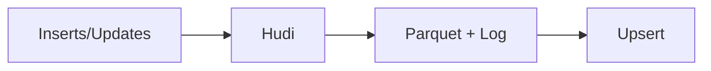

# Apache Hudi (Deep Dive)

📄 File: `book/05_data_storage_lakehouse/apache_hudi.md`

This chapter covers **Apache Hudi** — upserts and deletes on data lakes. For change data capture (CDC) and incremental processing.

---

## Study Plan (3–4 days)

* Day 1–2: Hudi basics, COW vs MOR
* Day 3: Upsert, compaction
* Day 4: Spark integration

---

## 1 — What is Hudi?

Hudi = **Hadoop Upserts Deletes and Incrementals**. Enables upserts, deletes, and incremental reads on object storage.



---

## 2 — Table Types

| Type | Write | Read |
| ---- | ----- | ---- |
| **COW** (Copy-on-Write) | Rewrite files | Read Parquet |
| **MOR** (Merge-on-Read) | Write to log | Merge log + base |

---

## 3 — Write Modes

* **upsert**: Update existing, insert new (default)
* **insert**: Insert only (faster)
* **bulk_insert**: For initial load

```python
# Write in upsert mode
df.write.format("hudi") \
    .option("hoodie.datasource.write.recordkey.field", "id") \
    .option("hoodie.datasource.write.precombine.field", "updated_at") \
    .option("hoodie.table.name", "events") \
    .mode("append") \
    .save("s3://bucket/events/")
```

---

## 4 — Incremental Read

```python
# Read only new data since last commit
incremental_df = spark.read.format("hudi") \
    .option("hoodie.datasource.read.begin.instanttime", "20250101000000") \
    .load("s3://bucket/events/")
```

---

## 5 — Why Hudi for AI?

* **CDC**: Sync DB changes to lake
* **Incremental**: Process only new/changed rows
* **Deletes**: GDPR, data retention

---

## Interview Questions

1. COW vs MOR?
2. Hudi vs Delta for upserts?
3. Incremental read — how?

---

## Key Takeaways

* Hudi = upserts, deletes on lake
* COW = rewrite; MOR = log + merge
* Incremental reads for pipelines

---

## Next Chapter

Proceed to: **lakehouse_architecture.md**
